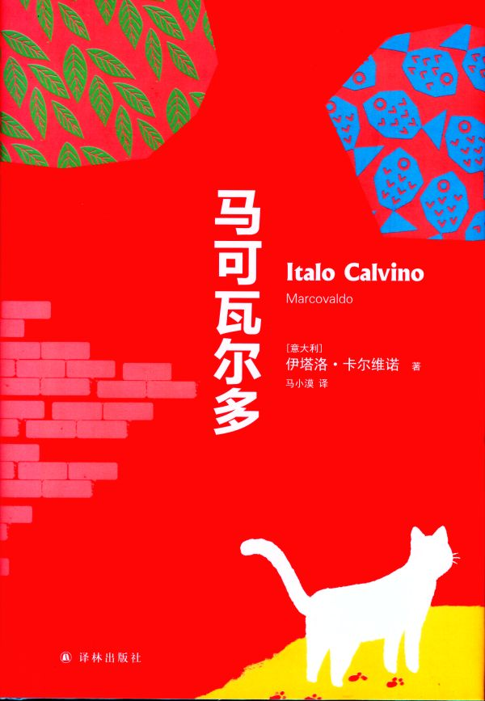

卡尔维诺的[《马可瓦尔多》](https://rsywx.net/books/01962.html)又是一本很了不起的作品。专家说，“没有《马可瓦尔多》，或许就不会有《隐形的城市》”。

全书20篇，分5个小卷，每卷4篇，按顺序以春夏秋冬排列，体现了卡尔维诺一贯的严谨风格。每篇都讲述了主人公马可瓦尔多的一个经历。

  - **城里的蘑菇**：马可瓦尔多挖蘑菇的故事。但蘑菇有毒，幸好吃的不多。
  - **长椅上的假期**：马可瓦尔多不愿意在家里睡觉——因为环境不好，所以选择到公园里的长凳上过夜。结果被一早喷水的车子给浇了个湿透。
  - **市政府的鸽子**：马可瓦尔多听说有丘鹬在迁徙时会经过城市上空，就准备用捕鸟胶捕捉它们。结果捕捉到了一只市政府的鸽子。
  - **消失在雪里的城市**：城里下了大雪。马可瓦尔多要铲雪。一不小心被屋顶上人们铲下来的雪盖了个严严实实。他感冒了，打了一个大喷嚏，所有的积雪都被他吹没了。
  - **黄蜂疗法**：马可瓦尔多从报纸上看来了黄蜂毒刺治疗风湿的方法，于是开始实践。最后因为他儿子不小心捅了马蜂窝，他的“医生”生涯不得不提前告终。
  - **一个有着阳光、沙子和睡意的星期六**：马可瓦尔多准备用沙疗——把自己埋进沙里——的方式来治疗自己的风湿。他的孩子们将他埋在了一艘船上的沙堆里，结果小船开始随波逐流，最终搁浅。马可瓦尔多先生也被震了出去。
  - **饭盒**：马可瓦尔多决定带饭盒吃午饭，但每天都吃的前天晚上的剩菜。一天，他与一个富家小朋友交换食物（用香肠换来了炸脑子），结果被小朋友的管家发现了。
  - **高速公路上的森林**：冬天到了，马可瓦尔多家没了生火的木材。他自己去砍柴，收获不大；孩子们也出门，去了高速公路边的森林，收获颇丰，还砍下了一个广告架。马可瓦尔多也去了，还成功地骗过了眼神不好的警察的巡视。
  - **好空气**：马可瓦尔多带着一家子去山上走走。习惯了城市污浊空气的孩子们对山上新鲜的空气反而没有感觉。他们最后到达的地方是一个肺病疗养院，于是马可瓦尔多赶紧带着还在摘樱桃的孩子们回家了。
  - **和奶牛们旅行**：夏夜，马可瓦尔多睡不着，带着孩子们上街。他们看到一群牛去往山地吃草。他的大儿子随着牛群进了山，音讯全无。((这让我有点想起[[https://rsywx.net/books/00670.html|《我们的祖先·树上的男爵》。]]))家人们想象着他悠闲的生活。牧季结束后，他回来了，大吐苦水。
  - **毒兔子**：马可瓦尔多即将出院，在医生办公室里带走了一只兔子。妻子准备把它杀掉吃掉，于是让三个男孩牵着兔子出去，请别人帮忙杀掉。孩子们放走了兔子。但这是一只有毒的兔子，是实验室的试验品之一。经过一番周折，兔子终于被逮住了，而马可瓦尔多一家也被隔离了起来。
  - **下错了的车站**：城里大雾，马可瓦尔多看完电影出来后迷了路。他四处探路，却莫名其妙地走进了机场，登上了航班，直飞孟买。
  - **在河水更蓝的地方**：食品安全让所有人烦恼。马可瓦尔多决定找一片干净的水域去钓鱼。他向很多人借钓鱼的工具，凑齐了一套——他这么做是不想让人知道他的真正动机。他去钓鱼，收获颇丰。回家路上却被看守人拦住，告知取决于钓鱼的地方，要么这些鱼有毒，要么要对鱼征税。他只好将鱼都放走了。
  - **月亮与GNAC**：GNAC是COGNAC的最后几个字母，也是树在马可瓦尔多家阁楼对面楼上的霓虹灯广告的一部分。霓虹灯亮20秒，熄20秒，影响了马可瓦尔多一家看月亮、看星星。于是孩子们用弹弓把霓虹灯打碎了。树起这个牌子的威士忌公司（SPAAK）的竞争对手（TOMAWAK）与马可瓦尔多一家商定，只要对面树起霓虹灯广告，就把它打灭。SPAAK公司破产了，TOMAWAK公司崛起，在原地树起了更大的霓虹灯广告——现在是亮2秒，熄2秒。马可瓦尔多女儿伊索丽娜与对面小伙子费奥尔达里基的爱情也宣告终结——本来，20秒的时间是够他们眉目传情的。
  - **雨水和叶子**：马可瓦尔多的公司有一棵种在盆子里的植物。下雨后，他发现它生长了一些，于是将它带回家接受雨水。它越长越大、越长越高。为了让它充分吸收雨水，马可瓦尔多带着它去追雨。它变成了一棵大树。马可瓦尔多准备将它送回苗圃，但此时雨停了，太阳出来了。叶子开始脱落，最后只剩下了光秃秃的树干。
  - **马可瓦尔多逛超市**：马可瓦尔多一家去逛超市。他们没有钱，只能过过干瘾——在购物车里堆满东西，再在结账前放回货架，他们一家每个人都这么做了。然后他们一家来到了天台上，坐在吊车的吊篮里逃走了。
  - **烟、风和肥皂泡**：各大洗衣粉公司在住户的邮箱里放了免费领取样品的赠券。马可瓦尔多的孩子们联合其他的孩子们去收集这样的赠券，并指望从中发财，却没能成功。最后，洗衣粉公司报了警。孩子们只好把领来的洗衣粉倒进河里。城市被泡泡覆盖了。
  - **属于他一个人的城市**：圣母升天节((八月十五日，意大利国定假日。人们一般从七月底、八月初开始休假，直到八月底。))到了，城市里的人都出去度假了——除了马可瓦尔多先生。他在空无一人的街道上行走，接受采访，为电视台打起了小工。
  - **顽固猫咪的小花园**：马可瓦尔多在午休时和猫交上了朋友，并在一只虎斑猫的带领下，去到了一家高档酒店，还从厨房里钓到了一条鱼。但鱼被猫叼走了。他追着猫，来到了一位女侯爵的家中。她的地盘是城市里唯一没有被盖上高楼的地方。猫（还有青蛙、蚊子）生活在那里。一天，女侯爵死了，市政准备在地上盖楼，但猫（还有青蛙、蚊子）阻止了这场运动。
  - **圣诞老人的孩子**：圣诞到了，各大公司想尽办法促销、送礼物。马可瓦尔多被打扮成圣诞老人，去为“穷孩子”送礼物。孩子们跟着他去到一家富人的家里，那里的孩子对铺天而来的礼物早已失去了兴趣。孩子们回家后又再为这个孩子送去了特别的礼物：锤子、弹弓、火柴。这个孩子破坏了一切、烧毁了一切。这反倒让商家有了新主意：赠送“破坏性”礼物。

 ! [TR@SOE](taylor.ren@gmail.com) 2020/01/14 06:48