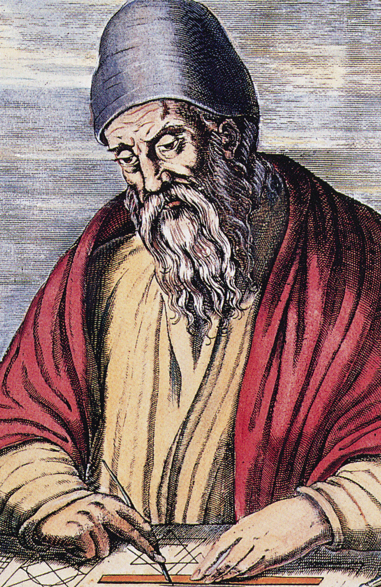

## 欧几里德（Euclid，约公元前325年——约公元前265年）——生平与成就

欧几里德是最为人所知的数学家——也许牛顿要除外。直到20世纪，他唯一的也是唯一流传下来的著作[《几何原本》](https://rsywx.net/books/00439.html)还是历来最畅销的书籍，只有圣经排在之前。不过我们有理由相信，欧几里德不过是一位他当时人们所知晓的数学知识的汇编者。这有点像韦伯斯特，一位伟大的19世纪词典编纂者，他的名字与美国词典中的顶尖品牌相关联。

关于欧几里德我们所知甚少。他在亚历山大的一所学院里教书，这座希腊城市由亚历山大大帝在埃及尼罗河河口建立。因为他的工作是进行汇编，欧几里德对他之前的希腊数学家都很熟悉，特别地，他也很知晓数学史上的第一次危机：无理数危机。

毕达哥拉斯（卒于约公元前475年）在早期希腊数学中是个神秘人物。如果我们对欧几里德是所知甚少，那么对毕达哥拉斯几乎可以说是一无所知。但是我们确实知道一些关于毕达哥拉斯学院的事情。毕达哥拉斯认为整个宇宙可以用整数（1，2，3，4……）来描述。亚里斯多德如是说：“毕达哥拉斯学派……的学习自数学开始，他们认为事物就是数字……而整个宇宙就是比例和数字”。

毕达哥拉斯定理（本章中会讲到）就体现了这点。观察一些小的整数，比如3，4和5，它们不仅可以用来描述一个直角三角形的边长，而且当两条较短的边上各自构造出一个正方形，将这两个正方形面积相加后，其和等于最长边（斜边，也就是直角所对的那条边）上构造出的正方形的面积。我们注意到，古希腊人描述毕达哥拉斯定理时用的是几何对象而不是用数字！

然后有人就问了一个很有趣的问题：如果有一个正方形，每边长都是单位长度，还有另一个正方形面积是第一个正方形的两倍，第二个正方形的边长和第一个正方形的边长相比是怎样的？关于根号2的问题就这样第一次被提了出来。

古埃及人找到了一个不错的近似值。第二个正方形边长比上第一个正方形边长近似等于7比5。我们对此当然不会感到意外，因为我们都知道7/5等于1.4，非常接近我们所知的根号2的小数展开。但是对毕达哥拉斯学派来说，近似是不够的。毕竟毕达哥拉斯定理不是说这些正方形的面积*近似*相等。它断言它们实际上是相等的。

然后，某人（今佚其名）发现了其深刻的内涵。假定$\sqrt 2$可以用两个整数的比值表示，而且这两个整数除了1——它们共同的组成单位——之外没有公因子。令这两个整数为p和q，而且具有这样的性质：按照边长p构造出的正方形P的面积正好是按照边长q构造出的正方形Q的面积的两倍。于是，如果P包含Q中两倍的单位数，那么P必定含有偶数个单位！毕达哥拉斯学派已经知道如果一个正方形包含偶数个单位，那么该正方形所包含的单位数必定是单位面积的4的倍数，而它的边长一定包含整偶数个单位边长。

另外，大家都知道，给出一个正方形，你可以找到一个是它四分之一面积的正方形：只要在某条边上以一半的边长构造一个正方形即可。于是，我们构造一个边长t为边长p一半的正方形T。因为p包含偶数个单位整长度，所以边长t一定包含整数个单位长度。但是如果正方形T是正方形P的面积的四分之一，那么正方形Q必须包含正方形T面积单位数量的两倍。因此，如果正方形Q包含偶数个单位面积，和正方形P一样，正方形Q也必须包含4倍的单位面积数。所以它的边长q必须包含偶数个单位长度。到目前为止，这一数学论证有点像打网球：选手们来回的击球。

最后，论证到了最高峰。一开始我们假定边p和边q除了1之外没有公因子，但是我们得到了矛盾：它们有公因子2！毕达哥拉斯学派再怎么尝试，也找不到这一论证中的错误。既已知晓没有人事实上曾经找到一种方法用两个整数的比来表达根号2，毕达哥拉斯学派面临的事实就是他们已经证明根号2不能用两个整数的比来表示。

无理数，至少在两千年内不能用整数来表示的数学对象，第一个被克罗内克称为“人的工作”的东西，就此诞生了。

毕达哥拉斯学派小心翼翼地保守这这个发现，因为这一发现带来的危机会牵涉到他们宇宙学的根本。他们发现其成员之一向某个圈外人士泄露了这一秘密后，毕达哥拉斯学派立刻计划在出海的时候将这个“叛徒”扔出船外，淹死在茫茫大海之中。不论此人是谁，他都是数学的第一个殉难者！

无理数危机也让古希腊人认清了方向，他们不能依靠算术来建立其他数学的基础，并用其来解释宇宙的结构。他们必须另寻他方。他们于是转向几何。

欧几里德的《几何原本》最为人所深记的是它的几何，特别是它在平行线定义中对平行线的处理方法：

>平行线是同一平面内的直线，向两个方向无限延伸，在任何方向上都不会与另一条线相交。

以及第五公设（平行公设）：

>即，如果一条直线与两条直线相交，得到的同一侧的内角之和小于两直角，那么这两条直线如果无限延长，会在该侧相交。

这一公设通常所表述的方式与前述很不相同：

>给定一条直线和线外的一点，通过该点能且只能做一条与该线平行的直线。

这一等价而不同的描述，由苏格兰数学家普赖菲尔于1795年提出。

在牛顿体系受到众人信仰的时代，即便如康德这样的哲学家都从未对欧几里德的平行公设提出过质疑。他们只是对其真实性的本质提出疑问。平行公设对于宇宙而言是必须为真呢？还是只需条件为真？当然，随着爱因斯坦体系的革命，我们知道就宇宙而言平行公设根本不成立。我们所寄居的爱因斯坦时空的宇宙是弯曲的。欧式几何以及牛顿物理只是近似表达。

于是乎我们就要问，希腊人对平行公设的本质是如何思考的？我相信如果我们简要回顾一下古希腊人对世界的概念将会表明，他们也只是将平行公设作为一个有用的虚构部分而不是物理世界的真实描述。毕竟，希腊人相信我们所居住的——如科学史家柯瓦雷所称作的“闭合世界”——是一个球形宇宙，实际上没有任何直线可以无限延伸。在月球轨道之下，物体以直线要么向着地球中心要么背离地球中心而运动。而在月球轨道之上，物体以完美的圆形围绕地球中心运动。在这样的宇宙中，实际上不存在任何直线。

但是希腊人还有一个问题。他们需要为其数学找到一个基础。毕达哥拉斯学派以算术为基础却遇到了危机。为了找到一个替代品，另一个源自泰勒斯（卒于约公元前547年）的学派试图将数学建于几何之上。该学派发现，如果没有平行公设，他们能获得的东西是非常少的！比方说，他们将无法证明毕达哥拉斯定理。而事实上，他们也证明不了什么几何上的东西。于是我们这些现代人就不会感到奇怪了，毕竟我们得益于2500年的后知后觉，并知道在非欧几何中毕达哥拉斯定理是不成立的。我相信，古希腊人知道平行公设只是个有用的——不，应该说是非常有用的——近似而已。

如果说证明了平方根的无理性为我们带来了数学上的第一次危机，它同时也为我们给出了自那远古以来就为我们所知的论证方法的第一个范例。这一方法称为`reductio ad absurdum`，即归谬法（或称反证法）。而这一论证方法的第二个例子可见于欧几里德关于素数的无限性证明之中。当然，这一证明也源于其它人。

所谓素数是指这样的整数（比如3，23），它只有1和其本身是整数因子。证明素数有无限多个异常简单。假定最大的素数为P。将所有直到P的素数相乘，然后加1。得数不能被P整除，也不能被小于P的任何素数整除，因为P和所有小于P的素数在这个积加1之前都可以整除之。于是假定有一个最大的素数会得到矛盾。归谬法！

希腊人注意到很多素数是成对出现的：11和13，17和19，29和31等等。它们被称为孪生素数。有人认为希腊人推测不光素数有无限多个，孪生素数也有无限多个。但是他们无法证明这点，直到如今，数学家也还没有能证明这点。

同样地，也没有任何数学家能证明不存在奇完全数。完全数？听起来就很“奇”怪了！什么是完全数呢？一个完全数是其大于等于1而小于自身的整数因子——即所谓其真因子——之和。古希腊人通过如下方法找到了所有的偶完全数：

注意到2的次方的和，从1（即2的0次方）开始直到$2^{n-1}$等于$2^n-1$。最简单的例子，对于n=3，1+2+4=7=8-1。让我们做一些简单的算术：

$7=1+2+4=2^0+2^1+2^2$

$7=8-1=2^3-2^0$

$14=16-2=2^4-2^1$

所有列加起来都等于28。将这个和用另外一种方式表达，我们得到：

$28=1+2+4+7+14=2^2+2^3+2^4=2^2 \times (2^0+2^1+2^2)=2^2 \times (2^3-1)$

28是其因子的和。注意到所有这些因子首先是2的次方（到某次方），然后是某次方下一次方减1（称为转折点因子），然后是转折点因子乘上所有2次方（直到给定的次方数）。还注意到，如果7不是素数，那么28也不会等于其真因子之和。只要转折点因子有一个能整除的素数因子，就会引起所有真因子求和溢出。

鉴于此，希腊人证明了：

>如果$2^n-1$是素数，那么$2^{n-1}\times(2^n-1)$就是个完全数，偶完全数必定以此形式出现。

两千多年后，还没有人发现一个奇完全数。没有一个数学家认为存在奇完全数。但是也没有人能证明不存在奇完全数！

毕达哥拉斯学派试过在算术的基础上建立整个数学体系但失败了。重新将数学建立在几何上意味着在几何中找到算术。

一个很简单的问题，哪个数更大：7/5还是10/7？也许对你来说太简单了。那试试不用计算器判断这两个数哪个更大：19/12还是30/19？试试只用乘法而不用除法来判断。欧几里德《几何原本》第五篇中呈现的所谓欧多克索斯比例理论提供了这样的工具——只用乘法——来得到答案。

基于欧多克索斯（卒于约公元前355年）的理论，欧几里德这样来解决问题：考虑4个长度量（a，b，c，d），我们如何判定a和b的比值大于、小于还是等于c和d的比值？欧多克索斯一开始就断言“所谓能得到一个数对另一个数的比例量，就是说乘以其中任一数会大于另一数”。他意识到如果a比b大于c比d，那么所有a比b的倍数都大于同样倍数的c比d的值。认识到这点后，欧多克索斯意识到他要做的就是找到要用的一个倍数并解决问题。他选择的倍数是b和d的乘积。将a比b乘以b和d的乘积，得到a和d的乘积，而a乘以d也就是边长为a和d的长方形面积。类似地，将c比d乘以b和d的乘积，得到b和c的乘积，也就是边长为c和b的长方形面积。

因此，边长为a和d的长方形面积大于边长为c和b的长方形面积，当且仅当a比b大于c比d。毕达哥拉斯学派试图算术化几何却以失败告终，而欧多克索斯试图几何化算术却得到了成功！顺便说一句，由于19&#42;19大于30&#42;12，因此19/12大于30/19！

欧几里德是有史以来最伟大的百科全书型数学家。现如今，专精于不同领域的数学家很难理解他人别的专业中处于前沿地位的工作，也没有一个数学家敢奢望能编纂出所有已知数学领域的纲要。但这仍然是数学圈子里的一个理想。20世纪后半段，法国的数学社区伪托了一个欧几里德式的人物布尔巴基。但事实上，布尔巴基根本就不是一个人。他是一群超过20名专攻于不同数学领域的法国数学家集体虚构的笔名！直到今天，欧几里德仍然是我们书写数学文字的典范。