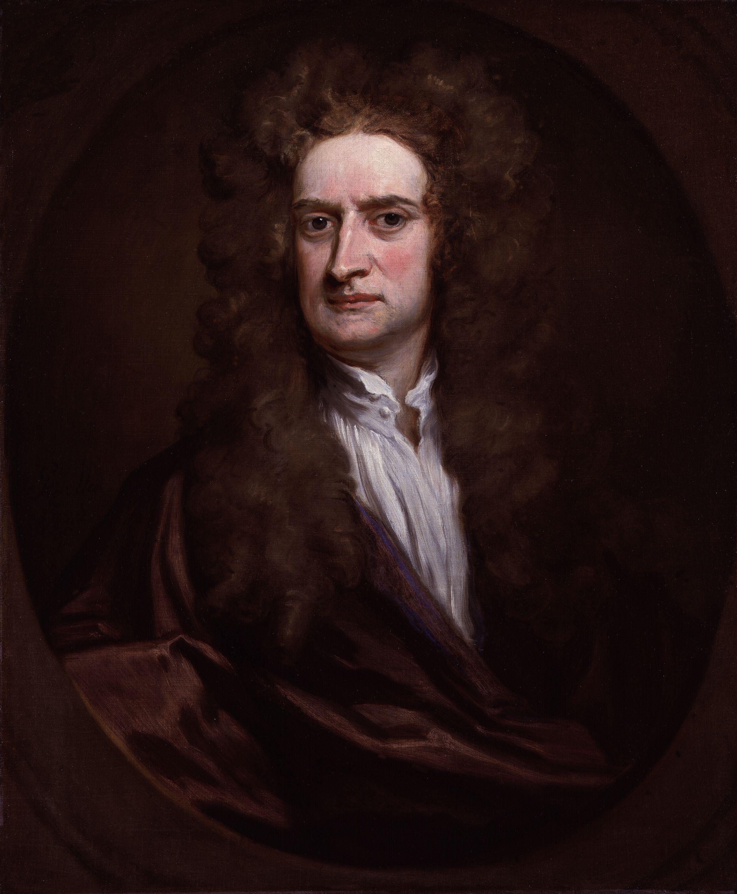
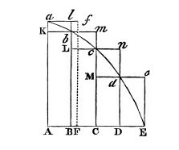

## 牛顿（Isaac Newton，1642-1727）——生平与成就

伽利略逝于1642年1月8日，正好是我诞生那天的300年前。牛顿在那一年的圣诞节出生于英国工业小镇林肯郡的乌尔索普。后来他将成为剑桥大学的卢卡斯数学教授，也是我目前的职位。[^1]

[^1]: 根据维基的[这一词条](http://en.wikipedia.org/wiki/Lucasian_Professor_of_Mathematics)，当今的卢卡斯数学教授是格林，而霍金担任此职的时间段为1979年到2009年。

牛顿的母亲并未指望他能存活很久，因为他的生产期提前的太早了。牛顿后来形容他出生时看上去是那么的小，几乎可以放到一个一夸脱的罐子里去。牛顿的父亲也叫伊萨克，是位自耕农，在他出生前三个月逝世。而到了牛顿两岁的时候，他的母亲汉娜·艾斯考夫再嫁了，嫁给了巴纳巴斯·史密斯，一位来自北威瑟姆的富有牧师。显然新成立的史密斯家庭中没有小牛顿的位置，于是他被留给他的外祖母玛格丽·艾斯考夫照料。这一被遗弃的阴影，加上他从未能见到他的父亲，终牛顿一生都使其受尽困扰。他看不起他的继父。在1662年他的日记中，牛顿回忆说曾“威胁我的史密斯父母，要烧死他们，还要烧毁他们的屋子让它倒塌在他们尸体之上。”

和成年后一样，牛顿的童年时代充斥着粗暴而有报复性质的冲突，不光是和他的假想敌，也和他的朋友和家庭。他也很早展示出那种定义了他一生成就的好奇心，并对机械模型和建筑图纸有兴趣。牛顿花了数不清的事情来构造时钟、着火的风筝、日晷和小型风车（用老鼠驱动），也花了不少动物和船舶的精美的素描。五岁的时候，他进入位于斯基林顿和斯托克的学校，但是一直被认为是最差的学生。他老师的报告中对他的描述是“不专心”，“木讷”。尽管他有好奇心，对学习也有显而易见的热情，可他对学校的作业就是提不起劲来。

到牛顿十岁的时候，巴纳巴斯·史密斯去世了，而汉娜从史密斯的遗产中获得了相当大的财富。牛顿和他的外祖母开始和汉娜以及一位同父异母的弟弟、两位同父异母的妹妹一起生活。由于他在学校的成绩——包括他的数学成绩——并不令人振奋，汉娜决定牛顿去管理农场和资产可能会更好，于是她将他从格兰瑟姆的弗里语法学校退学。对她而言很不幸的是，牛顿对管理家庭产业的兴趣比他对学校功课的兴趣更少。汉娜的兄弟威廉也是一位牧师，认为对这个家庭来说，最好还是把心不在焉的牛顿送回学校让他完成学业。

这次，牛顿得以和弗里语法学校的校长斯托克斯住在一起，而这似乎是其学业的转折点。有传闻说，学校里的某位学痞在牛顿的脑袋上狠狠地来了那么一下，而这一下却让牛顿开了窍并使得年轻的牛顿扭转了他本来是毫无前景可言的学习生涯。牛顿展示出对知识的好奇和天资，并开始为进入大学接受高等教育做准备。他决定入学剑桥大学之三一学院，而这也是他舅舅威廉的母校。

牛顿在三一学院开始勤工俭学，他干杂活（比如伺候教员进餐，为他们清理房间）赚取一些津贴以支付教育的费用。但是在1664年，他候选成为学者，这一职称提升了他的经济状况并让他不用再从事那些伺候人的工作。1665年大学因为黑死病肆虐而不得不关闭，于是牛顿回到了林肯郡。瘟疫蔓延期间，牛顿在家里呆了18个月，并专心研究力学和数学，也开始注意光学和引力。这一年后来被牛顿称为“神奇之年”（`annus mirabilis`），也是他一生中最有生产力、最有成果的片段之一。根据传说，也就是在这段时间，有一只苹果掉到了牛顿的头上，将他从树下小睡中惊醒，并促使他定义了引力定理。且不论这个传说是不是靠谱，牛顿自己的说法是，一个苹果掉下来，将他的涉猎范围“偶然带入”了对引力的沉思。可以确定的是，那时他进行了钟摆实验。“我正处于进行发明的黄金时光”，牛顿后来回忆道，“对数学和哲学的着迷程度比之后的任何时候都要强”。

回到剑桥后，牛顿学习了亚里斯多德和笛卡尔的哲学，也学习了霍布斯和波义耳的科学。他被哥白尼的力学、伽利略的天文学以及开普勒的光学所吸引。牛顿进入剑桥之前的数学教育如何，我们没有太多直接的资料。牛顿在剑桥的第一位导师是普林（也就是后来的钦定希腊教授）。不久，牛顿接受了巴罗的指导。巴罗是一位了不起的数学家，也是皇家学会的发起人之一。巴罗将教导年轻的牛顿尽快学完欧几里得的《几何原本》。之后，牛顿很快掌握了乌特雷德和韦达编纂的代数著作，特别重要的是，掌握了笛卡尔的《几何》。

也就在这段时间，在三一学院的宿舍或者他乌尔索普的家中，牛顿开始了他的三棱镜实验，研究光的折射与色散。学院的一个变化是巴罗的来到，这对牛顿的未来显然有着深远的影响。巴罗被任命为卢卡斯数学教授[^2]，他特别欣赏牛顿在数学方面非比寻常的天赋。1669年他从教授职位上退休时，他推荐当时27岁的牛顿作为他的继任者。

[^2]: 也是第一任卢卡斯数学教授。译者注。

作为卢卡斯教授，牛顿的第一个专题是在光学领域。他开始证明白光由不同类型的光混合而成，通过三棱镜折射后展示了光谱中的不同色彩。他一系列精心而精确的实验证明光线是由微小颗粒组成。这一结论使得像胡克这样的科学家大为愤怒，他们认为光线以波的形式传递。胡克向牛顿提出挑战，要他提出更多的证据来证明他那离经叛道的光学理论。牛顿的回应方式和他更成熟之后的也没能改掉的方式一样：他先是撤退，然后开始抓住任何机会去羞辱胡克，也拒绝发表他的著作《光学》，直到胡克1703年去世才发表。

牛顿担任卢卡斯教授的早期，他一直延续着他对纯数学的研究，但他几乎不和任何同事分享其成果。早在1666年，他已经发明了解决曲线问题的通用方法，他称之为“流数法和反流数法”。这一发明激起了他与那些支持德国数学家和哲学家莱布尼茨的人之间的一场富有戏剧性的争执。莱布尼茨在10多年后发布了他在微分和积分计算方面的成果。两人得出的数学原理几乎一致，但是莱布尼茨发表著作在牛顿之前。牛顿的支持者宣称莱布尼茨在多年前曾经看到过卢卡斯教授的文字。而一场在两大阵营之间展开的白热化的争论——及所谓的“微积分优先权之争”——直到莱布尼茨于1716年逝世后方告落幕。牛顿的攻击是恶毒的，通常会延伸到讨论对上帝和宇宙的观点这样的领域，而他指责莱布尼茨进行了剽窃也使得后者最终穷困潦倒，名誉扫地。

大部分科学史家相信，事实上这两位高人独立地获得了各自的成果，曾经的争论实在是没有任何意义。牛顿对莱布尼茨的尖酸刻薄也对他自己产生了生理和精神上的创伤。很快他又卷入另一场争论，这次是和英国耶稣会争辩他的色彩理论。1678年他患上了严重的精神崩溃。又过了一年，他的母亲去世，从此牛顿开始离群独居，不与人交往。他开始秘密地钻研炼金术——而炼金术即使在牛顿的年代也已经被广泛认为是徒劳无功的。这位科学家生平中的这段经历一直使得众多牛顿学者感到难堪。直到牛顿去世后很久，人们才知道他对化学实验的兴趣和他后来对天体力学和引力的研究是相关的。

1666年之前牛顿就已经开始形成其运动的理论，但是他还没法精确地描述圆周运动中的力学。大概在50年前，德国数学家和天文学家开普勒提出了行星运动三定理，精确地描述了行星是如何相对太阳运动的，但是他无法解释为什么行星会如此运动。开普勒就其中牵涉到的力得出的最接近的猜想是太阳和行星有着“磁性”的连接。

牛顿开始着手发现行星之椭圆轨道的原因。将他自己的向心力理论应用到开普勒行星运动的第三定律（和谐法则）中，他得出平方反比定理，即两个物体之间的引力与两物体质心间的距离的平方成反比关系。牛顿因此意识到引力的普遍的：将苹果拉向地面的力，和促使月球围绕地球运转的力是一种力。然后他开始用已知的数据来检验其平方反比关系。他采纳了伽利略的假设，即月球到地球的距离是地球半径的60倍，但他自己对地球直径的估算不够精确，因此无法完成令他满意的试验。具有讽刺意味的是，在与他的老对手胡克1679年的通信中，他重拾了对这个问题的兴趣。这一次，他将注意力房子啊开普勒第二定理上，即等积定理，由于有向心力，牛顿能证明其正确性。胡克也试着去解释行星轨道，而胡克信中谈到的这些问题让牛顿特别感兴趣。

1684年的一次臭名昭著的会议上，皇家学会的三名成员：胡克，哈雷，雷恩（也就是建造了圣保罗教堂的著名建筑师）参与了一次关于住在行星运动的平方反比关系的热烈讨论。在17世纪70年代早期，伦敦咖啡屋和其他知识中心中讨论的是，引力从太阳那里向各个方向发出，随着距离的平方而以反比的速率减弱，因此随着平面的扩大，对球体平面的作用会被越来越稀释。1684年会议其结果是催生了《自然哲学的数学原理》（`Principia`）一书。胡克声称他从开普勒的椭圆定理出发，证明了引力是一种传出的力，但是不会向哈雷和雷恩公开，直到他准备好公布于众。哈雷气急败坏地来到了剑桥，将胡克的声明告诉了牛顿，并提出了下面的问题：“如果行星被一种力，一种与距离的平方成反比的力拉向太阳，那么这个行星的轨道会是什么形状的呢？”牛顿给出了令人惊讶的回应。“除椭圆无他”，他立马回答道。他还告诉哈雷，4年前他就解决了这个问题，只是不知道放在他办公室里什么地方了。

在哈雷的要求下，牛顿用了三个月的时间重构并改进其证明。然后，在18月的工作——期间他曾是如此投入而常常忘记吃饭——而而积累起来的能量的爆发中，牛顿进一步发展了这些想法，而用了整整三卷去进行表述。他选择的书名是《自然哲学的数学原理》（`Philosophiae naturalis principia mathematica`），特意要和笛卡尔的《哲学原理》加以对比。牛顿的这三卷《原理》在开普勒的定理和物理世界间搭建了连接。对于牛顿的发现，哈雷的反应是“喜出望外”。对于哈雷来说，这位卢卡斯教授应该是在他人都失败的地方取得了成功。他私人出钱资助了这一人类社会的礼物和杰作的宏篇伟制的印刷。

伽利略说物体是被“拖”向地球的中心，但是牛顿得以证明，这同一种力，引力，影响着行星的轨道。他也熟稔伽利略在抛物线运动上的成果，而他断言月球围绕地球的轨道遵循同样的原则。牛顿表明，引力解释并预测了月球的运动，也能解释并预测潮汐的规律。《原理》的第一卷列出了牛顿运动三定理[^3]：

  1. 任何物体保持其静止状态或者匀速直线运动状态，除非有外力作用于其上迫使其改变该状态。
  2. 加速度与所加的作用力成正比，其方向与力所作用的直线方向一致。
  3. 每个作用力都有一个相等的反作用力；或者说，两个物体的相互作用总是相等，但方向相反。

开始的时候，牛顿只是将第二卷作为第一卷的后继补充，并未包括在著作最初的大纲中。它主要是关于流体力学的论文，同时也能让牛顿展示其数学天赋。在书的结尾处，牛顿总结说，笛卡尔所提出的涡流并用以解释行星运动根本经不起审视，因为运动可以在没有涡流的自由空间发生。牛顿写道，之所以如此，“可以从第一卷中得知。而我将在接下来的篇幅中加以更详细的处理。”

第三卷的副标题是《世界的系统》，牛顿将第一卷中的运动理论应用到物理世界，并总结道：“所有物体都有引力作用，并与它们包含的质量成正比”。他因此证明，他的万有引力定理可以解释已知的六个行星的运动，也可以解释月球、彗星、春分秋分以及潮汐的运动。定理表明，所有物质都被引力互相吸引，引力正比于它们质量的乘积，反比于他们距离的平方。牛顿只用了一个定理，就统一了地球和天空中能看到的一切。牛顿在第三卷中最初的两个“推理准则”这样写道：

>我们必须承认，自然物体再也没有别的动因，能更真实也更充分地去解释其存在。因此，对于相同的自然效应，我们必须尽可能地给予相同的动因。

正是这第二条规则在事实上统一了天堂和人间。一位亚里斯多德学者会断言，天堂的运动与人间的运动显然不是同一个自然效应，因此牛顿的第二法则将不适用。但牛顿不这么认为。《原理》于1687年出版时受到了一定的好评，但是其初版只印刷了500本。而牛顿的死敌胡克威胁说不管牛顿会得到什么赞誉，他都要摧毁之。第二卷出版后，胡克公开声明，他1679年写的信为牛顿的发现提供了至关重要的科学理念。他的说法虽然不能说没有理由，但让牛顿身为痛恨，他发誓推迟甚至不再发表弟三卷。牛顿最终还是妥协了，发表了《原理》的最后一卷——在之前他不辞辛劳地删去了所有提到胡克名字的地方。

牛顿在积分和微分方面的工作可以在他17世纪60年代中叶所做的笔记中找到。但是，牛顿从未以自己的名义发表过一篇纯数学的论文。直到20世纪下半段，才发表了大量他写的数学文章。牛顿在《原理》的第一卷第一章向他的同时代人展示了他发明的微积分的惊鸿一瞥。他将该章命名为“初量与终量的比值[^4]方法，并籍此证明下列命题”。在这一章中——本书也已收录——牛顿为最初和最终比例提出了11个引理（`lemmas`，希腊文，意为“辅助命题”），他籍此能将由曲线构成的图形与对应的由直线构成的图形互相交换使用。

在引理一中，牛顿证明：

>数量，以及数量的比例，在任意有限时间内连续收敛到相等，而在此之前互相越来越接近并比任何给定的差值都小，将最终相等。

他证明这点用的是很直接的方法，而两个世纪之后魏尔斯特拉斯的ε-δ描述最终将极限加以完美定义。牛顿的证明是：如果数量和比例不能最终达到相等，那么一定有一个有限且最终的差异D，他们将无法互相接近到小于那个差异D！我们注意到牛顿叙述这个命题时用的是随着时间而变化。基于《原理》是一本关于物理科学的著作，这个设定不会令我们意外。

牛顿之前的2000年，阿基米德证明了一些特定几何形状（比如圆）的面积定理，他用的方法是做出这个物体的内接和外切多边形。在引理二中，牛顿从阿基米德那里得到启发，并将这一方法扩展应用到任意曲线，做出曲线段的内接和外切矩形，并证明由这些内接和外切矩形构成的内接图形和外切图形的面积具有终极比例意义上的相等性。

牛顿要求读者考虑一条任意曲线和一条直线（途中以AE表示）间的关系，他将AE分割成相等的部分：AB，BC，CD……等等等等，无限地这么分下去。然后他构造矩形（比如AKbB）内接于某一曲线段，在构造矩形（比如AalB）外切于同一曲线段。他注意到这些矩形的面积差异也就是矩形aKbl的面积，而这些“差异”矩形的面积之和就等于第一个外切矩形AalB的面积！牛顿注意到矩形AalB的底边AB的长度是趋近无限小的，因此矩形AalB的面积“变得比任何给定的面积都小”，这就是证明。因此，内接图形和外切图形的面积最终“变得最终相等”，和曲线直线描述的图形的面积也相等！

牛顿将他的引理马上用在他《原理》中的第一个定理，也就是开普勒的定积定理——的证明中！

在第一章结尾的注释中，牛顿谈及很快就会被批评家们提到的问题，亦即数量如果自身趋向于0，不可能有一个最终的比值，因为他们会等于0。他的回应是，将其与某个物体在空间某个特定点的速度的终量对比。依照根植于古希腊的观点，牛顿指出这个物体在那个时刻那个特定的空间点，显然不是静止的。相反，它有一个确定的即时速度对应该特定时刻的特定空间位置。以此类推，趋向于0的数量可以在趋向于0的时候相互间有一个终量比值。

>量消失的时候的终量比值其实不是真正的终量的比值，而是一个极限，比值与之的接近程度可以小于任何给定的差值，但是直到这些量趋向无限小，该值永不能超越，也不能实际上达到。[^4]

[^4]: 这个描述与我们现代所谓的“极限”概念接近。译者这里采用的是陕西人民出版社出版，王克迪译一书中的译法。

进入18世纪，牛顿开始在政府供职，担任皇家铸币局的局长。他利用炼金术中的学问来找到重新建立英格兰货币信用的方法。作为皇家学会的主席，他一如既往地以不屈不挠的决心与假想敌斗争，特别地，与莱布尼茨进行的旷日持久的关于到底是谁发明了微积分的争论还在延续。1705年安妮女王授予他骑士头衔，他一直活到《原理》第二版、第三版的发表。

牛顿偶尔会宣称《原理》中很多重要的命题的证明用到了他发明的微积分。大约1715年左右他为《原理》草拟的前言——但是未发表——中，他做了如是声明。而类似声明最终付印的版本是在1722年，他匿名发表了一篇评论评论的是一本关于他和莱布尼茨发明微积分的言论的书。他这样写道：

>借助该新分析方法，牛顿先生证明了他《原理》中的大部分命题。然后，古人确认事件的做法是，不会将任何事承认是几何，除非得以综合证明。他综合地证明了这些命题，亦即天堂系统可能鉴于良好的几何。于是对于不熟悉此间原理的人来说，很难看出得到这些命题是基于何种分析。

最近对于牛顿的笔记本所进行的学术分析指出，根本没有证据支持他所做的那么过分的声明，说是他自己——而不是他的死敌莱布尼茨——先一步发明了微积分。

牛顿逝世于1727年3月，死于肺部炎症发作和痛风。如其所愿，牛顿在科学界已经没有了敌手。一个显然一生没有和女性发生任何浪漫纠葛的人——某些历史学家怀疑他可能喜欢男人，比如瑞士自然哲学家杜伊耶——其工作热情是无法被指责的。牛顿同时代的诗人波普，用这样的诗句来描述这位伟大思想家给予人类的礼物是最优雅贴切不过了：

>自然和自然的规律，隐于沉沉黑暗之中；

>上帝说，让牛顿来！于是一切变得光明。

牛顿一生以琐碎的争论，彻骨的傲慢为标记。在生命的尽头，牛顿在评价其自身成就时，也做出了特别尖刻的评论：“我不知道我在世人眼中的形象如何。但就我个人而言，我就像是个小男孩，在海边嬉戏游玩，不时找到一块光洁一点的卵石或者漂亮一点的贝壳而已。真理的浩淼汪洋在我眼前展开，而我还未曾探索。”

[^3]: 这里的牛顿运动三定理的翻译按照原文译出，与其它翻译有一些差异。

