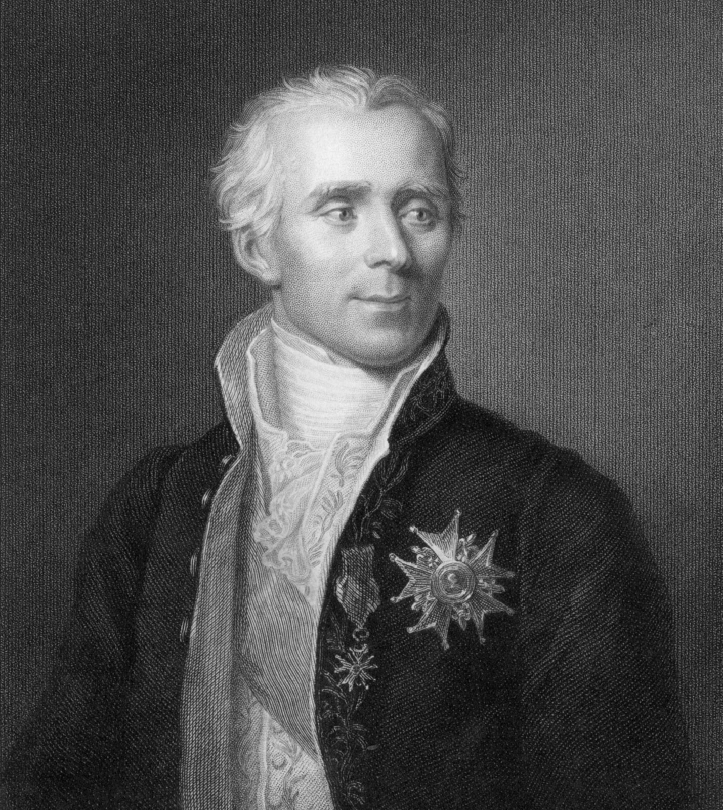

## 拉普拉斯（Pierre Simon Laplace，1749-1827）——生平与成就

当代达尔文生物学的批评者通常会引用高度复杂的生理系统——比如血液凝结现象，他们称之为“无法约简的复杂性”，而这些系统是如此复杂，其演变是无法用达尔文的进化论加以解释的。他们用这样的系统作为证据，证明存在着来自智慧的设计，因此也就有着有智慧的设计者。他们真该好好回头看看两个世纪前拉普拉斯——也许是有史以来最伟大的数学物理学家——获得的成就。

牛顿的《原理》统一并简化了当时所有人类已知的物理科学，但也留下了很多悬而未决的问题——那些甚至无法用物理科学回答的问题。1687年《原理》出版后不久，本特利牧师——牛顿最早期的支持者和推广者之一——向大师提出了一个没有在《原理》中考虑的问题。考虑太阳系，所有行星几乎在一个平面上按照同一个方向围绕太阳运转，这样的系统可以只依赖自然力量产生于初始状态下物质的均匀分布吗？还是这本身就是大设计的证据？

牛顿认为他的系统根本无从解释天堂中这些显而易见的规则。他的回复是，毋庸置疑的，它们无法仅从自然力量的作用中诞生。其动因“必不能盲目，又不靠运气，而必须完全掌握力学和几何学。”

几乎整个18世纪都是如此的想法，直到拉普拉斯横空出世，如一道闪电划过了法国科学界的天空。

拉普拉斯于1749年出生于小镇诺曼底。很可能他的某些远方叔伯也在威廉统治者1066年入侵英格兰所带领的诺曼人之中——当然我们永远无法考证。我们知道的是，拉普拉斯的父亲是为成功的苹果酒商人，他的母亲出生于富足的农场主家庭。这当然是很舒适的家庭背景，不过看起来在这样的背景下，他们的儿子应该追求的是神职或者军队里的职位。

拉普拉斯接受教育的道路确实也是如此。他先是在当地的本笃教会学校读书。16岁时，他进入附近的卡昂大学学习，目标是获得神学学位。但很快拉普拉斯发现了数学的乐趣。两年后，他离开卡昂来到巴黎——法国科学的中心。在巴黎，拉普拉斯很快让数学家达兰贝尔另眼相加，并为他这位年轻的门徒谋到了在军事学校的教职。拉普拉斯在该岗位上为出身良好的士官们教授几何及三角，但是他本人对这些科目兴趣不大。不管怎样，该职位使得拉普拉斯得以留在巴黎——法国的数学中心，事实上也是全球的数学中心。

1770年，拉普拉斯开始大量地产出论文，主题涵盖了理论数学和应用数学的多方面，并为其带来了广泛的注意。最重要的论文研究的就是悬而未决的行星理论。最大的两颗行星木星和土星的轨道有时会比预测的位置拖后，有时却会超前。拉普拉斯试图解释行星轨道是如何相互影响的。这是比三体问题更难的问题，而且三体问题到目前还只能依靠逐次模拟来解决。拉普拉斯证明扰动不是累积的——这也是牛顿害怕的——而是阶段的。我们不需要上帝的干预，太阳系也不会塌陷。

有了如此重大的成功，拉普拉斯显示寻求入选声誉卓著的科学院，而此时他仅仅22岁。1771年他第一次申请失败后，第二年他又再次申请，又再次失败。他没能入选，这次输给了他认为比不上他的某个中庸候选人，而此人只有一点比拉普拉斯高，那就是年岁！拉普拉斯当然毫不犹豫地让所有人知道他对自己的评价有多高。即使才20出头，他已经自认是法国最优秀的数学家了。他的导师即使有可能不像年轻的拉普拉斯那样对他有着那么高的评价，但是他们对他的才华还是认同的。1773年，达兰贝尔和拉格朗日协力让拉普拉斯先入选了柏林科学院，然后成为巴黎科学院的特别会员。

在法国科学界确立地位后，拉普拉斯继续大量发表文章，当然教书也是必要的。1784年，军队委任他作为皇家炮兵队的检查员。这一任命使得拉普拉斯有了额外的收入，并能使其接触政府高级官员。不过在这一任命中拉普拉斯建立起来的交情里，最重要的也许是与他首批学生之一的交往。此人16岁，来自科西嘉，名叫拿破仑·波拿巴！

1788年，拉普拉斯39岁那年，他与玛丽-夏洛特·德·柯蒂·德·罗芒成婚，她是来自法国境内阿尔卑斯山区贝桑松的一位富有的乡绅的女儿，成婚时她只有丈夫年纪一半多一点。一年不到，他们的婚姻又增添了祝福，儿子夏尔-埃米尔诞生。夏尔的军事生涯战绩彪炳，只可惜在1874年死去且无子嗣。拉普拉斯夫人又在1792年生了个女儿索菲·苏珊。索菲嫁给了巴特斯侯爵，此人是拿破仑一世时期的贵族中的少数派。她在生产拉普拉斯唯一的外孙女（也叫索菲）时因难产去世。小索菲后来嫁给了科尔波特·夏伯耐伯爵，一个显赫的贵族家庭的后裔。他们生有多个子女，如今拉普拉斯的男性后裔的姓是科尔波特-拉普拉斯。

拉普拉斯对科学全神贯注，也就没有什么时间卷入18世纪80年代末到90年代初的政治漩涡。在法国大革命最激进的18世纪90年代初，他根本就没有参与进去，而只是参加了设计公制系统的委员会，而这也算是砸碎旧王朝锁链的系统性工作的一部分。有一批人认为长度的基本单位应该以地球赤道的周长来定义。而拉普拉斯认为，鉴于几何中直角的地位，长度的基本单位应该基于从北极到赤道的四分之一圆的长度。多亏拉普拉斯成功的争辩，米被定义为北极到赤道距离的1/10000。

到了1793年末，巴黎的政治气氛对于拉普拉斯而言是太动荡了。和很多其他著名科学家——比如拉瓦锡，库仑——一样，拉普拉斯被赶出了公制系统设立委员会。激进的共和党人大声宣布，如此的责任只能被授予那些“因其共和的美德以及对国王的憎恨”而为人所知的那些人。

说句大实话，出于怕掉脑袋，拉普拉斯一家人逃出巴黎而来到30英里之外的梅伦乡间小镇。拉普拉斯回忆说，他是对各种可能结果出现的概率作出了正确的判断。他的朋友和同事，化学家拉瓦锡选择留在巴黎。1794年春天，拉瓦锡被送上了断头台。

1794年7月，随着雅各宾党人及其党魁罗伯斯比尔的独裁被推翻，巴黎有了秩序井然的表象。不久之后，新政府重新将拉普拉斯召回巴黎，帮助法国科学从大革命的过分激进中恢复起来。拉普拉斯兴致勃勃地开始了新的工作，也自然而然地在那些著名学府——比如高等师范学院，理工学院，公共事业中心学校等——的重建中奠定了领导地位。新政府也将科学院重新改造为法兰西学院，拉普拉斯于1795年12月当选副院长，并于1796年4月，当选为院长。

拉普拉斯50岁生日后的第二年，他发表了其最伟大的著作。1799年，他发表了其划时代著作《天体力学》的第一卷（这本著作最终有五卷，最后一卷发表于1825年）。

在18世纪，天文学家发现了海王星以及土星的若干新的卫星。所有已知的行星和卫星以同一个方向运动，并几乎都在太阳的赤道平面内。太阳、行星和卫星与地球有着同样的旋转方向。如果这29个天体运动的相同是纯概率事件，那么这个概率是非常小的，小到只有1千亿分之一！

拉普拉斯意识到天空的规律性必定有着物理根源，而他找到了。他完成了牛顿认为不可能的任务。在《天体力学》一书中，拉普拉斯证明太阳系能从一团旋转的太阳云中产生，行星和卫星是旋转的气体球，然后冷却并凝结，其旋转必定是同一个方向，并且几乎在太阳运转的相同平面上。

拉普拉斯对概率的研究早在1780年就开始了。1812年，他发表了该领域其杰作《概率分析理论》的第一版。在拉普拉斯之前，所有研究概率领域的数学家都假定我们可以得到几率事件的绝对可能性。拉普拉斯不这么认为。他认为既然我们的世界是确定性的，事物不可能有或然性。概率源自我们知识的缺乏。拉普拉斯写道，概率

>……来自将相同类型的所有事件归并到一个特定数量的、相同可能的情形，也就是说，对这些情形，我们都同样地不确定其存在性。

如此一来，拉普拉斯扩展了概率理论的范围，将其包括过去已知事件的概率以及将来发生事件的概率。在《分析理论》中，拉普拉斯得出公式，为过去事件的命题加上了合理的信任程度。

书中第一章结尾的问题是一个很好的例子，说明哪类问题能吸引拉普拉斯。在该问题中，拉普拉斯先用一个用罐子构成的环状排列开始。一个罐子中只有黑球，一个中只有白球，而其他罐子中混杂着白球和黑球，且黑白比例不等。拉普拉斯考虑这样一个过程：从一个罐子中拿出一个球，放在下一个罐子里，充分摇动那个罐子，再从里面拿出一个球放到下一个。拉普拉斯证明，最终所有罐子中的黑白球比例是一样的。籍此，拉普拉斯实际上给出了一个例子，这个例子说明，自然力量倾向于实施秩序于哪怕是最混乱的系统，类似于他对太阳系秩序的证明。

《概率分析理论》的巨大成功激励了拉普拉斯编写一个更通俗的版本《概率的哲学笔记》，它首版于1814年，本书也将其选入。众多评论家认为这篇文章是所有关于宇宙决定性解释的文章中最完整、最完美的论证。

笔记开篇是七个原则的论述：

  - 概率是被考虑的情形的数量与所有可能情形的数量之比。
  - 如果这些情形不是等可能性的，我们必须先确定他们各自的可能性。
  - 如果事件各自独立，那么它们同时发生的概率等于它们各自概率的乘积。
  - 如果两事件相互依赖，那么该复合事件的概率等于第一个事件的概率乘上（假定该事件已经发生时）第二个事件发生的概率。
  - 如果我们先验地计算已经发生事件的概率，以及一个包含该事件和第二个期望事件的概率，那么第二个事件的概率除以第一个就得到基于已观察到事件的期望事件的概率。
  - 观察到的事件可归结到的每个原因，都可以表示为有多大概率也就是有多少可能性该事件会发生，当然要假定该事件是恒定的。
  - 未来事件的概率是各个原因的概率的积的和，基于观察到的事件，及该原因存在则该未来事件会发生的概率。

我们不用感到意外，《笔记》包含了很多投掷硬币的问题。拉普拉斯这样写道：

>考虑两个等概率的事件，我们看不出有什么理由其中一个事件会比另一个更可能。因为，即使两者之间有着不等的概率，我们也不知道是哪一个。而这样的不确定性使得我们看待每一个的时候都像是这一个和另一个同样可能。

因此，即使我们被告知硬币是有偏重的，我们也无从得知这一偏重，也就是说，如果我们不知晓这个偏差，我们就以它是公平的假设作为开始。如果考虑一系列很多次投掷硬币时连续出现了20次正面的情形，拉普拉斯问道，这20次连续的正面应该被视作偶然事件呢，还是某个原因的结果。拉普拉斯分析道：

>我们看待一件事情，如果我们看不到里面的常规性，看不到任何表明有设计的迹象，更深入的说，我们不知道带来此等现象的原因，就会认为是偶然的结果。因此，偶然本身没有任何现实性在内。这不过是一种表述，表示我们不知道某个现象之各方各面是如何互相关联，又是如何与自然界的其它部分联系的一种说法。

那么连续20次正面到底是偶然事件，还是宣示了设计？对于常人来说，看上去像是常规，但真的如此吗？考虑这个问题在乐透彩中的再现，我们要在50个数字中选择6个数字。很多人会避免选取诸如{01, 02, 03, 04, 05, 06}这样的组合，因为觉得这样的六个数字呈现出的规律性要高于上次得奖的数字{06, 13, 15, 17, 32, 36}。但是拉普拉斯会指出，通过对乐透抽奖过程的透彻分析，我们会发现每个数字的选择都是独立的。因此{01, 02, 03, 04, 05, 06}这个组合与{06, 13, 15, 17, 32, 36}相比，其规律性既不高也不低。既然乐透颁奖数额取决于赢家的数量，以及很多人会避免选择{01, 02, 03, 04, 05, 06}这种组合的确定事实，那么实际上这个组合很有理由拿来一试，因为极少有可能别人会选择同样的数字组合！

在拉普拉斯的晚年，他将注意力投向物理数学中广泛的主题：毛细管作用，双折射，声音的速度，地球的形状和热度，弹性流体等。

拉普拉斯没有什么坚定的政治主张，只是要保住小命，从而可以进行其科学研究。拿破仑将他选入参议院。但是在1814年，拉普拉斯投票赞成恢复君王制，将他以前的学生和恩主拿破仑流放到了艾尔巴岛。1815年，拿破仑短暂地恢复了权势，而拉普拉斯再次逃离了巴黎。拿破仑在滑铁卢失败并被流放到圣赫勒拿岛后，拉普拉斯成为波旁王室的忠实支持者。作为回报，路易十八擢升拉普拉斯为贵族，并于1817年封他为侯爵。

1827年他78岁生日前不久，因两年之久的衰弱，拉普拉斯逝世。在他葬礼的悼词中，傅立叶指出拉普拉斯直到其生命终点，都保持着他超凡的记忆力和敏锐的思维。傅立叶还这么说道：

>拉普拉斯生来就是为了完美一切，加深一切，推翻所有的边界，解决那些被认为不能解决的事情。

在他葬礼的悼词中，数学家泊松这样说道：

>对于拉普拉斯，数学分析是一种工具，他将其目的遵从各类应用，但却总是使方法本身居于每个问题的内涵之下。

显然，《天体力学》是拉普拉斯在数学分析方面最了不起的成果。拉普拉斯将第三卷献给拿破仑。看完这一大卷著作后，拿破仑说他在里面看到上帝并未被提及。听到拿破仑此言，拉普拉斯回应说：“阁下，这个假设没有必要存在！”达尔文的当代批评者真该好好记住这句话。