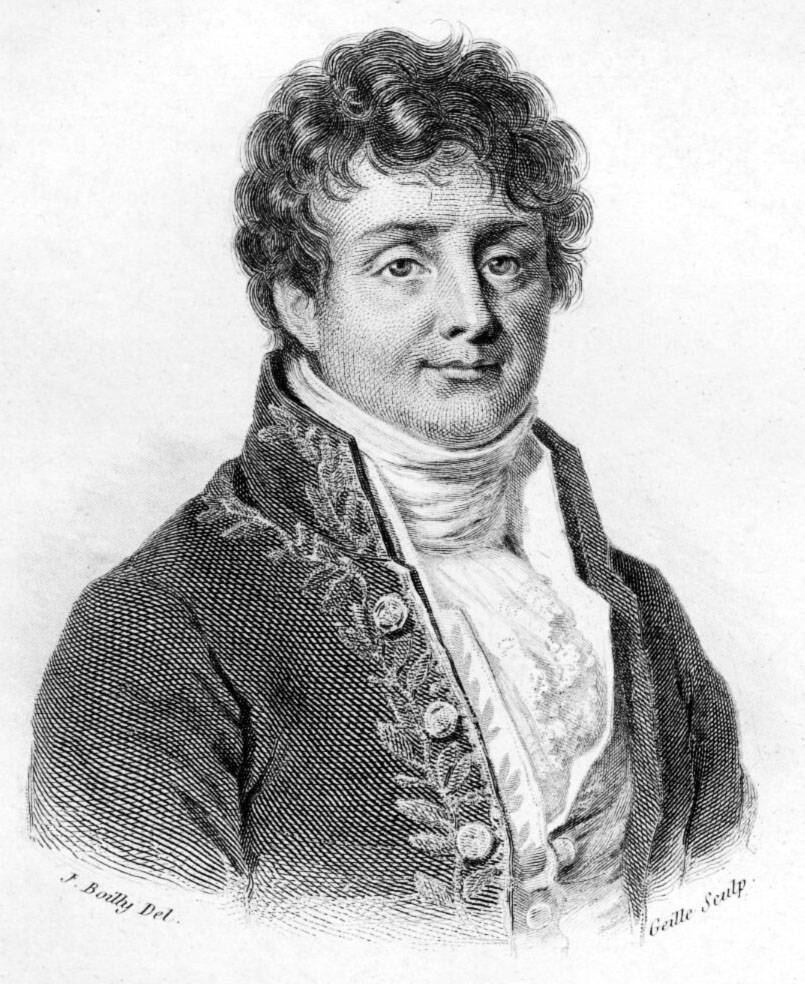

## 傅立叶（Jean Baptiste Joseph Fourier，1768-1830）——生平与成就

将一个新的工具引入学术领域，通常会在该领域激发一系列的重要成果。商博良于1822年对罗塞塔碑的成功解读就为埃及学提供了这样的一个火花。学者突然之间就能翻译埃及文物上的象形文字了。也就是在那一年，傅立叶发表了开创性的著作《热的分析理论》，为19世纪余下时间内的纯数学和物理数学的重大突破铺平了道路。

这些新工具出现在同一时间并不是巧合。商博良本就是傅立叶的门徒，1799年发现罗塞塔碑的法国科考队的领队正是傅立叶。傅立叶的一生，他以一位严肃的埃及学家和能干的政府官员——而不是一位数学物理学家——更为人所知。如今，我们铭记他是因为以他名字命名的数学工具。

1768年春分时刻，法国又迎来了一个春光明媚的季节。在距离巴黎东南100英里的欧塞尔镇，让·巴普蒂斯特·约瑟夫·傅立叶出生了。他的父亲是约瑟夫·傅立叶。老傅立叶和他第二个妻子艾德米·杰曼·勒贝格育有九个孩子，他和第一个妻子还生有三个孩子。傅立叶是这十二个存活下来的孩子中的老九。

傅立叶早年的情况我们知之甚少。只知道在他九岁之前，他的父母就相继去世了。有位莫顿女士将孤儿傅立叶从不幸中拯救了出来，并出资让他就读于皇家军事学院——一所由本笃教会运营的当地军事学校。正是在此处，傅立叶第一次发现了数学的乐趣，将所有的业余时间都投入到这个新的爱好中，并同时准备当一名军官。1787年从当地军事学校毕业后，傅立叶希望在巴黎蒙太古的本笃教大学继续读书。但是不知出于什么原因，他的申请被拒了。

发现从军无望，傅立叶别无选择，只得走上另一个当时有才华的法国年轻人通常会选择的道路：神职。在靠近奥尔良的小镇弗勒里的圣·伯努瓦-上卢瓦尔的本笃教修道院，傅立叶当上了一名学徒。不久，院长意识到了傅立叶的聪明才智，让他负责院里的教学工作。对于一个还在神职道路上孜孜以求的人来说，这可是一个很大的负担。但是过了不久，傅立叶开始怀疑他是不是真的要将神职作为自己的职业。他更强烈地渴望去研究数学和物理。他给一位朋友写的便条可以证明这点：“昨天是我21岁的生日。在这个年纪，牛顿和帕斯卡已经获得了不朽的名望。”

傅立叶做出的第一个重要数学研究是在修道院里进行的。1789年，他向位于巴黎的科学院提交了一篇关于等式理论问题的论文。著名数学家勒让德和蒙日推荐该论文于当年秋天发表。但是论文最终未能发布，因为在1789年7月14日，一群暴徒攻占了巴士底狱，法国大革命开始了。

应该说，文章被取消发表是法国大革命对傅立叶的影响中最小的一个了。巴士底狱被攻占后不久，傅立叶离开了修道院。他回到老家并在其母校教授哲学，历史，修辞以及数学。

革命的环境对年轻的傅立叶有着影响。在傅立叶晚年，他这样写道：

>随着平等概念的自然产生，就有可能形成这一最高的希望：在我们中间建立一个自由的国度，没有国王和修士， 将多年以来被掠夺的欧洲大地从这双重枷锁中释放出来。我已做好准备投入这场运动。在我看来，所有国家所进行过的运动中，这是最伟大、最美丽的。

傅立叶用实际行动来回应他的热情。他加入了欧塞尔市民监督委员会，该组织的任务是确保政府命令得以实施。更具不幸意味的是，傅立叶还加入了当地的普罗社区，这一社区和革命派雅各宾党是同一立场的。雅各宾党的首脑——最著名的是罗伯斯比尔——认为一个充满活力的、中央集权的政府对于整合大革命所带来的进步是必要的。到1793年中，雅各宾党将更为温和派的吉伦特党人从国民议会里赶了出去。

在欧塞尔的普罗社区，傅立叶成为一个卓越的演说家并为人所知。在一次会议中，他的演讲“为法国军队效力的必要”是如此具有说服力，以致那个区域的征兵名额全都由志愿者填满。他还致力于保护欧塞尔的公民不受罗伯斯比尔和其公共安全委员会在全法国强推的恐怖统治的威胁。1794年，傅立叶对与他共事的当地官员腐败的尖锐批评使得委员会发出了一项法令，要将其逮捕并送上断头台。

傅立叶前往巴黎为自己辩护但是没有成功。他回到家后，当地的监督委员会发出逮捕令和处决令。但是支持他的公众呼声是如此强烈，该项命令被撤销。但是八天之后，在来自巴黎的公共安全委员会的压力下，该项命令重新生效，傅立叶还是被逮捕并被关了起来。

欧塞尔的公民们再次站到支持傅立叶的一边。他们派出一个代表团前往巴黎，见到了克劳德-路易·圣·朱斯特，罗伯斯比尔的同事，也是公共安全委员会的成员。经过不懈努力，傅立叶的支持者们说服了朱斯特下令释放傅立叶。但是不用多久，这些都无所谓了。随着罗比斯比尔、朱斯特和其他雅各宾党领导人的被捕和被杀，恐怖统治突然之间就终止了。接着就是大赦天下，傅立叶也被释放了。

雅各宾党控制的国民议会在高等教育领域留下了一份遗产，并对傅立叶的职业生涯产生了巨大的正面影响。1794年，它下令在巴黎建立高等师范学院，教授与革命新环境相匹配的大学程度的课程。议会希望师范学院能与其他高等教育的专门学院（比如由独裁者建立的矿业学院）不同。作为鲜明的对比，师范学院由法国最好的学者教授涵盖广泛的课程。其数学教学人员中包括著名的数学家拉格朗日，拉普拉斯以及蒙热。傅立叶的家乡立即推举他成为师范学院的一名学生。

师范学院的寿命比法国大革命期间发明出来的其它东西的寿命还要短。1795年1月学院开张，5月就关门大吉。幸运的是，这点时间对于傅立叶来说已经够了，蒙热已经对他有了深刻的印象。

1794年，议会还建立了理工学院，为那些将来要从军的学生们提供工程和应用科学方面的培训。师范学院关门后，很多科学和工程方面的学生转学到了理工学院。虽然傅立叶也想这么做，但是理工学院有就学年龄的限制，入学学生必须是20岁以下而傅立叶已经25岁了。多亏有蒙热的帮助，傅立叶克服了这个障碍。

一开始，蒙热想为傅立叶谋一个教书的位置，但是学校没有多余的预算增加教员。于是蒙热为傅立叶谋了一个警务干事的职位，负责维持教学厅里的纪律。傅立叶当年的日记表明他也帮助蒙热备课，主要是在军事环境下的科学和数学的应用方面。

在理工学院期间，傅立叶早年与雅各宾党的纠缠最后一次骚扰了他。从多方面来说，替代罗伯斯比尔的政府也不比其前任好到哪里去。它会怀疑每个街角处都酝酿着阴谋。因为他和雅各宾党的联系，因为他和罗伯斯比尔的关系——虽然是罗伯斯比尔亲自下令逮捕傅立叶——政府逮捕了傅立叶。到8月，在聆听了朗格朗日、拉普拉斯、蒙热以及傅立叶的学生们的申辩后，政府同意释放傅立叶。

1797年，傅立叶接替拉普拉斯成为分析和力学教授，尽管此时他在科学或者数学方面还完成没有什么原创的研究工作。很快就不会如此了。他于1798年发表了他的第一个数学成果：笛卡尔关于符号规则的新证明。在多项式：$f(x)=x^m+a_1x^{m-1}+...+a_m$中，两个相邻的系数称为组合。如果它们同号，那么该组合被称为是“持久”的，如果异号，则是“变化”的。笛卡尔原则认为，正数根的数量不会超过变异的数量，而负数根的数量不会超过持久的数量。傅立叶给出了一个简明许多的证明。

第一篇论文成功发表后，傅立叶激情满怀。但是他的研究和教学生涯却很快迎来了一个意外的中断。1798年，法国政府任命拿破仑·波拿巴领导前往埃及的一次探险。拿破仑向蒙热和化学家贝托雷请教，要他们挑选一个探险队里的科学家。5月份，蒙热推荐了他的学生兼同事傅立叶。3个月后，傅立叶被任命为埃及研究所常务秘书。

拿破仑于1798年7月末率领探险队前往埃及，并于1799年8月返回巴黎，成为第一执政官。他走之前的几个月，拿破仑委任傅立叶作为两支探险队中其中一支的领队。该探险队整个1799年秋都在上埃及研究纪念碑和铭文。也是这个探险队与1799年7月发现了罗塞塔碑。

在埃及，傅立叶和探险队又呆了两年，直到1801年英法和议签署，法国人被迫撤离（同时将罗塞塔碑交给了英国人）。埃及探险既然已经结束，傅立叶希望能回到理工学院的教学岗位。但是拿破仑有别的打算。

在和傅立叶埃及探险相处的几个月中，拿破仑被傅立叶的外交和军事才能打动。到1801年，拿破仑在法国已经大权独揽，不再需要他人的批准就能委任傅立叶担当伊泽尔省地方行政长官一职，长官衙署位于格勒诺布尔市，靠近意大利边境。这个岗位这则重大。长官必须执行中央政府的命令，同时也要为当地公民的需求负责。傅立叶担当此任期间，兢兢业业，清廉公正。虽然很多长官利用职权，将来自巴黎或者老家的亲朋好友安插到本地的职位上，傅立叶所做的正好相反。他确保有能力的本地人就职那些重要的岗位，其中就有商博良，那位解读了罗塞塔碑的学者。

1804年2月，就在拿破仑加冕为皇帝之前的三个月，他巡视了格勒诺布尔并封傅立叶为新成立的荣誉军团的骑士。5年后，拿破仑将傅立叶册封为男爵。

尽管他认认真真地执行者地方长官的职责，傅立叶渴望免去这些政府职责而追求数学中的乐趣。1807年，蒙热和贝托雷试图说服拿破仑解除傅立叶的行政职务，但是对于这些游说，拿破仑阁下是听不进去的。傅立叶辛勤工作于政府职责中，即便格勒诺布尔的刺骨寒风让他患上了严重的风湿病。他有段时间曾考虑过流亡，从而能逃避那繁重的政府工作而享受更健康的气候。

不管怎样，1807年时，傅立叶还是找到足够的时间研究他的热扩散理论。那年年末，他向法兰西学院提交了一篇名为《论固体中热的传播》的文章。这篇文章可以视为15年后他要发表的《热分析理论》的前导。学院委派数学家拉科鲁瓦、蒙热、拉普拉斯和拉格朗日成立一个委员会来判定这篇文章是不是值得发表。前三位都同意发表。拉格朗日反对发表，因为他不同意傅立叶所做的将函数展开为三角级数的做法——这个方法如今被称为“傅立叶级数”。这部分的数学在本书中重印，这也是傅立叶最为人所记住的贡献。

傅立叶觉得他的科学研究所获得的报酬有限，于是他转而投向另一本巨著《关于埃及的描述》，他是这本书的主编。最终此书有二十卷，前后耗时二十年（1808-1827）。1810年新年，法兰西学院宣布悬赏征集关于热力学理论的数学原理和验证的最佳论文。另外，还保证将该作品发表在学院刊物上，而且如果评审中觉得得奖的论文有价值，还将单独发表。

1811年9月23日，也就是截稿前的一周，学院收到来自一位名叫博尔赫斯的安托万·卡东-米盖尔的投稿。他提交了一份21页的论文，将热描述为“人类回归火的符号”。傅立叶的文章有215页之多，在五天之后递交。这也是他1807年论文的修订。

拉格朗日，拉普拉斯和蒙热是评审委员会成员，成员中还有马吕斯和奥伊。拉格朗日再次反对傅立叶的工作，但是他不得不同意傅立叶的论文是收到的论文中最好的。拉格朗日得以成功阻止单独发表傅立叶的论文，并迫使它只能在学院刊物的常规发行中发表。而事实是，1811年到1827年间，学院的刊物《众学者呈现的成果》（`Memoires presentes par divers savants`）都没有得以发行。

尽管拉格朗日于1813年4月去世——随之而去的还有他对傅立叶的数学的反对，傅立叶意识到，唯一能确保可以发表他工作的方式是将其修订到书的样式然后自己发行。在修订期间，拿破仑于1814年4月宣布退位。尽管他对拿破仑的忠诚使他处于被新恢复的王朝起诉的危险境地，但是新政府承认傅立叶在作为伊泽尔省地方行政长官时的公正性。也因为如此，他为要求继续留任。

一年后，拿破仑从艾尔巴岛的流放中卷土重来，这大大考验了傅立叶的忠诚度。他组织起城市的防御以抵抗拿破仑。拿破仑强行破开城门是在1815年3月7日。不久前，傅立叶逃离了格勒诺布尔。第二天，拿破仑发布命令解除傅立叶长官之职——傅立叶盼望这个解除令可是盼了8年啊！再过一天，这两位老相识在格勒诺布尔城外又见了面，而拿破仑立马委任傅立叶担任附近罗纳省——其首府位于里昂市——的行政长官。傅立叶别无选择只好接受任命，不然拿破仑大有可能把他给关起来。傅立叶不久就辞职了，因为他收到了来自巴黎的命令，逼得他必须解除任何曾表示过对王室效忠的官员的职位。

傅立叶怀疑拿破仑在位置上能待多久。很显然的是，到了6月18日，英普联军在滑铁卢战役中打败了拿破仑。四天后，拿破仑逊位，被流放到了位于南太平洋上的圣赫勒拿岛。到了7月8日，路易十八重回巴黎，波旁王朝重建。

傅立叶在王室和拿破仑之间的摇摆使他在新政府的眼光中显得很不良。他最终辞去了政府任命，但是收入方面也来源窘迫了。他向新政府申请补贴。一开始，政府是准备同意发放的，但是最终拒绝了这个请求。

傅立叶再次得到了以前的学生兼同事的帮助。沃尔维客的沙布罗尔伯爵是他以前的学生，也是埃及探险队的前同事，目前担任新政府赛纳省（包括首都巴黎）的地方长官。他为傅立叶提供了省统计局局长的职位，而该职位可以为傅立叶提供一份不错的薪水。傅立叶终其余生都将担任此职位。

一开始，新国王拒绝同意将傅立叶选入法兰西学院的科学院中。国王还因为其与拿破仑的联系而将蒙热流放了。不过到了1817年，国王同意了，傅立叶被选入科学院，而到了1822年，傅立叶成为其常务秘书之一。

1822年也是傅立叶发表其巅峰之作《热分析理论》的一年。在该作中，傅立叶主要的焦点是固体中热的传播。本书中节选的第三章是我们最感兴趣的。在该章中，傅立叶证明任何函数f(x)都可以表示为在$[-\pi, +\pi]$区间内的三角函数无穷级数：

$\frac{1}{2}a_0+\sum_{n=1}^{\infty}a_ncos(nx)+\sum_{n=1}^{\infty}b_nsin(nx)$

伟大的瑞士数学家丹尼尔·伯努利在18世纪40年代末期研究乐器的弦震动的数学分析时，曾指出如此的无穷级数表示是存在的。但是他没能确定这个序列的系数。傅立叶的伟大成就就在于他得出了这些系数的值。早在他1807年的论文中，傅立叶就证明：

$a_0=\frac{1}{\pi}\int_{-\pi}^{\pi}f(x)dx$

$a_n=\frac{1}{\pi}\int_{-\pi}^{\pi}f(x)cos(nx)dx$

$b_n=\frac{1}{\pi}\int_{-\pi}^{\pi}f(x)sin(nx)dx$

简单的说，傅立叶是这样来确定这些值的。他先假定：

$\frac{1}{2}a_0+\sum_{n=1}^{\infty}a_ncos(nx)+\sum_{n=1}^{\infty}b_nsin(nx)$

然后处理如下：

  - 为了确定$a_0$的值，傅立叶将等式两边在区间$[-\pi, +\pi]$上进行积分。
  - 为了确定$a_n$的值，傅立叶将等式两边乘以$cos(mx)$，然后在区间$[-\pi, +\pi]$上进行积分。
  - 为了确定$b_n$的值，傅立叶将等式两边乘以$sin(mx)$，然后在区间$[-\pi, +\pi]$上进行积分。

傅立叶做了两个关键的假设。首先，他假定函数f(x)是可积的。其次，他假定无穷级数和的积分，比如：

$\int_{-\pi}^{\pi}\left [ \sum_{n=1}^{\infty}a_ncos(nx)+\sum_{n=1}^{\infty}b_nsin(nx)+\frac{1}{2}a_0 \right ]$

等于各无穷级数积分的和：

$\sum_{n=1}^{\infty}\int_{-\pi}^{\pi}\left [ a_ncos(nx)+b_nsin(nx) \right ]dx+\frac{1}{2}a_0\int_{-\pi}^{\pi}dx$

（这就是无穷级数和的定积分的分配律。）

19世纪剩下的时间里，数学家们花费了大量精力来确定适用这些假设的函数的范围。

傅立叶最终发表《热分析理论》时已经50多岁了。他的身体状况开始变差，特别是他的慢性风湿病。他也可能患上了疟疾——可能是他在埃及的时候染上的。他一生未娶，虽然他的朋友们会说他特别喜欢和聪明的女士作伴，其中就有索菲·热尔曼，最早期的杰出女数学家之一。

1830年5月4日，傅立叶被严重的风湿病击垮，病逝于1830年5月16日。按照他医生的诊断，死亡原因是神经性心绞痛和心脏问题。

傅立叶在物理方面的成就围绕着他对固体中热传递问题的解决。这个问题不在自牛顿以降便一统物理学的常规和天体力学范畴之内。从这个角度来看，傅立叶的工作在数学物理方面取得了重要的成果。在这一工作中，他发明了一种新的数学手段，不然这种方法很可能不会被发展出来。19世纪剩下的时间里，它为数学物理和纯数学中的多项发展铺平了道路，直到今天仍然是这两个领域中最基本的分析工具。

伟大的英国数学物理学家开耳文勋爵会这样描述傅立叶：

>傅立叶的理论不光是最瑰丽的现代分析结果之一，而且它为处理几乎所有当代物理中最深奥的问题提供了一个不可或缺的工具……傅立叶是数学家中的诗人。