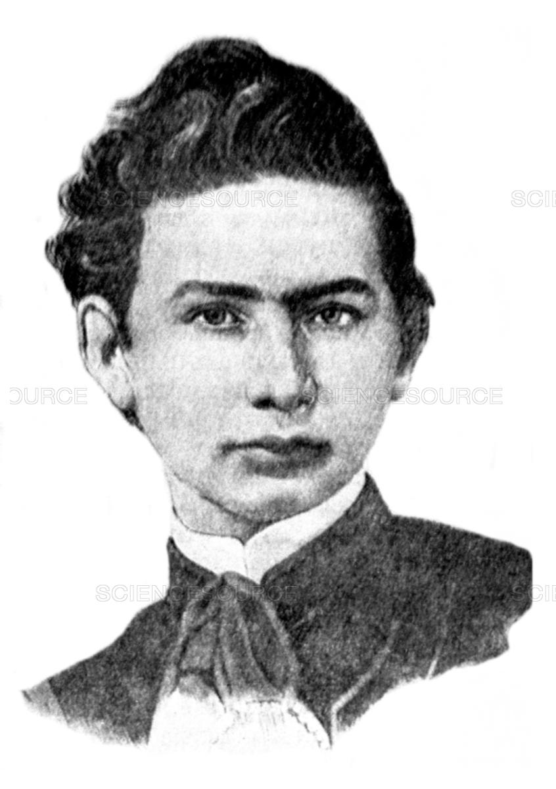
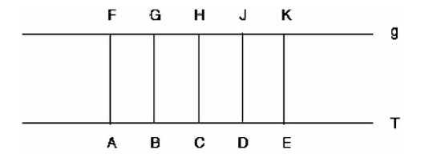
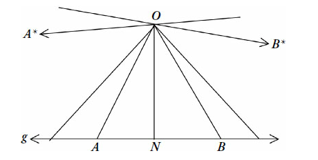

## 雅诺·鲍耶（János Bolyai，1802-1860）——生平与成就

在《奥德赛》中，荷马写下这样的诗句：“鲜有子嗣，与父比肩；综观诸世，多有不如；超越父者，几无已矣！”本书中写到的其他数学家都不是数学家的儿子——雅诺·鲍耶是例外。他的父亲法尔卡斯·沃尔夫冈·鲍耶（1775-1856）是位略有成就的数学家。两人都曾钻研过欧几里德的平行公设。老鲍耶试过但没能证明之。他得知小鲍耶在研究同样的问题后，建议他放弃，并用一句老话来规劝他：“按我说的做，不要照我做的做”。小鲍耶忽视了父亲的建议，而最终创立了非欧几何。

为了理解儿子的成就，我们必须先了解一下他父亲的工作。本章是关于他们两父子的。

鲍耶家族来自古老的匈牙利贵族家庭鲍利亚·鲍耶。这个家族早在13和14世纪就以其保卫祖国抵抗土耳其人的侵略的英勇事迹而著名。这一家族曾经很富有，但是到了18世纪中叶已经衰落。老鲍耶的父母分别是加斯帕尔·鲍耶和柯兹蒂娜，他出生于靠近特尔古穆列什镇的多玛德村上鲍耶家族已经大大衰败的鲍耶家族祖产之上。彼时，特兰西法尼亚是奥匈帝国之匈牙利王国的一部分。第一次世界大战结束后，特兰西法尼亚成为罗马尼亚的一部分而该镇改名为特尔古穆列什。

加斯帕尔为法尔卡斯开蒙，直到在他6岁那年让其进入附近纳吉泽文市的加尔文改革福音派学校就读。学校的老师很快意识到法尔卡斯在语言、音乐，当然还有数学方面的才华。12岁那年，他的才华为他赢得当柯梅尼—当地一位重量级男爵家的八岁小儿子—老师的委任。这一职务使得法尔卡斯能继续接受教育——他的家庭很可能负担不起的教育。在当地学校毕业后，法尔卡斯和柯梅尼一同进入附近克卢日的加尔文教会大学。

匈牙利于1699年脱离奥斯曼帝国而独立，但是90年后却落于奥匈帝国的统治之下。法尔卡斯于1790年抵达克卢日之时，该城正是自由主义和匈牙利民族主义的温床。所以毫无疑问地，他受到“理性而不是信仰才是理解宇宙之根本，且其使人类大幅进步”这样的观念的重大影响。特别地，这正是真正的匈牙利文化之根本所在。

法尔卡斯和柯梅尼1796年毕业后，他们没有选择去往帝国首都维也纳继续接受教育。他们先是报名入学普鲁士的耶拿大学，然后再进入著名的哥廷根大学。在哥廷根，他们接触到了数学和科学方面最新成果。对法尔卡斯而言，最重要的是他运气非常好，他在哥廷根的时候，有史以来最伟大的数学家高斯也在那里。他们成为了好朋友，其有生之年都保持着通信联络。

法尔卡斯和柯梅尼在哥廷根衣食无忧地生活了两年，完成了学业。此时柯梅尼的父亲经济上出了问题，信用被蒸发了。法尔卡斯甚至没钱回家。一年间他只好四处借贷、乞讨才能勉强维持贫困的生活。后来一位匈牙利的朋友给他汇来足够的钱还了债，并能使他步行回家。

回到克卢日后，他找到了一份教员的工作。法尔卡斯觉得他的收入足够支撑一个家庭了，于是和一位当地外科医生的女儿苏珊娜·冯·阿科斯结了婚。一年后的12月15日，他们的第一个儿子诞生，并取名为雅诺。新的家庭成员带来了新的财务压力，法尔卡斯不得不遵从他父亲的意愿回到特尔古穆列什的家中，在当地的加尔文教会学校任职，教授数学、物理和化学。这份工作的收入也很微薄，不过法尔卡斯通过编写和排演他自己的剧本，经营大学的客栈，甚至设计瓷砖、铸铁炉具等……还是能有一些额外的收入。

法尔卡斯和苏珊娜所有的孩子中，只有雅诺能活到成年。法尔卡斯和苏珊娜的婚姻并不幸福，于是他越来越将其注意力放到小鲍耶身上。小鲍耶在四岁的时候，就能在夜空中认出那些最明亮的星座。他也在很小的时候就展示出了对数学的掌握，能够辨认不少集合图形，甚至能知道正弦函数。在五岁的时候他自学如何读书，七岁的时候可以进行小提琴独奏！小鲍耶在九岁前都是在家中学习。老鲍耶教他数学，当地大学中最好的学生教他其它科目。

1812年，在他十岁生日前不久，雅诺进入当地大学学习。不出意料，他学业进展飞速，经常去上给比他大好几岁的学生才上的课程。法尔卡斯主义到亚诺13岁就精通了微积分，觉得他儿子最好能在哥廷根接受高斯的教育。对雅诺而言，无疑这是最好的计划。不幸的是，高斯拒绝了他老朋友的建议。鲍耶只好找别人来继续教育雅诺。

1818年，雅诺于当地大学毕业，但无论维也纳大学还是佩斯大学都不能提供吸引他的数学课程。前往国外的大学？那不可能，因为法尔卡斯的财务状况不允许。在最后，雅诺决定就读于维也纳的皇家工程学院学习军用工程。通常要七年才能学完的课程，他在四年内完成。在维也纳期间，他和读法律的萨斯成为好朋友。他们一起花了很多时间研究平行公设。

亚诺在就读皇家学院期间开始研究欧几里德的平行公设，他忽视了父亲让他不要这么做的警告：

>你不应该如此尝试研究平行（公设）。我对它的始末了如指掌——并为此度过了无数个不眠之夜，还丧失了生命中的每丝光明，每点快乐……你应对之避之不及，就像躲避猥亵的性欲一样。它会剥夺你所有的闲暇，你的健康，你心灵的平和，所有的快乐……这一无尽的黑暗也许能消耗掉一千座牛顿那么伟大的灯塔，永远不会照亮地球。可悲的人类将永远无法获得纯而又纯的东西，更谈不上几何了。

法尔卡斯还在哥廷根的时候就开始对平行公设的研究并在雅诺还是个小孩子的时候取得了他个人最大的进展。

法尔卡斯试图证明欧几里德平行公设采用的途径是他之前很多数学家使用的。他试图证明某条直线的“等距线”本身也是一条直线。

法尔卡斯先考虑线段BD以及线段CH，CH垂直于BD并交于C点——BD的中点。他将T看成是“几何可移动”的固定图形BCDH（形状像T倒过来），并将T沿着直线AE在两个方向上无限移动。法尔卡斯试图证明，由点H构成的曲线g是一条直线。他先假定g不是直线。注意到g应该是相对线段CH对称，法尔卡斯费力地声明g应该在H点之外再次和CH相交。

法尔卡斯在1804年末将他的证明发给高斯。高斯很快找出法尔卡斯证明中的一个错误，也就是认为g会在H点之外再次和CH相交，并回信向他的朋友指出了这一点。后来，大家也知道了，假定g是直线实际上等同于欧几里德的平行公设。

高斯的回应彻底让法尔卡斯泄了气。他放弃证明平行公设的尝试，并将其余生致力于找到更简单也更合理的欧几里德平行公设的等价公设。因此，法尔卡斯1820年对雅诺的警告就不奇怪了。那只是来自父亲的一份忠告。雅诺没有在意，并开始自己的尝试。他先试图证明平行公设，并最终构造了非欧几何。

1822年从皇家工程学院毕业后，雅诺立即成为皇家军队中的一名副上尉，并被派往利沃夫（如今属于乌克兰）。正是在1823年11月3日，雅诺从利沃夫给父亲写信说道“从一无所有，我找到了另一个全新的世界”。

雅诺考虑一条直线g以及线外的一点O，做出O到g的垂线，并与g交于N点。他再假定点A和B在g上，而位于N的异侧。然后，也许是出于他作为工程师受到的培训，也许是来自萨斯的建议，他将射线OA沿着点O逆时针旋转，并注意到会有一个位置OA\*，转到此处后，射线会从g上弹起而不再和g相交。同样对于OB，他沿着顺时针方向旋转，而得到$OB^*$，在这个位置OB从g上弹起。

然后雅诺问了一个很有趣的问题：$OA^*$和$OB^*$是各自的反向延长线吗？如果是，就得到欧式几何。如果不是，那么就出现非欧几何，且平行公设不成立。注意到在此情形下，$OA^*$和$OB^*$之间有一个正角度。而角$NOB^*$和角$ONB$之和小于两个直角。由此，雅诺很容易得出结论，即在该几何中，三角形内角和小于两个直角。

要过一年多后，雅诺才正式向父亲展示他的新几何。法尔卡斯一开始还是很谨慎的。毕竟他曾经也认为自己做出了重大突破，却最终失望至极。这对雅诺没有什么影响，因为他经常会被安排新的任务，在帝国东部诸省来回奔波，没有时间考虑发表他的工作。但是到了1831年，法尔卡斯对他儿子的工作产生了热情，在他日记中写道：“（这是）一个原创且伟大的成果，至今为止由匈牙利人做出的最伟大的成果。”

雅诺于1831年拜访了父亲，法尔卡斯强烈要求雅诺允许他将他的《绝对空间的科学》发表在《尝试》中。《尝试》这篇伟大的数学纲要是法尔卡斯经过十年的努力才发表的。考虑到他儿子的成就，在发表后，法尔卡斯立即将雅诺论文的拷贝寄给了高斯。

读完雅诺的论文后，高斯写了一封回信：“我认为这位年轻的几何学家鲍耶是第一流的天才。”他对法尔卡斯的回应赞许不多，更多的是陈述事实。

>现在谈谈您儿子的成果。您也许会有一些震惊，因为我会说我无法赞美这个成果，但我确实别无选择。赞美它等于赞美我自己。整篇论文的内容，您儿子所采用的途径，以及他得到的结论，几乎处处和我自己的想法吻合，而我过去30-35年来一直处于如此的思考之中。

法尔卡斯震惊了。

雅诺也很失望。当时他们还不知晓罗巴切夫斯基也同时发现了非欧几何，而高斯的回应看起来是要剥夺雅诺的优先权。即便雅诺确信了高斯的声明的真实性，他对这位伟人选择将他早先的发现置于沉默而感到苦涩。

高斯的回应无疑是雅诺不断易怒和健康状况变差的原因。1833年6月，由于好几个月受到高烧的感染，雅诺被迫退伍，年方30。雅诺先是回到特尔古穆列什和父亲一起生活。但是他和继母特丽莎处不好。法尔卡斯和特丽莎于1824年，即雅诺生母去世后三年结婚。

一年后，雅诺前往多玛德，住在鲍耶的祖产中。在那里他遇见了罗莎莉·冯·欧班，他事实上的妻子。他的年金很少，无法支付必须的保证金来正式成婚。

雅诺终其与生继续其数学工作，特别是复数的几何表示。1837年，莱比锡的雅布龙斯基协会征集论文关于此主题。得知他父亲也为此提交了论文后，雅诺很苦恼。两人的文章都没有发表。事实上，尽管雅诺写下了大约2万页的笔记（这些笔记现存于特尔古穆列什的图书馆），他一生中除了《绝对空间的科学》之外没有发表任何东西。

到1846年，罗莎莉为雅诺生下了三个孩子，其中有两个存活。不知出于什么原因，也许是为了更接近他新近鳏居的父亲，雅诺在那一年从多玛德搬家回到了特尔古穆列什。搬到离父亲更近没有什么好处。父子关系反而变僵了。

他们离得近的一个结果是，法尔卡斯很方便地将罗巴切夫斯基的《平行线理论》的一份拷贝（该拷贝于1848年抵达）交给了雅诺。雅诺仔细研究了罗巴切夫斯基的成果，并将他的想法记录在标为《几何探究》的一本笔记中。一开始，他认为罗巴切夫斯基可能不过是高斯虚构出来的一个人物。最后，雅诺意识到他和罗巴切夫斯基各自独立地发现了非欧几何，而这个俄罗斯人同样享有这一名望。

雅诺和罗莎莉最终在1849年正式成婚，因为法律有了改变，不再要求他支付一笔法律意义上的保证金。但是他们婚姻并不快乐，三年后他离开了她。

法尔卡斯最终于1851年从大学教职上退休，并死于1856年11月20日，死因是一系列的中风。那时，雅诺也针扎于常年的疾病。他三年多后去世，时在1860年1月27日。

雅诺去世之时几乎不为人知，也就没有留下他的肖像。匈牙利邮政局为了纪念他逝世100周年而发行邮票——该邮票在本章之首印出——的时候，只好按照想象画了一幅他的肖像。

《绝对空间的科学》一直为人遗忘，直到巴尔策1867年的《数学原理》第二版将其与罗巴切夫斯基的《平行线理论》一起讨论时才为人所知。进一步的认可来自法国数学家于埃尔一年后将其翻译到了法文。最终的致敬来自19世纪末，伟大的法国数学家庞加莱用了“鲍耶-罗巴切夫斯基几何”来描述这两位数学家同时发现的非欧几何。