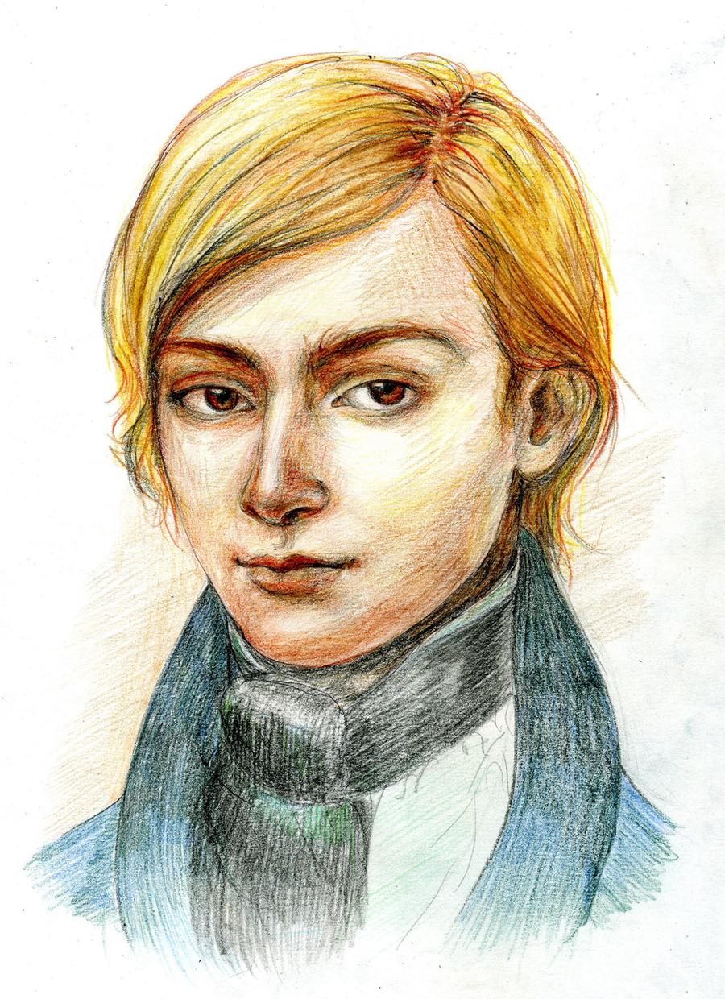

## 伽罗瓦（Évariste Galois，1811-1832）——生平与成就

年轻的时候，我们的世界没有边界。一切皆有可能。这世界一切的罪恶——不管其多么复杂，都在你的掌握之中——而不论解决之道之根有多么激进。多么具有讽刺意义啊！伽罗瓦，这位本书中讲到的最短命的数学家，他证明五阶以上的多项式没有根的通解公式，而奠定了他的地位！

1811年10月25日，尼古拉斯-加布里埃尔·伽罗瓦和妻子阿德莱德-玛丽（娘家姓德曼特）生下了一个儿子伊瓦里斯特，一位有可能是有史以来最早熟的数学家。伽罗瓦家族无论是父母的哪一边都没有数学天才的记录。但是他还是有着智力基因可循。他的外公和和一位舅舅是巴黎法学院的法官。他的父亲和祖父均为一所学校的校长。

伽罗瓦在出生地皇后镇——距离巴黎约五英里——长大。拿破仑1815年百日回归期间，他父亲是该市的市长。他母亲在他12岁之前是他唯一的教师。她为他打下良好的希腊文和拉丁文的基础，并向他传递了她和她丈夫共同拥有的对宗教的怀疑态度。

1823年，伽罗瓦12岁那年，他的父母为他报名入学位于巴黎的著名的路易大帝公立中学寄宿。这一著名的预备中学如今还存在，其校友中包括罗伯斯比尔和维克多·雨果。很可能他的父母认为路易大帝公立中学是一个自由的环境，而他们的儿子可以在其中接受教育，成长于日趋变得越来越保皇和保守的国家之中。事实证明，他们错的很厉害。

在路易中学的头几个月，大量的学生造反，反对校长在校内重新引入保守的耶稣会士教师的计划。一些学生拒绝在教室里背诵经文，有些拒绝在某个强制的教会服务中演唱。更多的人拒绝为濒死的国王路易十八敬酒。虽说这些行为应该是伽罗瓦十几岁时的典型行为，我们不知道他是不是也是造反者之一。不管怎样，校长因其造反行为而立马开除的四十名学生中，伽罗瓦不在其内。

也许伽罗瓦根本就没有参与这些造反行为。在路易中学的头两年，他的行为可称楷模，赢得了一等奖学金，因其功课而获得若干荣誉表扬。但就在此时，伽罗瓦对他的学业开始感到厌倦，第三年的表现糟糕透顶，不得不留级。幸运的是，他重修三年级的时候第一次开始上数学课而他成绩斐然。这一课程为他引进了勒让德的几何课本，而据说伽罗瓦读这本书的速度和别人读小说一样快。

伽罗瓦不仅是成绩突出。他沉浸于数学之中，为此付出了其他学科荒废的代价。很快，除了数学，别的学科的成绩都是一塌糊涂。他的修辞学讲师将他描述为“放荡不羁”。只有他的数学讲师韦尼耶赞许伽罗瓦惊人的天才。他写道：

>数学是占有了他的激情。我觉得如果他的父母允许他不要学习别的，这样才是对他最好。在这里他只是浪费时间，一无是处而只是折磨他的老师，而他也被各类惩戒所压倒。

韦尼耶还写道，他的学生应该获得更多的方法，但是伽罗瓦还不拥有。没有听从韦尼耶的建议，伽罗瓦提早一年参加了著名的理工大学的入学考试，甚至没有参加该考试的那些常规准备课程。不出所料，伽罗瓦没能获准入学，因为他还未掌握若干基本的数学领域。对伽罗瓦来说这太不公平了，而韦尼耶试图对他说明，这个结果其实不意外。

不管怎样，韦尼耶鼓励伽罗瓦参加由伟大的老师理查德举行的一个数学特别班。理查德很快注意到伽罗瓦的天才并试图帮助他的明星学员不经过入学考试而进入理工学院。不出所料，理工学院拒绝考虑这一请求。作为回应，伽罗瓦越来越不顾理查德课程中的作业，开始写一篇关于连分数的小论文，并于1829年3月发表在《数学年刊》之上。他那时才17岁！

1829年之春，伽罗瓦着手于为科学院写他的第一篇论文，一篇关于代数式的解的论文，并准备在7月再次参加理工大学的入学考试。事情的进展再次不那么顺利。那年6月份，某位教士在一些粗俗的笔记中伪造了伽罗瓦父亲的名字，而大大惹恼了伽罗瓦大家族中的好多成员。伽罗瓦的父亲收到随之而来的丑闻的羞辱，于7月2日自杀。伽罗瓦理工学院的入学考试当然以惨败而告终。结果是他不得不选择师范学院，一所培养中学教师的学校。

他的论文也没落到什么好。学院指派伟大的数学家柯西来审阅论文。但是柯西一直忙于自己的研究，抽出时间来审阅。1830年7月他写信给一位同事说，他病得厉害，无法将对伽罗瓦论文的评判和他自己的论文提交给学院。一个月后，柯西提交了他自己的论文但是没有提交对伽罗瓦论文的评判。反之，可能柯西鼓励伽罗瓦修订一下他的论文，重新提交论文给数学家傅立叶，学院的数学和物理的常务秘书，以参加数学大奖竞选。啊哈，傅立叶1830年4月去世了，也没有记录表明傅立叶将伽罗瓦的论文分发给大奖评审委员会的其他成员。

1830年对伽罗瓦和法国来说都是重要的一年。1824年登基的国王查理十世在众多方面比1那些1789年大革命之前8世纪的法国国王更加独裁。7月26日，查理和他的幕僚颁发了法令，禁止新闻自由，并大大削弱了立法记过的权力。当天巴黎市民就暴动了。三天后，他们废黜了查理，并推选了奥尔良公爵路易-菲利普为新王。

6月和7月，革命与反君主主义思潮在巴黎掀起。师范学院院长决定将学生关在校内以防止他们走到街上造反。伽罗瓦怒了，他试图翻墙来逃出学院。失败后，他别无选择，只好参加微积分和物理的考试。7月22日，在九名参加微积分考试的学生中排名第四。两周半后的8月9日，在八名参加物理考试的学生中他排名第三。我们只能假定，伽罗是被师范学院墙外发生的事件分了心。

考试考完了，七月革命也结束了，校长也不能再把学生关在学校里了。伽罗瓦很快借助新形势并参加了人民之友会。这是一个极端共和派秘密组织，其宗旨是彻底废除君王制。伽罗瓦的政治动作很快使他陷入与学院的深深危机之中。在校长的开除令生效之前的12月，他从学院退学了。

离开学院后，伽罗瓦立即加入了国民警卫队炮兵团，这是其成员大部分是反君主共和派成员建立起来的自卫队的一个分支。12月21日，一所巴黎法庭将计划对四名前查理十世的部长宣判，他们被判犯下了叛国罪。激进的共和派认为除了死刑还能判什么刑呢！炮兵团（包括伽罗瓦）在罗浮宫外待命，一旦法庭宣判的是终生监禁，就准备发起暴动。尽管局势异常紧张，但是没有爆发冲突。法国革命和美国革命的英雄拉法耶侯爵呼吁和平，而群众似乎也平静了下来。尽管如此，感受到其对王伟的威胁，12月31日，一道皇家法令解散了国民警卫队炮兵团。

既然从学校退了学，伽罗瓦决定自办一个每周的数学课。在《学院通讯》上的声明中指出，这个课程将包括那些新的数学话题，新到从来没有在公开课程中讲过。第一堂课在1831年7月13日举行，地点在靠近巴黎大学的一个书店里，有将近40名学生参加。也许其中有些人希望在教室的前面而不是后面见识一下这位狂热的激进派。不论如何，课程只进行了几次。伽罗瓦的政治活动重新占据了他的时间。

1830年这个动荡的12月，国民警卫队炮兵团中有19名成员北部，罪名是向暴徒们秘密提供了大炮。他们的下狱和审判占据了伽罗瓦的时间。他们于1831年4月被无罪开释，随即于5月9日在“勃艮第之采收"饭店举办了庆祝酒会，伽罗瓦是组织者之一。《基督山伯爵》以及《三个火枪手》的作者大仲马在日记中这样写道：“全巴黎都很难找出200个人对政府的憎恨要比那些下午五点重聚在花园上方底层长长大厅中的人更强烈。”

在酒会上，伽罗瓦拿出一柄小刀，举起酒杯，说了一番提到新国王路易-菲利普的祝酒词。酒会上的某些人认为他们听到伽罗瓦的词儿中有威胁国王的言语。其他人认为是其他人说了那些话，而此时伽罗瓦正在祝酒。政府选择相信最坏的那面，于次日在伽罗瓦拜见母亲的时候逮捕了他。他被囚禁在巴黎的圣佩拉杰监狱，等候审判。

审判于6月15日开始。伽罗瓦的律师对陪审团说，伽罗瓦所说的是“致路易-菲利普，要是他背叛的话”，此时他正挥舞着小刀，人群中很多人没有听到他说“要是他背叛的话”，因为当时太吵了。检察官开始讯问他时，伽罗瓦成为他自身最不利的证人。检察官问他是不是真的想杀死国王，伽罗瓦回答说：“是的，要是他背叛的话。”他接下来预测国王事实上会背叛人民，即便他还没有开始如此做。幸运的是，法官要求陪审团根据伽罗瓦在当时狂热派对的情形下判断他的所说和所指，而不是在更为庄严的法庭中并发过誓的情形下。陪审团也许为伽罗瓦的年轻打动，他们经过几分钟的讨论便裁定他无罪开释。

伽罗瓦还是没法摆脱麻烦。多年后，庆祝攻陷巴士底狱会被认为是正常的爱国主义行为。但在1831年，穿着被法律禁止的炮兵团制服庆祝这一天——也是伽罗瓦和他的共和派朋友杜卡特雷所作的，是异常严重的行为。这两位朋友因此行为而被囚禁于圣佩拉杰监狱。

七月的结束标志着1830年七月革命的周年纪念。为了纪念逝去的英雄，圣佩拉杰监狱的典狱长安排了一次纪念他们的弥撒。弥散当时的气氛非常紧张，这也不出所料。犯人们被关在各自的牢房里，到处可闻“救命啊！杀人了！”的呼叫。住在对街阁楼的一位狱警开了一枪，伤到了一个犯人。伽罗瓦暴怒了，他指责典狱长谋划了这次射击。典狱长的回应是将伽罗瓦投进了地牢。

伽罗瓦在那里待了三个多月，直到被正式起诉并加刑六个月。在监狱的时候，他得知学院拒绝了他最新的文章。其秘书阿拉戈说数学界泊松的回应是：

>我们竭尽所能理解伽罗瓦的证明。他的论据既不充分清晰，也没有充分展开，能让我们判断其精确性。我们甚至对他的论文毫无想法。
>
>作者声称手稿中包含的命题是有着丰富应用的更通用理论的一部分。通常理论的不同部分如果放在一起可以互相澄清也更容易被理解。我们希望等待作者发表他工作的更完整的内容，然后再形成更确定的意见。

读到这个，伽罗瓦崩溃了。他决定在朋友舍瓦利耶的帮助下自己发表论文。本书会选取其中两篇。以下是其论及的数学的简要描述。

所谓多项式方程是形如：

$a_0x^n+a_1x^{n-1}+a_2x^{n-2}+...+a_{n-1}x^1+a_n=0$

的式子。其中n的值被称为多项式的阶。最简单的多项式方程是线性方程：$ax+b=0$。这个一次方程显然其解是：$x=-b/a$。

在欧洲沉沦于黑暗时代的时候，印度和阿拉伯的数学家开始研究二次方程式，形如：$ax^2+bx+c=0$的二次方程。大概在900年，印度数学家释律徒罗 （约870年——930年）一般化了丢番都《算术》中的解法并发现，如果这样的等式有解，那么解的形式一定形如：

$\frac{-b+\sqrt{b^2-4ac}}{2a}$

虽然释律徒罗没有用这个形式给出结果，他的代数方法和我们当今代数教科书中的证明几乎一致。对于释律徒罗来说，(\(b^2-4ac\))必定要是非负数才能使这个二阶方程有解。虚数在数学中的引入要等到释律徒罗之后的一千年。我们现在知道这个二阶方程有两个解：$\frac{-b\pm\sqrt{b^2-4ac}}{2a}$，而不用管(\(b^2-4ac\))取什么值。如果(\(b^2-4ac\))=0，我们称之为重根。

16世纪开始了文艺复兴，欧洲的数学家们开始研究更高阶方程的解。1545年，意大利数学家卡尔达诺（1501-1576）在其《大衍术》中发表了立方等式（也就是三次方程）：$x^3+ax^2+bx+c=0$的通解公式：

$\sqrt[3]{\frac{q}{2}\pm\sqrt{\frac{q^2}{4}+\frac{p^3}{27}}}$

其中：

$p=b-\frac{a^2}{3},\, q=c+\frac{2a^3-9ab}{27}$

《大衍术》一书中也有四次方程：$Ax^4+Bx^3+Cx^2+Dx+E=0$的通解公式：

$-\frac{B}{4A}+\frac{\pm_sW\pm_t\sqrt{-(3\alpha+2y\pm_s\frac{2\beta}{W})}}{2}$

该公式由卡尔达诺的学生法拉利（1522-1565）找到。这个公式太复杂了。我就不再用慢慢一页纸向大家解释W，α，β，y是怎么计算的了。

既然卡尔达诺和法拉利是师生关系，也就不奇怪他们的证明都是从将x替换为如下的表达式作为出发点：$t-(b/na)$，

其中：

  * $n$是多项式的阶（比如3或者4）
  * $a$是$n$次项的系数
  * $b$是$n-1$次项的系数

这个方法也可以用来得到二次方程式的通解公式。

接下来的250年，数学家们试图用这个方法或者别的方法找到五次或更高次方程式的通解，也就是一个表达式，只牵涉到有限数目的项和加减乘除、指数和开方的操作，并求出根。

1821年，年轻的挪威数学家阿贝尔（1802-1829）认为他找到了长久以来一直寻找的五次方程的求根公式。虽然阿贝尔很快发现他的证明有误，但是他的工作没有白费。到1824年，阿贝尔证明对于一般的五次方程，没有通解。

此时，伽罗瓦还在十几岁的年纪，他开始研究五次方程问题。一开始，和阿贝尔一样，伽罗瓦认为他找到了解法。也和阿贝尔一样，他很快意识到他犯了错，也许是因为读了阿贝尔1824年的文章。他没有继续研究六阶多项式方程求解的问题，而是从当前问题，即找到五次或者任意类多项式方程解的问题，退后一步，问了一个更深刻的问题：

>假定一类多项式方程有通解，那么这些通解应该有怎样的特性？

我们再次看到，一位数学家先假定解法存在，然后去找到解法，或者证明不存在这样的解法。

伽罗瓦注意到，多项式的根本身满足一系列等式。考虑：

$23+\sqrt 3,\,23-\sqrt 3$

它们是二次方程$x^2-46x+526=0$的根，并且满足如下等式：

  * $A+B=46$
  * $A*B=526$
  * $A^2+B^2=1064$
  * ……等等

伽罗瓦进一步注意到，所研究的多项式的根满足任意一个如上的代数式，那么不论根的顺序如何，也满足以上的代数式。在上面提到的等式中，无所谓是$A=23+\sqrt 3, \,B=23-\sqrt 3$还是$A=23-\sqrt 3, \,B=23+\sqrt 3$。

伽罗瓦的洞见的关键要素是他考虑了重新排列，或者更确切的说是“重整”，那些满足任意代数等式的根经过此操作后还满足这些等式。

当然，这就引发如下问题，怎样对根进行重整后还能具备我们刚讨论的特性。为了回答这个问题，伽罗瓦开创了数学中的新分支，即我们现在所知的群论。首先他先研究重整组。考虑四个元素的几何$\lt a, b, c, d\gt$。现在对其重整，成为$\lt b, d, c, a\gt$。将$\lt a, b, c, d\gt$映射到$\lt b, d, c, a\gt$的动作是所有对该四个元素的有序集合所进行的重组中的一个。用现代的表述，这一特定重整被写为(1,4,2)(3)，因为他将第1个元素移到第4，第4元素调到第2，第2调到第1，而第3位的元素不动。将新排列的四个元素回归本来顺序的重整操作是(2,4,1)(3)，被称为是(1,4,2)(3)的逆操作。注意，(1,4,2)(3)和(2,4,1)(3)这两个操作先进行哪个再进行哪个是无所谓的。

现在考虑(1,3,2,4)这个重整。对有序集合$\lt a, b, c, d\gt$先进行(1,4,2)(3)，然后再进行(1,3,2,4)的操作，会得到$\lt a, c, b, d\gt$。相反，如果先进行(1,3,2,4)，然后再进行(1,4,2)(3)，会得到$\lt c, b, a, d\gt$，结果不一样了！这次，重整的顺序很重要。

伽罗瓦将他对重整组的研究放入更广义的群论中。一个群G是这样定义的：有一组元素{g}，和群操作（通常以°符号表示），并满足如下特性：

  * 如果g和h是G的元素，那么g°h也是G的元素
  * 如果f, g, h是G的元素，那么(f°g)°h=f°(g°h)（结合律）
  * 存在属于G的元素e，使得对于G中的所有元素g，e°g=g（e称为单位元）
  * 对于每一个G的元素g，存在元素h，使得g°h=e（h成为g的逆元，并被记为g^-1）

对n个元素进行的重整组操作被记为Sn。

考虑G的一个子群N，它（1）是G中元素的一个子集；（2）所有元素也满足刚才列出的那些特性。如果每个N中的元素n和G中的元素g，满足g°n°g^-1也是N中的一个元素，那么一个子群N或者群G被称为常态。

简而言之，伽罗瓦证明，一般n阶多项式方程有通解当且仅当每个重整组Sn的子群N是一个常态子群。然后他证明，对于所有的n<=4，Sn的每个子群是常态的，而n>5时则不是。这也就证明了无法为所有一般超过4阶的多项式方程找到根的通解。

伽罗瓦没能活到他论文发表的时候。他一直呆在圣佩拉杰监狱也没再惹新的麻烦。直到1832年3月中，霍乱爆发，迫使当局关闭了圣佩拉杰监狱。伽罗瓦也被转移到福崔埃休养院，直到他于4月29日获释。

伽罗瓦死于5月30日与一名叫做德宾维尔的男子的决斗之中。伽罗瓦生命最后一个月的情况我们所知不多，除了有一封他在决斗前夜写给一位朋友的信。他在给这位共和派的朋友的信中这样写道：

>为了一个不名誉的荡妇和上了她当的两个人，我会作为受害者死去。终结我生命的是如此不堪的一个丑闻。

给另一位朋友的信中他写道：“我被两个爱国者激怒……我无法拒绝。”

多年以来，历史学家都在猜测伽罗瓦进行这次送死决斗的原因。可能的原因包括保皇党的阴谋，政府的谋划，一名女奸细或者妓女。到了1960年代，一位历史学家研究了伽罗瓦新建的原稿，并注意到他在其中一封信中擦去了斯特芬妮·杜摩特的名字。进一步的调查表明，斯特芬妮-菲莉茜·鲍特琳·德·摩特是一位医生的女儿，这位医生在福崔埃休养院照顾过伽罗瓦。而德宾维尔是19名被控向暴徒们秘密提供大炮的共和党人之一。最终，我们有了确定性的证据：伽罗瓦是为爱而献身！

他死之前的那晚，他还给他朋友舍瓦利耶写了最后一封信（我们在此印出），信中伽罗瓦给出了他的成果的概要。伽罗瓦请求他朋友将其刊印在《百科综览》之上，舍瓦利耶做到了。在信中，伽罗瓦写道：“让雅各比或者高斯给出意见，不是对其正确性，而是对其重要性。”这两位数学家似乎都没有注意。

十年后，法国数学家利乌维尔注意到了。1843年，利乌维尔向学院宣布，他在伽罗瓦的工作找到了一个“美妙问题的正确而又深刻的解决方案，判定一个不可约简系数的方程是否有通解。”1846年，利乌维尔在《纯数学及应用数学期刊》上发表了伽罗瓦成果的全文。

伽罗瓦死的时候默默无闻，几乎无人读过——遑论理解——他的成果。现如今，他被冠以一个数学家能得到的最高荣誉。数学的一个分支以他的名字命名：伽罗瓦理论。