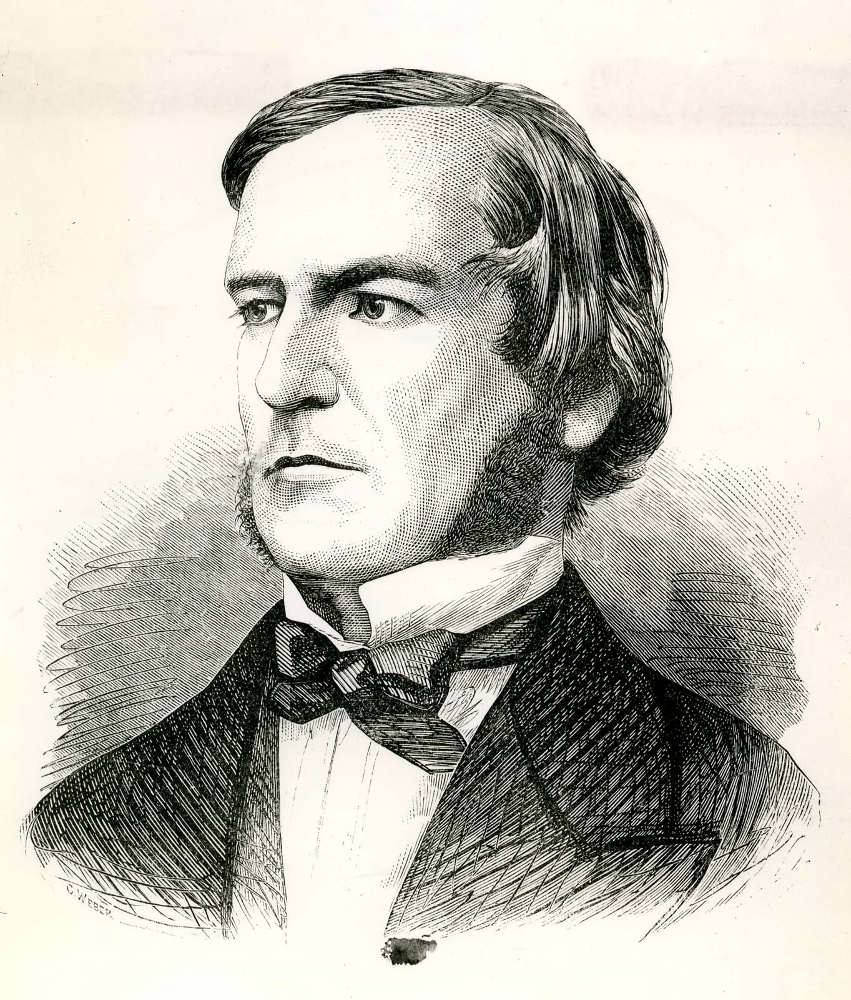

## 布尔（George Boole，1815-1864）——生平与成就

一类“淋湿在雨中”的人等同于这一类人：“[淋湿在雨中的人]与[[淋湿在雨中的人]”。这是所谓“幂等性”（按照字面意思理解是“自我乘幂”）的一个例子。布尔发现了它全部的力量。而他妻子对此的误解将导致他过早的去世。

布尔出生于英格兰北部的林肯，离英国有史以来最伟大的科学家牛顿的出生地不远。布尔的父亲约翰的家族在林肯住了很多世纪但是一直不富有。虽说他的职业是鞋匠，但他对科学仪器，特别是望远镜产生了浓厚的兴趣。1800年他23岁的时候去往伦敦寻找发财的机会。

伦敦没有为约翰带来财富，倒是带来了一位新娘。1806年，他遇见了玛丽·安·乔伊斯，一个古老的伯克郡家族的年轻女儿，在伦敦当女仆。他们约会不久后成婚，但是不得不在各自受雇的地方分开居住有六个月。那时的伦敦和如今一样，是英国最昂贵的住地。意识到他永远没有可能在伦敦发财后，约翰于1807年回到林肯并开始了制鞋生意。

玛丽一开始可能不是很适应北英格兰的气候。多年来她一直想要个孩子却一直没能受孕。到34岁那年，也就是结婚八年多后，她怀上了他们的第一个孩子，夫妇两人都欣喜若狂。1815年11月2日，她诞下一个儿子，取名乔治，为的是纪念他刚逝世不久的祖父。玛丽一定很适合当母亲。不久，她又生下了一个女儿而两个儿子。

虽说布尔一生都展现出害羞和不善社交的性格，但是在当地学校他的记录是出类拔萃的。他通过大量课外学习来补充他在教室里受到的教育。作为长子，他是父母眼中的心肝宝贝。他的父亲花了好多晚上教他制作相机、万花筒、显微镜、望远镜和日晷。

不过，布尔第一次获得名声还是要多亏他对古典语言的兴趣。在一位当地的书商那里学习了拉丁文后，布尔自学了古希腊文。14岁那年，他将希腊诗人梅里埃格的一篇颂歌翻译为韵律诗。译文大大打动了布尔的父亲，后者说服当地的《林肯先驱报》将其发表并附上译者的年纪。一位当地的校长写信给编辑说这样的翻译远远超过了随便哪个14岁孩子的能力。毫无疑问地，校长也对布尔的数学天赋产生了想法。

即便还在十几岁的时候，布尔就成了一个宗教异类。虽然他成长于英格兰东正教教堂下，他语言方面的能力让他可以阅读广泛的基督教神学作品。在一些早期的笔记中，布尔将基督教的三位一体和空间的三维进行了比较。在小时候，布尔对古希伯来关于上帝的概念——认为上帝是绝对统一——产生了兴趣。有一段时间，布尔甚至考虑转信犹太教。最终，他成了一名异类的一位论派。

要是他出身于更富有的家庭，布尔肯定会入学牛津或者剑桥。但这永远不会是他的命。作为一个努力谋生的鞋匠的儿子，布尔根本无法哪怕是去想一想接受大学教育，更别提他那非正统的宗教信仰会引起的问题了。

于是，年轻的布尔决定，既然不接受教育，那可以教育别人。17岁那年，他成为唐卡斯特的一名教师。他的非正统宗教观使得他在那里没能待长，不到一年后布尔来到利物浦教书。布尔对自己的教书和管理能力很有信心，于是仅仅六个月后他辞去利物浦的职位回到林肯。1834年秋，他开办了一所古典，商业和数学学院，一所教授年轻男女学子的走读学校。

布尔的校长生涯大获成功。到1838年，他全面接管了一所大得多的位于沃丁顿的学院。沃丁顿离林肯只有四英里，因此布尔能与林肯当地的慈善和教育机构保持联系。如果说布尔从父亲那里接受了科学指导，那么他一定是从母亲那里认识了良好工作的重要性。在20岁那年，他成为林肯女子悔过之家的联合创始人和委托人，这是一个为任性不羁的女性提供康复治疗的中心。他还是所谓“早点关门协会”的一名官员。这不是一个戒酒协会，而是一个寻求合理工作时间限制的组织。

布尔在林肯最重要的工程方面的关联是和力学院的关系。这个学院成立于1834年，正好是他回到林肯的那一年。这是一个贸易学校和图书馆的联合体，为工人阶级提供改善自身的途径。布尔是首批管理者，并确保图书馆中收藏了皇家学会的发行物以及伟大的英国著作、欧洲著作，不如牛顿的《原理》、拉普拉斯的《天体力学》、拉格朗日的《分析力学》。布尔学习着这些材料，不光读一次，而且是有必要的话多次阅读，以求精通。

布尔与力学院的一位恩主布罗姆黑德爵士，皇家学院成员的交往也使他受益匪浅。布罗姆黑德是剑桥毕业生，一位有才华的业余数学家，对数学天才有着伯乐般的眼光。（他刚成为诺丁汉数学家格林的资助人。）布尔肯定花了不少时间去拜访布罗姆黑德位于林肯郊外特比霍尔的家族庄园，从布罗姆黑德的图书馆中借阅了大量的书籍。

林肯的内外环境一定非常适合布尔。1838年，他发表了第一篇论文《论变分法中的某些定理》。他早年的论文主题广泛：微分方程，积分，逻辑，概率，几何以及线性变换。这些论文都发表在新近发刊的《剑桥数学期刊》上。到1843年，布尔有了信心，向皇家学院——大不列颠科学的最顶尖机构提交了他的论文《论分析的一般方法》。皇家学院差点不考虑他的论文，因为学院里没有人知道布尔是谁。幸运的是，学院数学委员会的头建议由两名专家来审阅论文。其中一名建议拒绝论文，不过他的意见没有占到上风。另一名专家不仅建议发表论文，而且提名该论文获得学院1841-1844年间最佳论文的金奖。他的建议占了优势，并为布尔赢得了大不列颠数学界的欢呼。

尽管有了这一褒奖，布尔延续着他的习惯，常常婉拒被介绍给那些伟大的数学家，因为他觉得自己的成果与他们相比实在微不足道。事实上在1845年他快30岁的时候，他还考虑进入剑桥从本科生念起。意识到他不能再逃避对其父母的经济义务，布尔转变了思路，他不再寻求进入大学学习，而寻求大学教授职位。幸运的是，皮尔爵士的政府在1846年通过了一项法令，决定在爱尔兰建立三所新的皇后大学。布尔很快提交这些新学校教授职位的申请，并希望能在一年内获得委任。但情形不是这样。爱尔兰爆发的大规模土豆饥荒将政府的注意力从建立大学转向更重要的事情。最终，1849年8月，他父亲去世后不久，布尔收到了委任，受聘于位于爱尔兰西南的柯克皇后大学。

布尔的论文《论分析的一般方法》是他在逻辑方面的开创性著作的前导。它关注的是数学分析对象的结构和形态，因此为他转向逻辑本身的结构和形态打下了基础。在这篇论文的后记中，布尔写道：

>我最渴望建立的一点是，高层次分析上的任何重大进步应该来自越来越注重于符号组合的法则。这一准则的价值怎么高估都不为过。

在学校中，布尔很快当选教务主任。每年大学开学，身居此职的布尔要为学校的教员发表年度演讲。他1851年的演讲题为《特别是建立在其与人文自然的关系上的科学的诉求》，包含了一些他三年后将在《思想之法则》中阐述的一些提示。在演讲中，他问道：

>首先，针对我们的思维能力，是不是存在一个一般法则，是建立一门科学所必需的；因为我们已经认识到，正是对一般法则的认同，而不是对特定事实的认同，才构成了科学。
>
>其次，假定这样的一般法则是可以被发现的，我们思维维持对其联系的本质又是怎样的？是不是和外界自然一样，是一种必然的屈从关系，还是一种特别类型的关系，在物质系统中没有先例，也没有对应？……
>
>如果问及是否从这些推理的常规准则中，我们能推出其基本法则的表示，我的回答是，这是可能的，而结果将构成数学真正的基础。我这里不是说仅关于数字和数量的数学，而是一种更大——而且我相信也是更真——的数学。以符号形式表述的通用推理，并由法则支配，其最终的居所是在人类的思想之中。

布尔之前最伟大的逻辑学家当属亚里斯多德和莱布尼茨。他们认为应该有可能以数学形式表达逻辑的基本定理。在布尔之前，很多数学家正是这么尝试的。比如，莱布尼茨研究了一种体系，将“所有X是Y”表示为“X/Y”。通过和算术的对比：

$X/Y * Y/Z = X/Z$

可以表示，如果所有的X是Y，而所有的Y是Z，那么所有的X是Z。不过这也就是布尔之前人们所作的极限了。所有之前进行的用代数形式表示逻辑的尝试都试图强制逻辑进入实数代数。布尔意识到需要有另一种代数。在《思维法则》中，他沿着抽象的道路前进，在代表实体的符号之上进行代数运算，而这些符号在之前根本未被认为是数学对象。两个类的交集用一个类似乘法的运算来表示，而两个类的合集用一个类似加法的运算来表示。

经典逻辑集中在“四种形式”的语句：所有的X是Y，没有X是Y，有些X是Y，有些X不是Y。布尔先从这些形式中的第一种开始：所有的X是Y。他这样来表示“所有X是Y”这个断言：XY=Y。因此，如果所有X是Y且所有Y是X，那么XY=YX。特别地，XX=X，也就是说X^2=X，对于所有X类，而不是对数字代数中两个特定值的幂等性法则。使用+来表示交集，布尔证明了类交集对类合集的分配律：Z(X+Y)=ZX+ZY。例如，Z（所有左撇子的人）和X（所有英格兰人），Y（所有爱尔兰人）的交集，等于左撇子英格兰人与所有左撇子爱尔兰人的合集。

布尔然后证明，类表示的这些纯符号运算可以用来表示经典的蕴涵结构，而不用考虑结构中参数自身的意义。布尔是这样证明“如果所有X是Y，且所有Y是Z，那么所有的X是Z”的。假定所有X是Y，所有Y是Z。用符号来表示就是：X=XY，Y=YZ。用Y=YZ替换X=XY得到：

$X=XY=X(YZ)=(XY)Z=XZ$

也就是X=XZ，表示所有X是Z。

布尔将引入符号1代表全集，而0代表空集，运算符-表示补集，从而得到更强有力的结果。P-Q这个类是那些在P中而不在Q中的元素的集合。这么一来，他就证明对于所有的X，X(1-X)=0，即矛盾律——没有一样东西可以有一个属性同时有该属性的反属性。

$X=X^2$
$X-X^2=0$
$X1-X^2=0$
$X(1-X)=0$

亚里斯多德认为矛盾律和幂等律处于同样的地位，都是逻辑推理必须的公设。利用其逻辑代数，布尔证明矛盾律可以从更直观的幂等律中推导而出，而幂等律表明拥有属性X和属性X（实际上你想要放多少次都可以）的对象集合，等价于拥有属性X的对象集合。该书写成半个世纪后，罗素将《思维法则》描述为“纯数学由此诞生”。

要说柯克见证了布尔最伟大的数学成就，此地也是他生命中最快乐的时光所处之地。来到柯克后，布尔很快成为约翰·里亚尔的密友，后者是学校的副总裁和希腊语教授。1850年，布尔遇见了里亚尔18岁的外甥女玛丽·埃弗瑞斯特。玛丽出身于格洛斯特郡的一个乡绅家庭。她的父亲托马斯是位国教教堂中的教士。他的哥哥，乔治·埃弗瑞斯特爵士是印度的总测绘员，他是第一个测量了世界最高峰的人，因此他将这座山峰以自己的名字命名！

和只在孩提时代见识过北英格兰的凛冽的布尔不同，玛丽算是见过世面的。她的父亲患有肺痨，多年来一直在气候较为健康的法国休假。在那里他接受了所谓顺势疗法。顺势疗法（字面意思是“类似某种疗法”）强调，通过服用小剂量的药物治愈某种疾病，而如果这种药物施加给健康人，会引发这一要治疗的疾病的症状。埃弗瑞斯特教士也认为早餐前进行长距离步行和冰水浴是晨间令人精力充沛的运动。

在日记中，布尔承认自己是个无可救药的浪漫派，时时陷入爱河也常常剑斩情丝。但是他们初见时布尔似乎对玛丽没有任何旖旎的念头。他满足于在1850年到1852年间的夏季教授她数学。而在1852年到1855年，他俩似乎也对就数学问题进行通信可以接受，更没见过面。1855年6月，托马斯突然去世，玛丽陷入了赤贫。处于浪漫的天性，布尔立即向玛丽求婚。玛丽接受了，他俩于当年9月11日成婚。

他们婚姻的前两年，住在一所叫做“大学风景”的屋子里，离大学也就10分钟步行的路程。这当然很方便。但很快布尔家就挤不下了，因为他们的第一个女儿玛丽·艾伦诞生于1856年，很快第二个女儿玛格丽特诞生于1858年。在玛格丽特出生前不久，他们搬到黑石镇的租赁房中，离大学有四英里，但是离火车站只有半英里。布尔家很喜欢这个房子，从那里可以看到柯克宏伟码头的美妙风景。

但是不久这间屋子对于日渐扩大的家庭来说又太小了。他们又添了两个女儿，阿莉茜亚诞生于1860年，露茜诞生于1862年。1864年他们还将迎来另一个孩子，这次还是个女儿。埃塞尔诞生于1864年。布尔一家搬到巴林坦布尔镇上的一所名叫利奇菲尔德小别墅的房子里。这里离学校近了一英里，但是离火车站就远多了。玛丽觉得这是一个机会，可以让布尔进行长距离的步行，她父亲一直鼓励进行这样的运动。这样可以有助于他经常抱怨的由风湿带来的烦恼。

但是长距离步行并没治愈布尔。有一次步行还要了他的命。1864年11月24日，布尔在暴雨中从巴林坦布尔走到学校。他衣衫尽湿地做完演讲，又走回巴林坦布尔。回到家后，他瘫倒在床上发起了高烧。玛丽对顺势疗法深信不疑，她开始朝着她丈夫的头上泼着一筒又一筒的凉水，希望借此治愈他。但是，很显然布尔患上的支气管肺炎不具备幂等性。冷水疗法只是加重了病情。玛丽最终在12月5日叫来了一位医生。但是一切已经为时太晚。布尔已经陷入了深深的高热并发的昏迷，并于三天后死去。

布尔生前获得了多项荣誉。都柏林三一学院和牛津大学都授予他名誉博士学位。1857年他当选皇家学院会员。但也许是其后人才给了他最高的荣耀。很多计算机语言都有一种类型的对象，取值为TRUE或者FALSE。它们被称为“布尔类型”！