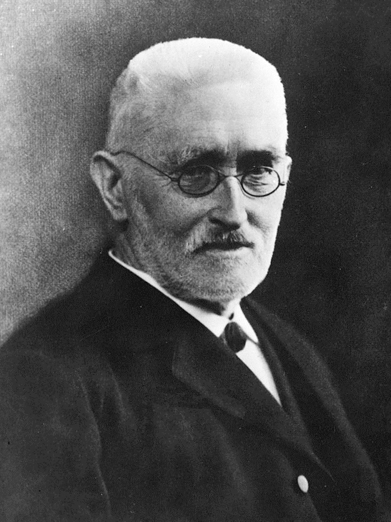

## 戴德金（Richard Julius Wilhelm Dedekind，1831-1916）——生平与成就

戴德金1831年10月6日生于德国的不伦瑞克，这也是高斯的出生地。他的父母是朱利叶斯·列文·乌尔里希·戴德金和卡罗琳·玛丽·亨利艾特·戴德金（娘家姓昂普锐斯）。他是他们四个孩子中最小的一个。他的家庭有着促人上进的知识氛围。这也不奇怪，因为这是一个在学术上颇有成就的家庭。他的父亲是不伦瑞克卡罗利能大学的法学教授，而祖父则是一位有名的化学家和物理学家。他的外祖父也曾是大学的教授。他的一个哥哥成为一名法官，而他的姐姐朱莉发表了几部小说。

追随着他哥哥的足迹，戴德金的正式教育开始于不伦瑞克的马蒂诺-卡萨林纽恩中学。一开始，他最喜欢的科目是化学和物理，而数学不过是学习它们有用的工具。但是等到他1848年进入卡罗利能大学，他不再喜欢化学和物理，他觉得它们的逻辑结构太混乱，而转向喜欢数学。在大学的两年中，戴德金只学习了数学和最抽象的物理科学。很快他就掌握了解析几何，微积分以及分析基础。

1850年，戴德金进入附近的哥廷根大学学习，他是班上准备最充分的学生。戴德金快速吸收着哥廷根的数学营养。他参加了高斯的最小二乘法讲座。50年后，他还记得当时的情形，并认为这是他所见过的最优美、最有逻辑性的数学阐述。在哥廷根，他还参加了一次数论讲座，这是数学系能提供的最尖端的课题。在这次讲座中，他遇见了比他略大的黎曼，并成为他的拥趸。1852年春，戴德金在高斯的指导下，完成博士论文，写的是欧拉积分理论。伟大的高斯一共有六个博士生，他是其中最后一个。[^1]

[^1]: 按照[维基百科的说法](http://en.wikipedia.org/wiki/Carl_Friedrich_Gauss)，高斯有七个博士生。比较为人熟知的，除了黎曼、戴德金之外，还有一位康托。

虽然得到了博士学位，戴德金认为自己的数学教育还没有完成。他又花了两年参加讲座，填补他认为他的知识中还缺乏的部分，然后才进行考试以便能让他成为一名大学讲师。他毫无悬念地以出色的成绩通过了考试，使他成为哥廷根的一名无薪讲师，为本科生教授几何和概率。

高斯于1855年去世后，戴德金感到对他而言是特别大的损失。但是戴德金的损失很快得到了巨大的弥补，他可以和高斯的继任者狄利克雷一起工作。尽管他本人也是教员的一份子，戴德金从来没有后悔去聆听狄利克雷的讲座。狄利克雷的讲座涵盖面非常广泛，包括数论，势论，定积分，偏微分方程等。这两个人非常亲密，很多哥廷根数学圈子的人开玩笑说他们简直就是连体双胞胎。但是，如果真的有人是戴德金的双胞胎的话，那个人应该是黎曼。他们才是真的形影不离，一起在哥廷根附近的森林中长距离的散步，讨论着数学话题。当戴德金获得一个更好的位于苏黎世理工学院的职位时，他因必须离开哥廷根和黎曼感到郁闷。最终，戴德金接受了这一远在苏黎世的职位。

虽然身在瑞士，戴德金的心却在德国。黎曼于1859年入选柏林科学院后，戴德金因有机会在黎曼访问柏林时陪伴他这位朋友而雀跃不已。这是一个明智的决定。在柏林期间，他见到了德国数学圈内的重量级人物：库默尔，博尔夏特，克罗内克，特别地，他见到了魏尔斯特拉斯。这些杰出很快结出了果实。1862年，他们安排戴德金获得了不伦瑞克理工学院——也就是之前的卡罗利能大学——的教职。戴德金回到了他的母校，也是他父亲任教的学校。虽然日后他还会接到更有身份的邀请，戴德金觉得在他的出生地才算是在家，他也拒绝了任何新的邀请。

戴德金在苏黎世的第一年教授过微分课程，这激起了他对数学基础的兴趣。随着课程的展开，他意识到他无法向他的学生们展示一个构成实数轴上实数连续性的坚实理论基础。他开始研究以解决这个问题。14年后的1872年，他发表了他的经典著作《连续性和无理数》，第一次给出了实数连续的坚实理论基础。他的这篇著作和另一篇他的文章《数字的本质和含义》在本书有收录。

自从公元前5世纪毕达哥拉斯发现了根号2的无理性后，实数轴的本质就受到了折磨。回顾数学的发展，戴德金意识到一类数不断扩展到另一类更广的数（且前一类数是后一类数的一部分）的进程。首先，是自然数：1，2，3，...扩展到所有整数类：正整数、零、负整数。对负整数的数学运算可以用整数来表示。然后整数扩展到有理数（并且是有理数的一部分）。而不久前，戴德金的导师高斯将实数扩展到复数（有实部和虚部）。

戴德金采用“分划”的概念将整个实数轴（包括有理数和无理数）以有理数加以分割。他一开始就注意到，每个有理数a将有理数集合分为两类：

  * A1，比a小的有理数集合
  * A2，比a大的有理数集合

另外，每个属于A1的有理数都比每个属于A2的有理数小。因此有理数a通过比较关系（小于和大于））“分划”有理数为两个独立的数集。

戴德金意识到，在有理数中可以构造很多其它的分划。例如，根号2将有理数分为两类：

  * A1，所有的正有理数（其平方小于根号2）加上0和所有负有理数
  * A2，所有正有理数（其平方大于根号2）

同样的，每个属于A1的有理数都比每个属于A2的有理数小。类似地，π也分划有理数为两类：

  * A1，形如a/b这样的正有理数，其比值小于圆周长与直径之比，加上0和所有负有理数
  * A2，形如a/b这样的正有理数，其比值大于圆周长与直径之比

同样的，每个属于A1的有理数都比每个属于A2的有理数小。

给出了分划的例子后，戴德金将概念一般化。任何详尽的实数分割而定义的A1和A2两个集合，且每个属于A1的有理数都比每个属于A2的有理数小，这样就定义了一个分划，并由一个实数标记。如果实数标记不是一个有理数（比如由根号2定义的分划），那么它必定是个无理数。

将实数以分划形式定义后，戴德金继续证明，对实数的算术运算能如我们所期望的那样进行，是因为基本的算术运算（加和减）在正有理数上保留了小于/大于关系。比如，由根号2和根号3创建的分划A1/A2和B1/B2。A1中任取一个有理数，B1中任取一个有理数。它们的积必定小于A2中任取一个有理数，B2中任取一个有理数的积。正如我们预期的，对应的分划就是根号6。

戴德金经常在瑞士或者提洛尔阿尔卑斯山消暑。1874年，他度假的时候在因特拉肯第一次见到了康托。戴德金对连续统的开创性研究，成为康托研究超限数的革命性成果的主要灵感源泉。（康托的事迹我们稍后再说。）正是借助康托在1870年代和1880年代和戴德金的书信，历史学家才了解了康托是怎样发展出他的概念的。

哥廷根超越了柏林，成为数学的显赫之地。但是不伦瑞克还是远远落后。戴德金在不伦瑞克没有收到博士生。不伦瑞克相对轻松的工作使得戴德金能监督两篇数学巨著的发行。1863年，戴德金发表了狄利克雷的《数论讲座》，来源大部分是他做的笔记。到1894年，该书已经四版。1866年黎曼不幸早逝，戴德金承担其发表他朋友全集的任务。这一经典著作在他朋友去世后第十年面世。他也监督发行了他导师高斯的全集。

戴德金还在1872年到1875年成为理工学院的校长，这也是因为不伦瑞克相对较轻的工作压力。虽然他讨厌行政性工作，戴德金还是很得意这样的一个事实：这个位置之前是他父亲和外祖父担任过的职位。1894年戴德金从大学职位退休。即便已经退休了，他一直到70多岁后还进行这演讲。和很多数学家不同，他喜欢演讲。

戴德金在其职业生涯中获得过众多荣誉。第一个来自哥廷根，1862年将他选入其科学院的通信会员。1880年，他从柏林科学院获得了类似的荣誉，1900年来自巴黎科学院和罗马科学院。1902年戴德金获得哥廷根大学博士学位50周年的时候，他获得了好多名誉博士称号。

戴德金对他在不伦瑞克的生活很满意，也就一直未婚。他和姐姐朱莉一起生活，直到她于1914年去世。1916年2月12日，他生了病，不久去世。尽管欧洲当时正处在第一次世界大战，法国和英国的数学家们还是为他的去世而哀悼，因为他们知道，和伟大的高斯最后一丝直接的关联也不再存在了。