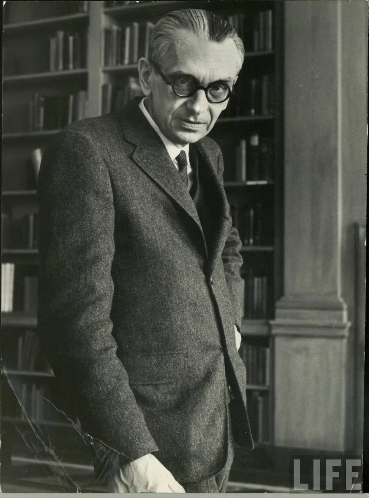

## 哥德尔（Kurt Gödel，1906-1978）——生平与成就

数学家向来以古怪而闻名。根据同名小说《美丽心灵》改编的电影为我们描画了数学家纳什在MIT和普林斯顿期间的种种古怪表现。也许纳什可以称得上是他在MIT期间最古怪的数学家，他肯定不是普林斯顿最古怪的数学家。那项荣誉毋庸置疑地归于哥德尔，有史以来最伟大的数学逻辑学家，当然也是最疯狂的一个。这同一个脑袋证明了当代数学中最深刻的结论，却也终生忧郁，在每件事情的后面都怀疑有着阴谋的存在。

哥德尔于1906年4月28日生于摩拉维亚的布尔诺，当时那是奥匈帝国的一个行省，现在属于捷克共和国。他的父母是鲁道夫和玛丽安，两人都是信仰信教的德国人。他是他们两个孩子中的次子。哥德尔家族无论是父系还是母系都没有展示出在数学或者科学上的杰出资质。而哥德尔有。

哥德尔受教育的早期进展迅速，他只用了四年就完成了相当于八年教育的课程。1918年他进入中学，此时捷克斯洛伐克刚于一战结束后成为一个独立的国家。哥德尔在学校的时候几乎总是获得最高分。讽刺的是，他唯一一次没有得到最高分是在数学课上！

这些早年的迹象，没有一个能预示着伟大的哥德尔能做到怎样的成就。基于哥德尔的德国血统，我们也就不奇怪，他和他哥哥鲁道夫于1924年进入维也纳大学学习，鲁道夫将学习医药。维也纳离布尔诺约75英里。哥德尔一开始想进行物理方面的学习。从他收藏的图书馆借书条——他可是个收藏成癖的人——来看，他在维也纳大学的前几年间建读了很多物理课本。

1920年代，维也纳酝酿着众多知识活动。一群科学家和哲学家自称“维也纳圈子”，每周聚会，试图将数学和物理建立在一个牢固的哲学基础上。1926年，哥德尔的导师，数学家哈恩邀请哥德尔参加会议。哥德尔参加了，也毫不犹豫地将他的注意力从物理转向了逻辑。

1900年的时候，希尔伯特这位世界上最杰出的数学家，在巴黎举行的第二届国际数学家大会上发表演讲，列出了23个问题，“科学的进步有赖于对这些问题的研究”。希尔伯特的第一个问题是确定实数连续统的基数，也就是要解决康托的连续统问题（见本书第18章）。希尔伯特的第二个问题是证明构成数学基础的算术公理的一致性。哥德尔用完全出人意表的方式解决了希尔伯特的第二个问题。对于希尔伯特的第一个问题，他也获得了第一个本质性的结论。

哥德尔收藏的借书条明确表明，1928年夏秋期间，他在选择博士论文主题的时候，他的兴趣已经确定性地从物理转到了逻辑。哥德尔选择谓词演算的完备性作为主体。谓词演算在逻辑中引入了全称量词（“对于所有的X”）和存在量词（“存在一个X”）。一个典型的例子是，可以将亚里斯多德的“所有人都会死”这一断言加以形式化。在谓词演算中，这一断言如此表示：

>对于所有的X（如果X是一个人，那么X会死）

一个典型的谓词演算定义形如：

>存在一个X，使得（性质A适用于X，且性质B适用于X）
>意味着
>存在一个X，使得（性质A适用于X）
>而且
>存在一个X，使得（性质B适用于X）

哥德尔的博士论文证明了两个结果。

  * 谓词演算的完备性，即，**所有**真命题可以得到证明。
  * 谓词演算的一致性，即，**只有**真命题可以得到证明。（否则就是不一致的。）

1929年2月，他的父亲突然去世。他的母亲和他的阿姨安娜搬来和鲁道夫和他一起居住。即使如此，1929年上半年哥德尔还是在写作他的博士论文。哥德尔的导师于1929年7月6日批准了他的论文，他于七个月后的1930年2月获得博士学位。

哥德尔的完备性定理为他在数学界赢得了一些声望。它以意想中的方式证明了一个伟大数学家提出的问题。处于当时的奥地利和德国的大学氛围，博士论文和博士学位还不足以获得大学教职。还需要再写一篇所谓的资格论文（Habilitationsschrift）。哥德尔为他的资格论文选择了一个更有挑战性的问题：证明作为数学基础的算术公理的一致性。1930年代初，哥德尔开始写作他的资格论文的旅程，并在当年早秋完成。和哥伦布一样，他的旅程将他带到了他根本料想不到的地方！

和希尔伯特一样，哥德尔采用的是意大利数学家皮亚诺的公设，作为自然数形式化算术的基础。

  * 公理1：0是一个自然数。
  * 公理2：每个自然数n有一个后续（不严格的表示为n+1），它也是一个自然数。
  * 公理3：没有一个自然数的后续是0。
  * 公理4：不同的自然数有不同的后续。
  * 公理5：如果某个属性P，适用于0，而且如果P也适用于自然数n，P也适用于n的后续，那么P对所有自然数适用。[^1]

在资格论文中，哥德尔证明：

  * 形式化代数的不完备性。他证明，在任何这样的形式化系统中，一定存在一个无法在系统内证明的命题，即便它的真实性是显而易见的。
  * 如果形式化算术是一致的，那么一致性无法在形式化算术系统中得以证明（而这正是希尔伯特所追求的）。

在这一过程中，哥德尔严格区分了可证性和正确性。

这就是本书中收录的哥德尔的成就。哥德尔这一了不起的结果依赖于两个重要基石。第一个是哥德尔数，它为形式化系统中的每个术语序列分配了一个自然数值。考虑这个简单的命题：

>0=0'（0等于0的后续，即0+1）

假定为这个命题中出现的三个属于分配如下的奇数：

|术语|奇数|
|---|---|
|0|23|
|=|15|
|'|21|

那么这个数：$2^{23}*3^{15}*5^{23}*7^{21}$就是术语序列0=0'的唯一表示。（从字面意义上看，它表示的是，第一个和第三个术语是0，第二个是=，第三个是'）。哥德尔接着表明如何在形式系统中找到有效证明的哥德尔数。

哥德尔不完备定理的第二个基石是下述命题的形式化：

>这个命题无法被证明。

这个命题断言了它自身的不可证。这是形如自古希腊以来就有的说谎者悖论（“这句话是假的”）的一个微妙变形。说谎者悖论的句子既不能为真，也不能为假，无论如何都会引起荒谬的结论。

而注重于可证性而不是真实性，哥德尔的说法避免了悖论。如果形式化的算术是一致的，那么意味着只有真的命题可以得证，那么哥德尔的命题必定是真的。如果它是假的，那么它可以被证明，和一致性相悖！更进一步的说，它无法被证明，因为那将证明其所断言（其不可证）的相反面！

再进一步，哥德尔证明，如果系统内部就可以证明一个形式系统的一致性，那么我们刚给出的非形式化论点就可以被形式化，而“这个命题无法被证明”这一说法的形式化版本，可以被证明，因此违背了自身，并证明了系统的非一致性！

哥德尔的两个非完备性定理发表于1931年3月，立刻在整个数学界引起了震荡。希尔伯特一开始很愤怒，因为他得知他巩固数学基础的伟大远景被证明是不可能的。但是，希尔伯特的助理博奈斯说服希尔伯特，哥德尔取得了一个真正了不起的进步。它们对哥德尔的职业生涯也有影响。

哥德尔一年后提交了这篇著作作为他的资格论文，并让他获得了大学的有薪职位。更重要的是，这篇论文引起了美国数学界的注意，他们邀请哥德尔作为访问学者前往新成立的位于新泽西的普林斯顿高等研究学院。

1933年到1934年学院运作的第一年间，有24名访问学者在该学院，哥德尔是其中之一。爱因斯坦是学院最早的八名永久教员之一。哥德尔在学院的第一年，他认识了爱因斯坦，不过两人成为密友要再等差不多十年。

在安静平和的普林斯顿度过一年后，哥德尔回到了骚动不安的维也纳。就在他回国前的一个月，一群纳粹分子袭击了总理府，并刺杀了奥地利总统。哥德尔回来后，他的健康状况和奥地利的政治状况一样，都变糟了。整个夏天他都受到牙痛的困扰。10月，他抱怨说精力透支，需要一个礼拜在维也纳郊外的疗养院进行康复。

哥德尔恢复了些许健康。1935年9月，他回到普林斯顿学院又进行了为期一年的访问。但是，不到两个月，他就再次陷入忧郁症的挣扎之中，并决定于11月回到维也纳恢复。这次，他用了几个月的时间在疗养院中康复。

康复后，哥德尔开始研究之前我们提到的问题：对希尔伯特的第一个问题，即确定实数连续统的基数的部分解，并取得了第三个伟大的成就。康托猜想该连续统的指数为1，也就是第二个超限数的基数。1938年，哥德尔证明，如果集合理论是一致的，那么加入连续统指数为1的公理不会破坏它的一致性。

二战开始前，哥德尔还可以再次访问美国。他有一个很好的理由不去，因为1938年9月正是学年开学的时间。也就在这个月，哥德尔终于结婚了。妻子是与之有浪漫关系的唯一一名女子：阿黛尔·宁姆斯伯格·波克特。

哥德尔第一次见到阿黛尔是在1928年末或1929年初，当时他正在写论文。他的父母立即反对他和阿黛尔的交往。哥德尔那时才22岁，而阿黛尔已经29了，正要离婚，出身于天主教下层家庭。在他们看来，最糟糕的是，她是一名夜总会的舞女！我们对他俩的约会精力知道的不多。哥德尔一生有着那些最无足轻重的小玩意的海量收藏，但是哥德尔这一近十年的感情生活却没能留下只言片语。他们的婚姻对哥德尔的密友来说也根本是一个意外。他们根本不知道哥德尔和阿黛尔的关系。

阿黛尔是哥德尔的女守护神，忍受他的生活方式并尽其所能照料他生活的诸多方面。哥德尔家里不知道的是，哥德尔1936年在疗养院期间，阿黛尔经常去看望他，也经常为他品尝食物。不幸的是，阿黛尔只能照顾他国内的事务。

哥德尔在二战前最后一次访问美国的过程，揭示了他一贯对自己的事务不上心的特点。在他出发前，他本应通知维也纳的院长，他要请假。对于古怪的哥德尔来说，直到10月底才申请，是正常的。他在美国期间，他在维也纳大学的授课许可也失效了。

1939年6月，哥德尔回到了已经完全纳粹化了的奥地利。1938年3月，随着德国和奥地利的合并，哥德尔和妻子自动成为德国公民。他从美国回来不久，帝国给他发下通知要他向征兵局报到。德国军方认为哥德尔不适合打仗，但是在后方做防守还是可以的。幸运的是，纳粹从未得知他因抑郁而接受治疗的事情。如果他们知道的话，很可能会把他送进集中营，而不是认为他适合进行卫戍的岗位。

当然，此时的哥德尔再也不想待在奥地利或者德国，希望永久地离开而在美国定居。整个1939年秋，随着德国军队席卷波兰，高等研究学院和哥德尔都试着为哥德尔和他夫人获取美国入境签证和德国离境签证。学院主任写了一封措辞腼腆的信给位于华盛顿的德国领事馆，说哥德尔是个雅利安人，也是世界上最伟大的数学界之一。德国政府肯定认为，哥德尔能继续其数学研究，而不是为军队服役，才是更重要的。

哥德尔一家最终在1940年1月获得了所有必需的旅行文件。他们害怕穿过北大西洋到美国的直航路线。英国人可能进行袭击并弄沉他们的船。如果英国人把他们给抓住了，他们会被拘禁——因为他们是德国公民。于是哥德尔绕了一大圈去往美国。他们先是乘坐穿越西伯利亚的火车来到海参崴，坐船到了日本的横滨，最后乘搭一艘美国军舰来到旧金山。这些旅程加在一起用了七个星期。一位美国移民官问哥德尔，他是否曾是精神病院的病人。哥德尔这次聪明地撒了谎：“没有”。具有反讽意味的是，哥德尔所有伟大的数学成就都在他1940年永久定居于学院之前完成。不过还有一个伟大的科学成就。1940年代末，哥德尔将注意力转向宇宙学。在一本纪念爱因斯坦的文集编辑向他约稿的文章中，哥德尔构造了一个旋转宇宙模型，并符合爱因斯坦的方程。哥德尔证明，在这个旋转宇宙中，不存在可以被认为是整个宇宙中绝对的一个特殊宇宙时间的概念。事实上，在这样的一个旋转宇宙中，封闭的类似于时间的线，也就是旅行到（遥远的）过去的时间线，在理论上是可能的。和他的不完备定理一样，这个结论也颠覆了之前人们的期望。

哥德尔回到普林斯顿后，他和爱因斯坦成了密友。在很多方面，他们之间的差异像两极那么大。哥德尔冷静冷酷，一本正经，对常识有着怀疑。爱因斯坦和蔼可亲，待人友善。也许爱因斯坦意识到哥德尔需要有人照顾他。也许爱因斯坦也欣赏哥德尔总是与他进行智力上的较量且不同意爱因斯坦本人的想法。例如，哥德尔就怀疑量子力学和引力的统一场理论很可能是无法实现的。而这正是爱因斯坦晚年研究工作的焦点所在。

爱因斯坦还在哥德尔生命中最奇怪也最好玩的一件事情中扮演了角色。哥德尔于1947年12月成为美国公民。为了准备听证会，他勤奋研究，勤奋的过了头。经济学家摩根斯坦也是他的密友之一，注意到随着听证会日期的日益临近，哥德尔越来越焦虑。听证会的前几天，哥德尔向摩根斯坦承认说，他在美国宪法中找到了一个严重的缺陷。在参议院休会期间，总统可以不经参议院批准而进行空闲职位的任命。而这，哥德尔理论道，将引起独裁！

摩根斯坦意识到，他和爱因斯坦必须劝说哥德尔，在他的公民资格听证会上揪住这点很可能毁了他获得公民资格的机会。爱因斯坦和摩根斯坦一起驾车送哥德尔前往特伦顿进行听证。路上，这两位朋友试图说服哥德尔避开这个话题，但没有成功。福尔曼法官问哥德尔：“类似德国这样的独裁者有可能在美国出现吗？”哥德尔——追随着他一贯对逻辑而不是实践的关注——以确定的口吻回答说会，并开始详细说明宪法中可能存在的缺陷。幸运的是，福尔曼法官也是爱因斯坦公民资格听证会的主席，觉得爱因斯坦的出席本身对哥德尔而言就是一个足够的参考，于是很快地将他导向别的话题。

哥德尔生命的最后三十年间，他的精神和身体状况急剧变差。他越来越隐世，也越来越抑郁。他也开始吃得越来越少。有时，一些著名的欧洲数学界来访普林斯顿的时候，他会拒绝离家，担心他们可能是来刺杀他的。

哥德尔晚年的时候，他有时下午会在家中见客。他总是确保他妻子会在30分钟后打断会见，提醒他该午睡了。我有一次听一位英国哲学家讲述这么一个有着惊人转折的故事。阿黛尔进门提醒哥德尔该睡午觉了，而哥德尔的回答是：“可我喜欢这个人！”哥德尔在1951年进行了最后一次公开演讲。1952年之后，他没有发表新的东西而只是修订之前的工作。他的笔记表明他在1950年代和60年代还尝试着继续工作，但是没能有任何完成的结果。整个1960年代，他还是关注着逻辑和集合理论的发展。其中最值得注意的是科恩在1963年证明，假定连续统的指数取不同于N1的指数，集合理论的公理可以一致地扩展。换句话说，从集合理论公理出发，得到了康托连续统假设的独立性。

哥德尔生命的最后十年，他越来越远离学院的生活。他刚来那会儿的人，大多数已经早就去世。他的笔记表明，他花费几乎所有的精力于两个问题。第一个是，他试图继续他早年在连续统假设上的成果所关联的问题。他认为连续统真正的威力在N2，也就是N1的下一个基数。他徒劳无功地试图找到集合理论公理，并从中导出这一连续统指数。哥德尔研究的第二个问题与他之前研究的问题截然不同。他试图形式化圣安塞姆上帝存在的本体论证明！好多数学家在哥德尔的年纪的都会经历数学产出的衰落。但很少有人像哥德尔那样，经历了精神和身体的双重衰败。

哥德尔总是关注于他的饮食和健康，特别是他的肠胃运动。从1946年开始，他在笔记中记下他每日服用的泻药数量。1951年，哥德尔因溃疡出血而必须住院。他出院后，他进行了严格的节食，每天只吃1/4磅的黄油，3个全鸡蛋，两个蛋白。他几乎不吃肉。后来到了1954年，哥德尔又一次严重抑郁。毫无疑问，他从这些病情中恢复，完全依靠阿黛尔对他爱心照料。

整个1960年代，哥德尔的身体和精神状况很危险，但还不至于致命。1970年代初，一切发生了变化。他再次为其健康而进入偏执状态，比之前吃的还要少。按照摩根斯坦的说法，哥德尔“看着像是行尸走肉”。不幸的是，妻子阿黛尔比他大6岁，她自己也开始因严重的健康问题（包括一系列的小中风）而受苦。她再也不能照顾他了。

1977年圣诞后不久，哥德尔最后一次入了院。他死于1978年1月11日，死时只有65磅体重。死亡证证明了他是饿死了自己的事实。

哥德尔只处理大问题，做出决定性的突破，然后将进一步的研究留给他人。他的职业生涯中从未带过一个毕业生，也从未在定居美国后进行过教书工作。但是尽管如此，哥德尔在数学基础上留下了他明显的印记。

[^1]: 这是数学归纳法的由来。