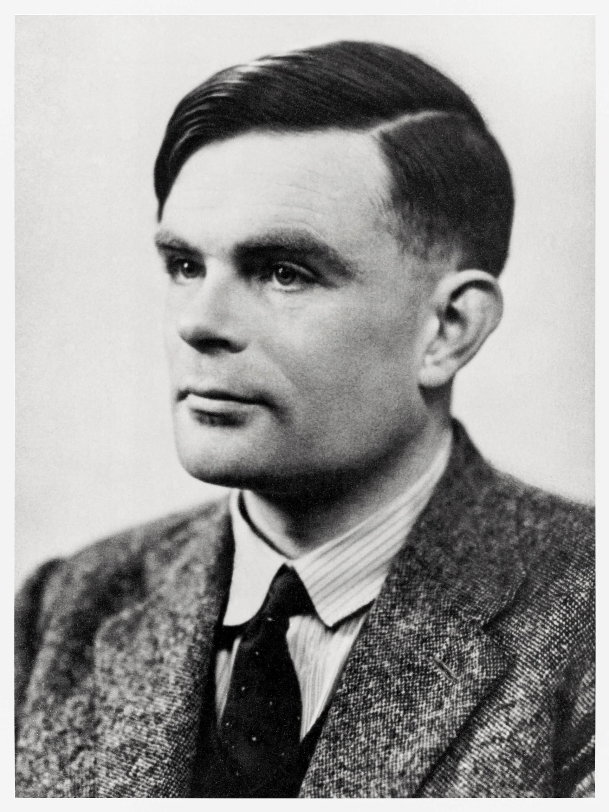

## 图灵（Alan Mathison Turing，1912-1954）——生平与成就

美国物理学家奥本海默正等着在国会委员会前作证，委员会试图剥夺他最高机密的特权。奥本海默的朋友兼同事拉比试图安慰他。拉比对他说：“奥比，要是在英国，你在原子弹上的成就足以让你获得骑士头衔。”

如果说奥本海默因领导曼哈顿项目，而结束了太平洋战争，因此记头功的话，那么图灵也应该同样被记头功：他破译了纳粹使用的加密设备Enigma，而将欧洲的战争提前结束。二战之后，图灵受到的荣誉比骑士身份低。获封骑士意味着要公开承认图灵破译了英格玛密码，而英国保守这个秘密长达25年，图灵早已死去多年。讽刺的是，在图灵因为“严重猥亵”行为而被捕时，这个荣誉没能起到什么用。反而加重了他违背公共道德的指控。他不仅是犯下了严重猥亵的行为，而且还是对一个劳动阶层的某人实施。

图灵出生于一个有着一些地位的家庭。图灵家族的先祖可以追溯到14世纪，来自北苏格兰的阿伯丁郡。1603年，詹姆士一世登基，斯图亚特王朝南下英格兰，当时他们必定是支持者。1638年，查理一世册封约翰·图灵爵士为从男爵。因为有这个封号，约翰爵士差点在英格兰内战中丢了命。

图灵的母亲埃瑟尔·斯通尼，来自一个爱尔兰新教徒家庭，1688年从奥朗热的威廉手里获得了土地。他们的一个远方堂亲乔治·约翰斯通·斯通尼于1894年创造了“电子”这个单词，那正是原子时代刚降临的时候。埃瑟尔的父亲爱德华在英属印度因建造铁路和桥梁而颇有名声。她和图灵的父亲尤里乌斯·马希森·图灵在1907年春认识，他当时第二次从印度回国。他获得牛津的学位后，在印度行政部门开始他的事业。他们于当年10月结婚并返回印度。第二年9月，他们的长子约翰出生。图灵是他们的次子，于1912年6月23日生于伦敦。当时全家正在英格兰度假。

受雇于印度行政部门的英国人过着既有好处也有代价的生活。在印度，他们生活近乎奢华，比他们回国后能过上的生活好得多。但是印度毕竟不是大不列颠，特别是对于孩子来说，回国后有很长一段时间无法和父母在一起。这也是小图灵的生活：在他九个月大的时候，父亲返回了印度，母亲六个月后也回了印度。这两个孩子留给沃茨家庭照顾。沃茨家和他们无牵无挂，是退役军官家庭，住在黑斯廷斯附近的一个小镇。

沃茨家没法给图灵家的孩子太多的时间，他们自己有四个女儿。沃茨上校古板又不尽人情。图灵也让沃茨太太失望，因为他对军事玩具没有任何兴趣。这就是图灵在成长期过的生活，父母都远在印度。幸运的是，老图灵于1926年辞去了印度的工作，此时图灵刚进入伯恩，一所古老的英格兰公共寄宿学校。

在伯恩，图灵一直没法适应。第一学年结束时，图灵的校长写信给他的父母：“如果他找到工作，他应该可以做的非常好。但同时，如果他试着作为学校的一分子而努力做到最好，那会更佳。他应该有更多的团队精神（`esprit de corps`）。”图灵在运动场上表现糟糕，同样在课堂上也表现糟糕。前一年半，他所有非科学类的科目的成绩都是垫底的。但是数学和科学的成绩就完全是两码事了。图灵很快在这些课程上出类拔萃。第二学年的下半学期，他“幸运地”得上了腮腺炎，于是有机会钻研这些课程而对其他科目置之不理。他待在学校疗养院的时候，研读了爱因斯坦狭义与广义相对论的通俗版本。

在伯恩的时候，图灵和克里斯多夫·摩康姆成了密友，他比图灵长一年级。摩康姆所是，正是图灵所不是。他各科成绩优秀，赢得了多项学校奖励。他们对数学都有激情，并希望能进入剑桥三一学院继续深造——那是一所培养了牛顿和罗素的学院，英格兰数学的真正中心。

1929年，两人参加了三一学院奖学金考试。摩康姆成绩斐然，顺利通过。图灵却没有。他一想到，虽然可以进入剑桥另一所学院，但不能和摩康姆朝夕相处就心烦意乱。但两人在剑桥没能共同相处。1930年2月，摩康姆突然发病并死于肺结核综合症。这个病是摩康姆小时候患上的。

摩康姆的死让图灵彻底陷入了孤独。他的父母只是一次离开他一两年，而摩康姆却永远的抛弃了他。图灵决定，要进入剑桥，而且凭一己之力完成两个人可以获得的成就。他做到了！图灵最终获得了剑桥国王学院的奖学金并于1931年秋天入学。从多方面来看，国王学院要比三一学院更适合图灵。拥有凯恩斯和福斯特的国王学院不像三一学院那样死守于传统。它的老师甚至会和学生们走在一起！对于图灵来说，能在剑桥学习数学是一种乐趣。他终于到了这样一个环境：伯恩学校所强调的那些特质，诸如体育才能，个人魅力，在这里统统不重要。这里只看重你的数学能力，而图灵是这方面的王牌！

作为他的本科毕业论文，图灵研究出了一种新的概率中心极限定理的证明，并以“杰出”的评分通过了本科考试。这些成果让他获得一份年金得以在国王大学进行研究生工作，而这也导向了他最伟大的数学成就：他1936年的论文《论可计算数及其在判定问题上的应用》（本书有选入）。

1928年，德国数学家希尔伯特——这位在世的最伟大的数学家向数学界重新提出了三个他最早在1900年巴黎国际数学家大会上提出的问题：

  - 证明所有的真数学命题可以被证明，即数学的完备性。
  - 证明只有真数学命题才可以被证明，即数学的一致性。
  - 证明数学的可确定性，即存在一种判定过程，来确定任意给定数学命题的真伪。

1934年末，图灵得知哥德尔已经证伪了前两个挑战。现在还留下第三个挑战。图灵开始解决这个问题。他从1935年春开始，一直到1936年春结束。为了研究这个问题，他需要为判定过程这个概念下一个精确的定义。他需要将其形式化。也许是受到小时候对打字机的兴趣的影响，图灵通过将判定过程概念用机器——即我们现在所知的图灵机——来表述而完成这点。

图灵意识到打字机只能在一张纸上书写。它们不能去解释这页纸的内容——那是打字员的工作。图灵意识到，要去除人的因素，机器需要能读取输入，就像写出输出那样。图灵做了极度的抽象和简化，设想他的机器对一卷磁带进行操作，磁带上有小方块，可以是一个标记也可以是一个空白。这卷磁带长度无限，左右都没有边界。图灵给予机器的能力是：从磁带上读取，在一个方块中写一个标记，或者在方块中抹除一个标记。为了避免人的影响并做到纯机器化，那么对于机器扫描的每个配置和符号的组合，机器本身的构造就有必要确定如下事项：

  - 是否要在一个空白方块内写符号，还是擦去符号，还是既不写也不擦；
  - 是否继续使用当前配置（即一系列的规则），还是换用另一套配置；
  - 要向左还是向右移动，还是保持不动。

定义一台自动机器的这些信息写下来后，就构成了“行为表”，该表是有限的，而且完备地定义了机器的行为。在抽象的角度看，这个表就是机器本身。

这样的表可以有好多张，各自定义了不同表现的一种机器。一台很简单的机器可以机械性的模仿两数相加的过程。假定每个数字都由磁带上连续的标记表示，两个数字之间用一个空白分割。机器先从两个数字中最左边被标记的方块开始。它向右移动，找到符号不做处理。而在找到第一个空白的时候，写下一个记号，表示第一个数字结束，第二个数字开始。然后改变配置为如下规则。一直向右移动，对找到的有标记的方块不做处理，直到碰到下一个空白方块。这也标记了第二个数字的结束。向左移一次并删除那个符号。具有稍微复杂一点的一个表格的图灵机可以用来定义两数的乘法。但这些都是简单的过程。相反，图灵意识到，如希尔伯特判定性问题所要求的那种判定机器不能被直接构造出来。最多，其存在只能被推导出来。而如果这样的机器不存在，也就是只能被推导，那么也许可以使用所有这样的机器的库存——图灵正是这么做的。

他假定，所有的机器按照一个确定的次序安防。他然后注意到，一个方块上面有符号可以被解释为1，而一个空的方块可以被解释为0。做出这样的解释后，机器就可以被理解为产出0和1的磁带。假定这些0和1的序列前置一个小数点，图灵就可以将每台机器（以二进制方式）表达为一个0和1之间的实数。图灵将这些数称为可计算数，而他进而用康托的对角线法构造一个实数，但它不是一个可计算数，一个与表中所有数都不同的实数。这样的一个数不可能是排列好的机器中任何一台机器的输出。这是一个不可计算数。

图灵还没讲完。也许康托的对角线法本身不过也是一个机械过程，它所作的无非是，计算第一台机器的表格中的第一个方块（并改变其值），然后计算第二台机器的表格中的第二个方块（并改变其值），如此类推，永无止境，第2241985台机器的表格中的第2241985个方块（并改变其值）……但是，图灵意识到，这需要我们假定第n台机器确实能达到第n个方块，但没人保证第n台机器不会进入一个循环而永远到不了第n个方块。既然没有判定过程——这个过程本身是否存在还是一个大问号——也就没有方法去检查机器的表格，看看它会不会陷入循环。唯一能确定一台机器是否避免了这样循环，是让机器跑，直到它达到第n个方块。但是，这需要对所有最初排好的那些机器都做一遍，以证明康托对角线法确实是个机械过程。为所有机器都做一次，将需要无穷多步，而不是图灵定义的机械过程所规定的有限步数。因此，在图灵定义的严格意义上，康托对角线法不是一个机械过程。

图灵证明了，不存在判定过程。短短六年间，哥德尔和图灵粉碎了希尔伯特的梦想。

正如图灵本人的一贯风格，他关于可计算数的成果完全是原创，一点也不是从他人的开创性成果中推导出来的。事实上，它是如此原创，以致于图灵根本不知道美国逻辑学家丘奇用完全不同的方法就希尔伯特的判定问题得到了相同的结果。图灵的证明是如此革命性，因此伦敦数学家协会认为只有丘奇本人才能来审阅这篇论文。丘奇不仅审阅了论文，而且邀请图灵来到普林斯顿大学跟他学习。图灵在剑桥的导师纽曼同意了。

普林斯顿的仿哥德式建筑让图灵想到了在剑桥的时光。但是，如果说剑桥蕴含的是阶层，普林斯顿展现的是财富。图灵对这样的财富根本就不熟悉。它研究院的钟楼模仿了牛津莫德林学院的钟楼。学生们开玩笑地称之为“象牙塔”，这倒不是因为它俯视着在下面举行的通常都是优雅万分的学术活动，而是因为它俯视着“普克特大厅”。这是研究生院的主要公共大厅，它的建造来自威廉·库伯·普克特的捐赠。而这位普克特先生创建了美国公司P&G，它们生产象牙肥皂！

只要不违反数学系的规章，图灵可以想干嘛就干嘛，也没有非要遵守什么的要求。他在系里感觉像是到了家。但是，尽管冯·诺依曼邀请他到高等研究院当一名助理研究员，图灵还是决定在获得博士学位后回到英格兰。他认为，美国作为一个整体，而长老会派的普林斯顿作为其特例，不会那么轻易容忍像他这样一个从不墨守成规的人。

1938年夏天，战争爆发前沿，他回到了欧洲。在回到剑桥之前，图灵先拜访了外交部开办的政府密码和解密学院（GCCS），并告诉他们他开始了加密，特别是解密技术的研究。1939年战争爆发后，图灵离开他剑桥的教职，立即向由GCCS建立的，位于小镇布莱切利公园的场所报道。该镇正是牛津到剑桥的铁路和伦敦到北方的铁路交汇之处！

在布莱切利公园，图灵和一位女性有了唯一一次正式的交往。琼·克拉克在1940年6月向布莱切利公园报到的时候，她正准备参加剑桥数学学位的最后考试。她的哥哥也曾就读于剑桥国王学院，而她在战前也和图灵见过一次。1941年春，图灵开始和琼约会。他们上班的班次一样，所以有机会一起下棋或者去看电影，或者一起休假的时候，进行为期一天的自行车之旅。

约会了几个月后，图灵向琼求婚，琼也理解答应了。没过几天，图灵当时已经有了别的想法，他向琼坦白了他的同性恋倾向并希望她能终止订婚。出乎图灵的意料之外，她没有那么做而带他去伦敦见了她的父母。

图灵和琼同意将他们的订婚消息保密，而只告诉最亲密的几个朋友。她在班上也从来不戴订婚戒指，而两者之间也继续以“图灵先生”和“克拉克小姐”互相称呼。几个月后，图灵意识到他无法继续这桩婚姻。他是爱琼，但更多多的是那种他想象中对妹妹的爱，或许是对摩康姆母亲的那种爱。他对她的爱很深，但不是那种对摩康姆的爱。和琼取消订婚后，图灵确保他不再和她在一个班次上工作。

战争结束后，图灵本来可以恢复他剑桥的教职并在数学领域开展他的职业生涯。但是，其英格玛上工作让他有了“建造一个大脑”的热情。剑桥不是做这件事的场所。而伦敦的国家物理实验室则是！战后，冯·诺依曼（一位普林斯顿人）和图灵各自开始研究第一台真正的计算机的工作。他们都设想了一台有着指令存储的计算机。但他们的相似之处也仅此而已。冯·诺依曼倾向于储存在计算机中的指令不能修改。它们只能说是以一种预定义的方式存储在里面。图灵走得更远。他认为计算机应该存储一系列指令表格，对于输入可以按需调用。图灵创造了对一台有内部程序存储的自动电子数字计算机编程的艺术！

在国家物理实验室期间，英国政府因图灵在战争期间的工作授予图灵大英帝国勋章（Order of the British Empire，简称OBE）。OBE勋章对图灵没有什么影响。由于国王生病，授奖仪式被取消，图灵大松了一口气。在他办公室门上漆有这些字母只是意味着，无论是谁问他做了什么而得了这个荣誉，他必须回答。到最后，他就把勋章收到了工具箱里。

计算机项目开始不到两年，图灵意识到项目陷入了官僚主义的泥沼之中。他知道他要的不是这些，于是他提早了休假，离开伦敦而回到剑桥这个庇护所，图灵恢复了教职并在那一年教授数学。回到剑桥后，图灵和一名三年级本科生内维尔·约翰逊有了超越师生之间的关系。

那年末，内维尔从剑桥毕业而离开。图灵也离开了。他没有回到伦敦的国家物理实验室，而接受了英国中部曼彻斯特大学的一个教职。他之前的导师纽曼在那里领导着一个团队，并在建造计算机方面做出了显著的成果。曼城的简陋让图灵很满意。这里没有那种剑桥或者普林斯顿的氛围。也没有剑桥对离经叛道的容忍。

1952年，图灵到曼城警察局报案，说他家被偷窃了。罪犯名叫“哈利”，图灵同性恋新伙伴的一个相识。哈利老于世故，认为图灵是个偷窃的好目标。作为同性恋者，在20世纪中叶的英国图灵不受到法律的保护。但是哈利算错了。图灵真的去了法律部门。在图灵天真的帮助下，有关部门指认了哈利就是罪犯，并以偷窃罪将其逮捕。

哈利也许是棋差一招，但图灵则错的更加严重。他付出的代价远远高于哈利。政府指控他“严重猥亵”罪。也许更糟糕的是，图灵事实上跨越了阶级区分，而和一个劳动阶层的人发生了亲密关系。相比之下，他在大学中的同性性行为，出了围墙就没有人注意。

他被定罪后，图灵选择接受雌性激素治疗，而不是两年入狱。他宁可放弃情感的欲望，也不能放弃两年的知识追求。但他的选择很糟糕。雌性激素治疗引发了不举（其实就是目的所在）以及严重的抑郁。有一次，图灵对一位朋友说：“我开始长乳房了！”而给另一位朋友的信中，他重新形式化了撒谎者悖论用在他自己身上：

  - 图灵认为机器会思考。
  - 图灵撒谎了。
  - 因此，机器不会思考。

图灵于1954年自杀。

我们只能想象，图灵如果活下去，他能有怎样伟大的成果。我们也只能想象，要是图灵所受的折磨早发生十五年，在他于二战期间领导了破解纳粹使用的英格玛密码之前，英国和整个自由世界会有怎样的后果。不过，图灵已经证明，没有机器可以判定这个问题。