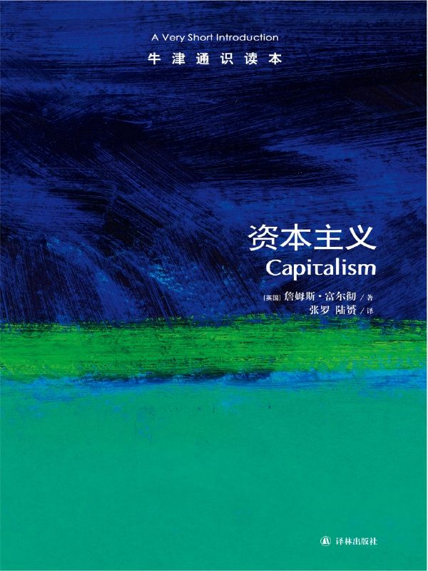

任氏有无轩主人评分：{{stars(page.route)}}

这本书可以说是关于资本主义（Capitalism）的初级入门读物。和我之前读过的[《资本主义与二十一世纪》](https://rsywx.net/books/01846.html)、[《基督教欧洲的巨变](https://rsywx.net/books/01929.html)》等书中的论述基本吻合。

### 摘录

  * p10：马克思关于“两个决不会”（“无论哪一个社会形态，在它所能容纳的全部生产力发挥出来以前，是决不会灭亡的；而新的更高的生产关系，在它的物质存在条件在旧社会的胎胞里成熟以前，是决不会出现的”）、“两个必然”（“资产阶级的灭亡和无产阶级的胜利是同样不可避免的”）和“三个有利于”（“资本的文明面之一就是，它榨取剩余劳动的方式和条件，同以前的奴隶制、农奴制等形式相比，都更有利于生产力的发展，有利于社会关系的发展，有利于更高级的新形态的各种要素的创造”）的科学论断诠释了资本主义社会经济形态的本质，并且在论证了资本主义走向灭亡的历史必然性的同时，阐述了一定历史发展阶段上资本主义存在的必然性和正当性，以及资本主义制度发展的弹性和生命力。
  * p20：这当然是资本主义，因为远途贸易需要以获取巨额利润为目的的大笔投资，但是这显然并不是自由市场资本主义。获取高额利润的秘密在于通过这样或那样的方式确保垄断，排斥竞争对手，并尽一切可能控制市场。因为利润是通过交易稀缺商品而不是合理化生产的方式取得的，商业资本主义对于社会的影响有限。当时欧洲的大多数居民过着自己的生活，资本所有者的商业活动并没有影响他们。
  * p27：资本主义社会的典型特征就在于，几乎其中所有的经济活动都是由以获利为目的的资本投资所驱动的。
  * p29：市场并不是你购买某些自己不生产的商品的场所，而是你获得任何事物的唯一途径。
  * p44：封建主义制度蕴含着演变为资本主义的潜力，但究竟此种潜力能否实现则取决于其他因素。
  * p45：在基督教和资本主义发展之间存在联系吗？马克斯·韦伯对这两者之间的联系提出了最为著名的论述，他把“新教伦理”和“资本主义精神”联系在一起。
  * p48：三种资本主义：无序型资本主义、管控型资本主义、重新市场化的资本主义
  * p61：重要的是，现在探讨不平等时，指的不再是财富或收入差异，而是指准入资格。
  * p86：雇佣劳动的扩散导致了工人力量在全球范围内的弱化。

### 评论

其中p45页中提到的马克斯·韦伯的论断，将新教伦理和资本主义精神联系在一起，我曾在别处多处看到。看来是定论。这从意识形态的角度解决了资本主义出现的一个重要问题并提供了根本的基础。

p61提到的准入资格，是非常明确也是非常尖锐的问题。中国的问题可能就是在于，准入资格的严格限制：被限制在极少数“赵家人”手里了。而如今很多学者在鼓动的“私有化”，在我看来也是很危险的——我已经在博客中多次论及这个问题。

资本主义有着其本身的致命弱点，但是富尔彻也明确地提出，目前还没有一个新的制度可以替代它。

