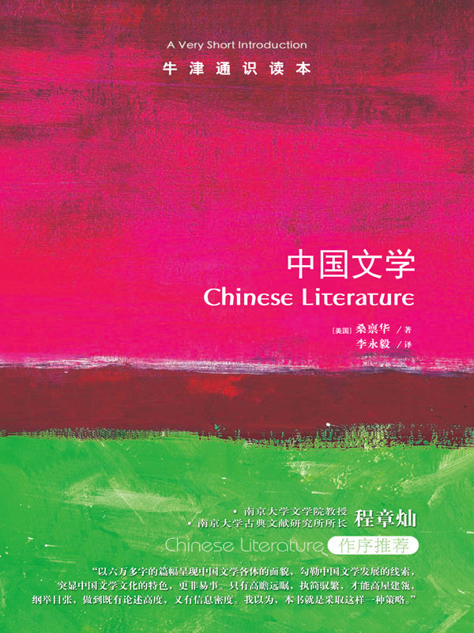

任氏有无轩主人评分：{{stars(page.route)}}

### 摘录

* p14：精英阶层的奖掖至关重要，作品传播与经典化的习惯也有利于这些利益集团。
* p20：中国文学的基础可以描述成一些互相交叠的求道之法。
* p20：词汇来探讨变化的精微过程。印欧语言通常突出名词、本质与物质，古汉语却更看重动词、过程和情境。
* p36：从最早的传疏开始，学者们就从这些诗中引发出许多道德教训，这种让文学服从于教化目的的做法开创了一个影响深远的先例。
* p57：年寿有时而尽，荣乐止乎其身，二者必至之常期，未若文章之无穷
* p61：《文选》和605年创立的科举制一起，促进了文人阶层的形成。
* p72：传统戏曲并不追求现实主义，而是通过一套象征的程式表达感情。
* p89：高行健的剧作是一则寓言，解读了中国从乡村进入城市的变化，隐含着对中国文学的现代化和全球化至为关键的五个主题：**对民族自豪感、人文主义、进步、记忆和快乐的追寻。**

### 评论

这本书篇幅很短，但却是一本提纲挈领般的著作，属于大历史的写法，是我钟爱的一种体裁。对于一些文学现象，作者也提出了自己的观点，可以作为深入阅读和研究的参考。

本书中提到的诸多中国古代文献以及近当代文献，任氏有无轩均有收藏，其中大多数乃先严收藏（如《太平广记》等）。至此，深感欣慰。