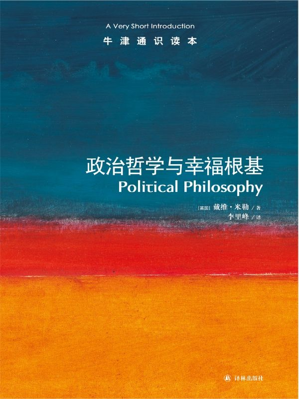

任氏有无轩主人评分：{{stars(page.route)}}

### 摘录

>p10：现实中，一些民主体制下的公民经常对政治问题和政治知识表现出惊人的冷淡和无知，这就说明决不应该忽视民主在实践中遇到的各种困难。

这是一个完整的出发点，而且是人道的出发点。如果我们否认这一点，就好比某人不知道ta有某种权利所以我们就可以无视该权利对ta的适用性或就此跳过权利在此人身上的体现一样。

>p14：一是好政府和坏政府深刻地影响着人类生活的质量。……第二个理念是，政府采取的形式不是预先确定的：我们可以作出选择。……第三个理念是，我们能够知道好政府与坏政府的区别何在：我们可以探究不同政府形式的后果，可以了解哪些品质有助于构成最好的政府形式。

完全同意。但对第二点，是否只有民主政府才能做到？

>p18：在环境问题、全球市场对发展中国家的影响或者普遍下滑的全球文化品质等方面，我们已经能够看到以政治运动形式表现出来的对于全球化的对抗性反应。这些运动对视经济增长为超级目标的观念形成了挑战，并在此过程中提出了我们生活的终极价值是什么、我们如何实现这些目标等问题，而这些正是政治哲学的中心问题。

同意。

>p22：这完全取决于哲学家所提出的潜在的思想变化是否与政治和社会变迁相一致，从而使新观念能够成为随后几代人的共识。

所以，中国没有哲学家。

>p30：当我们说国家行使政治权威时，我们指的是什么呢？政治权威有两个方面的意思。一方面，人们普遍承认它是权威，即拥有命令他们以特定方式行事的资格。譬如说，当人们服从法律时，常常是因为他们相信制定法律的实体有权这样做，而自己有相应的服从义务。另一方面，拒绝服从的人们会在制裁的威胁下被迫服从——破坏法律的人会被抓住并受到惩罚。这两个方面是相互补充的。

这是辩证的两方面。而且，在第一方面，结合后文我们也可以补充说：因为政治权威（以及作为其代表的政府）能给我们的生活带来好处。

>p32：在信任缺失的情况下人们之间的合作是不可能的，而只要没有超越众人之上的权力来执行法律，信任就不会存在。

信任除了人与人之间外，还有政治权威与个人（组织）之间的——也就是所谓的“公信力”。

>p34：无政府主义者本身大致可以分成的两类，一类指向社群，另一类指向市场。

文中对此有很精密的分析。

>p39：当然，原因之一是如果我不服从的话可能会受到惩罚。但我们这里要找的是一个更具道德原则性的服从理由。

是的。出于道德原则性的服从是更资源的，也是更彻底的。

>p40：说任何人只要享受国家福利就是表示了她的同意、就有义务服从法律，仍然是过分延伸了同意的概念。

是否可以这么理解：国家既然受让了公民让渡的权力，就有义务提供基本的国家福利？所以，享受基于义务的福利（可以换成另外一个不那么有道德绑架性质的名词），不构成自己的义务。

>p43：对公民不服从的辩护在于：如果某一特定的法律是极不公正或难以忍受的，或者国家在作决定时拒不考虑少数群体的想法，他们就可以在合法抗议无效时正当地违反法律。换言之，政治义务并非在一切场合都有约束力。我们可以有服从法律的一般性义务，在极端情境下又能正当地非法行事。

现代国家的一个特点是取消了非实体的“至高无上者”的存在。但是，国家权力的正当性仍然需要有一个可以为全民信赖的来源。

>p45：以民主的方式构建政治权威的做法渐成趋势。它依赖于两个基本假设：第一，没有人天生比其他人优越，因此他们之间的任何权威关系都需要证明其正当性；换言之，每个人都应享有平等的政治权利，除非能够证明所有人都从不平等中获得了好处。第二，保护人民利益的最好方法就是使之成为政治权威的终极来源，让任何被委以特殊权力的人都必须向作为整体的人民负责。

一个是如上文的“全民信赖”；另一个是全民代表并代表全民。

>p71：一旦开始考察自由的真正含义是什么，我们就会看到在许多情况下没有政府的积极行为人们就无法享有自由，因为前者提供了使选项开放所需的资源和人们作出自由而明智的选择所需的条件。

同意。

>p90：尽管政治与权力有关，即关乎谁应该拥有权力以及应该怎样控制它，可并非一切权力关系都是政治关系。

同意。

>p95：在一个文化多元的社会，对其他群体文化价值的普遍尊重是一种重要的美德。与此同时，不屈服于具有负面作用的政治正确要求也很重要。

所以，是德行。那么是“义务”吗？或者，是“法律”吗？

>p101：在此我们应该推断，积极歧视只有在事关保证个人之间的实际公正，即发现真正的成绩时才是正义的。如果超出这个范围、变成一种提高某个群体相对于其他群体的整体地位的手段，那么无论这种政策在总体上多么可取，它也不再是一个正义的问题了。

不能为了“公正”而公正。

>p114：首先，有一系列条件界定了民族国家之间交往的正当规则。……其次，全球正义要求尊重和保护各国民众的人权，如果必要的话，包括对侵犯这些权利的国家的当权者发起挑战。……全球正义的第三个要求是任何地方的人们都应该有政治自治的机会；一切政治共同体都应该享有自决的权利。

谨记。

### 评论

总之，这是一本高深的“入门读物”。Thomas Paine多年前写下的[《常识》](https://rsywx.net/books/01848.html)中写道：

>也许本书所述思想**暂时**不足以流星并获得普遍认可。只要长期以来习惯了一件**错误**的事就不会去质疑，以至于它表面看起来就是**正确的**，一旦出现反对声音就会激起捍卫传统的可怕呼声。但反动的呼号很快就会过去，时间比逻辑更有说服力。

我们真的需要很多常识来建立我们的知识体系。

