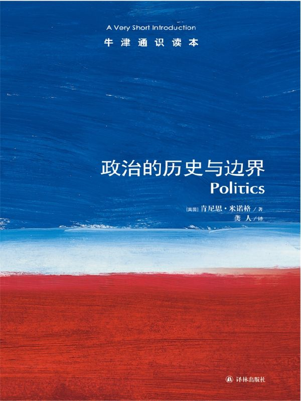

任氏有无轩主人评分：{{stars(page.route)}}

### 摘录

>p12：历史上曾大行其道的专制君主，今天已不再受人追捧；但包裹着理想外衣的意识形态，却带来了现代僭政的新隐忧。

是的，明目张胆的专制肯定行不通，那么就假借民主的名义吧！

>p14：非欧洲的各种文明几乎全都不可避免地被不同形式的专制体制统治过，而西方的思想创造则总是遭到各种专制统治者的敌视——从残暴的埃及法老到精神狂乱的罗马君王如卡利古拉和尼禄，还有印度和中国那样的远方异邦的皇帝。

中国也不例外，而且很典型呢。

>p15：专制主义的本质是，无论在事实上还是在法律上都不存在对统治者不受制衡的权力的挑战。臣民的唯一任务就是献媚。

这个就是专制的本质。

>p18：政客爱撒谎，这已经不是什么秘密，但最让世人迷惑的却是称谓与现实之间的这种扑朔迷离的关系。

所以，正名很重要。政客们爱撒谎也是因为名词（称谓）很不明确，所以就可以乱来一气，刻意地混淆、操纵。

>p28：君主制极易蜕变成僭主政体，僭主政体又被贵族政体推翻，贵族政体蜕变成剥削民众的寡头政体，寡头政体被平民政体推翻，平民政体蜕变成动荡的暴民统治而使人民无法忍受，某个强有力的人物夺权变成君主，于是循环又周而复始了。

这是一种必然吗？或者说，人们对这种近乎“宿命”的安排不满，所以才会去努力建立超越这种循环的体制。

>p32：（引文不写了）

这里应该是莎士比亚的长诗《鲁克丽丝受辱记》中描写的内容。

>p36：中世纪鼎盛时期文明的三个要素。第一是从那些野蛮人身上继承下来的对自由的无比热爱。……在所有这些地方政治的进程中（欧洲各地的具体情况各异）都可以看到这样一个事实：对属下佃户的控制使掌权首领处于某种独立的地位，必须通过与一批这样的首领订立协议才能建立起社会秩序。这是中世纪重建政治秩序的第二个重要因素。……中世纪政治的第三个因素最为重要，它与宗教有关。宗教就是一种文明对存在问题的信仰和知觉。

自由第一。再次重申了契约和所谓城市特许状的内容。这也是欧洲国家政体与中国政体不同的根本原因。宗教（基督教）也很重要，而这正是我现在在看的另外一本书[《基督教欧洲的巨变》](http://rsywx.net/books/01929.html)中的论述息息相关。

>p41：基督教对政治生活的真正意义在于它改变了人的价值观。基督教强调在上帝面前每个人的价值是相等的。个人的价值不在于他是否具有普遍理性，而在于是否具备对抗邪恶的个人品性。

所以，不是追求“更善”，而是坚持不去“作恶”。这是设定并保持下限的做法。

>p68：国家利益就是一个国家认为保障本国安全所必须采取的一切行动。

所以，定义“安全”。

>p68：邻国一般都是仇敌，而邻国的邻国就成了盟友。

这就是“远交近攻”啊。

>p78：维度之一就是这项行动的可行性。……维度之二：执行某一特别类型的政策会有什么后果？……还有一个维度：某项政策对于推行者的短期和长期利益会产生何种影响？

考虑这三点，推行政策可谓慎之又慎矣！

>p83：政治的精髓就是不同见解的争辩，要争辩就必须有对立的另外一方。

必须有对立的另外一方，而不是“辅助执政”的另外几方。

>p89：任何关于一劳永逸的最完美国家的设想与政治行为本身正好是相互矛盾的。

所以，这种设想更可能是独裁者的一厢情愿和一意孤行。

>p95：然而我们更熟悉的欧洲传统是，将自由定义为在法治下生活，而不是在专断的统治下生活。

法治，而不是人治。

>p120：总而言之，对于传统意义上的“政治”来说，它的形式越被理论化，政治问题就越容易被重新解释成管理上的问题。

政治是“谋”、“略”，而不是“术”、“法”。

### 评论

作者在本书中对“意识形态”进行了很充分的讨论。并针对“马克思主义”这一意识形态做出了批判。其出发点与p83的引文有相同之处。大意是说，马克思主义这种意识形态从自身的“真理”出发，从而论证自身“真理”的正确性，并同时将其他意识形态的“真理”论证为谬误。这种做法显然是很古怪的。

