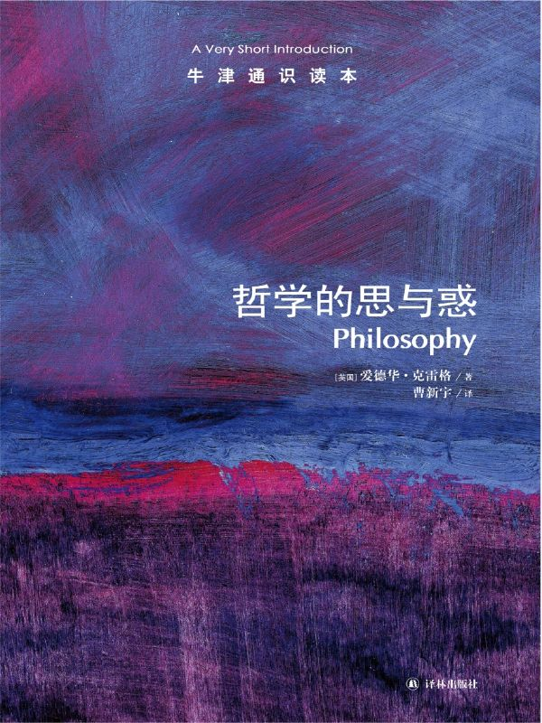

任氏有无轩主人评分：{{stars(page.route)}}

### 摘录

>p17：一方面，哲学的范围变得太广，以至于趋向无意义。几乎每个商业机构都自称拥有自己的哲学——实际上就是通常所指的企业政策。另一方面，哲学的范围又变得过窄——造成这种现象的主要原因是自然科学的发展。

可不是吗，名词的滥用恐怕也是我们的时代特色之一了。没有良好的积累，就在不断甚至无限地拔高自己。这不是空中楼阁又是什么？

>p24：很明显，真正关键的问题是人是睿智的还是愚蠢的（44d）。

语出柏拉图《格黎东篇》。这个问题牵涉到“苏格拉底所谓的智慧是什么”。

>p27：自己做某事就如同允许其他任何人都这么做，所以我必须考虑这种情形的后果，而不仅仅是考虑我个人行为的后果。

“己所不欲勿施于人”，诚哉斯言！

>p45：如果有人提出一个似乎显而易见的观点，这个观点对你来说又好像根本不是显而易见的，那么寻找其背后深藏的未被说出的东西就不失为一个好策略。

所以，保持“疑问”的心态。什么都不能轻信，随随便便地停在一个自己感觉舒服、但实际十分危险的位置。

>p53：没有任何道德上的理由是向前看的，合适的道德上的理由都是看我们行为的后果。

也就是说，都是归纳式的。

>p56：正直意味着完整一致，正直作为一种价值观意味着生活应该是完整的而不是一串互不关联的片段。因此正直要求坚定不移地遵守原则，坚守自己的观点，除非出现新的理由或证据。

问题是，新的理由和证据出现得太快了。防不胜防。可参见第一条摘录。

>p56：如果过去你坚持这个原则一直都能得到满意的结果（用幸福程度来衡量），那么这一事实至少可以给你一定的理由认为，继续坚持这个原则还能得到满意的结果——这正是现在继续坚持这个原则的一个理由。但是不管你多么坚持这个原则，不论它在多大程度上已经成为你人格的一部分，坚持原则本身并不能成为理由。

也就是说，坚持原则而不讲清楚这样的坚持给你带来了什么是没有意义的。

>p60：休谟在《论奇迹》中说智者根据证据的多少来决定自己信仰的深浅，理性就是这样一种大脑所具备的品性。

当然这里的证据是真的证据。

>p79：如果你想坚持自己观点的正确性，那么记住这是要付出代价的：生活将是一场永久的智力战。

所以我一直说，人是最难挑战自己的。

>p87：笛卡尔的反应是声称如果要避免生活在错误思想的指导之下，一生中就必然要有一次打碎自己整个的信仰体系，然后进行重建。

我觉得我现在正处在这个阶段。希望有突破和重建。

>p94：正是因为在我们的内部存在理念这个东西，尽管它不为人知却起着积极作用，我们才能有意识地追求我们有限的个人目标，同时又真正为理性服务。

理性！理性！

>p110：因为成功并非取决于物质条件，即一个人可以为另一个人安排的事情，而是取决于人们对待物质条件的态度。

这是精髓。由此可以解决众多问题。

### 评论

此书不是一本通史，只是常识。所以作者是从哲学的问题开始：**我应该做什么？存在着什么？（即现实是什么样的？）以及我们如何知道？**

一些篇幅的说明还仍显晦涩，显然是我的水平还不够深刻。

