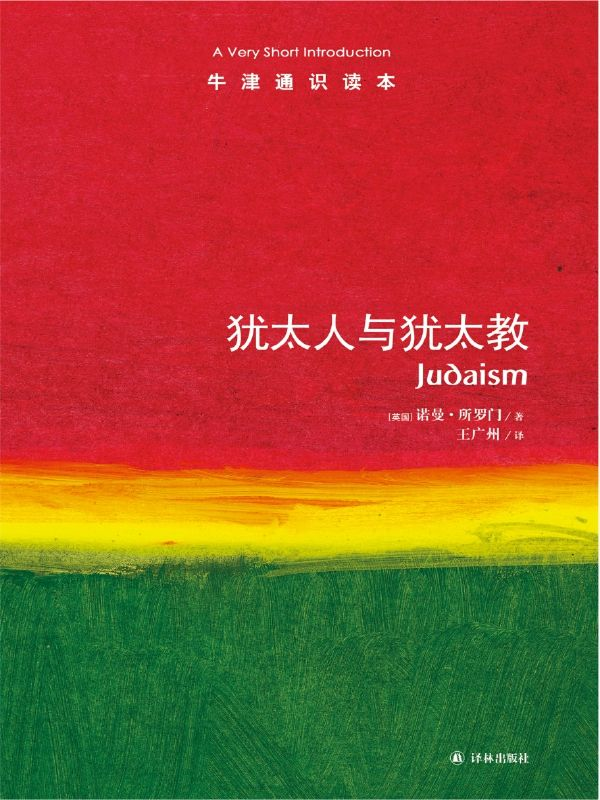

任氏有无轩主人评分：{{stars(page.route)}}

### 摘录

>p18：12世纪之前，犹太人在体貌特征上与其他民族没有区别。

Interesting to know.

>p19：只要文化环境，包括基督教文化和伊斯兰文化，坚持认为犹太人是“与众不同的民族”，并且坚持立法确保这种隔离状态，犹太人便会内化他们的社会状况，并会用古老的圣经词语来解释这种状况。

这是一种文化内敛用于自保的方式。

>p28：我们说的是“拉比犹太教”，即约公元2世纪以降，由拉比系统阐释、以《圣经》为根本的生活方式。

这是本书的范围。

>p32：保罗和彼得（两人都是犹太人）认为，放松摩西律法的严格要求能让外邦人更容易皈依基督教，会议上的其他人则认为，完全服从律法的规定至关重要。

我同意保罗和彼得的思想。事实证明，他们的想法也是对的。

>p33：一个民族，或者说一个宗教社团，往往通过法律、习俗以及宗教仪式表现其身份特质。

同意。

>p33：并非只有一个动因，而是教义差别、社会条件和外部事件等多方面因素的特定结合，才使得基督教开始了一个不同于犹太教的发展过程，尽管它与犹太教有着密切的关系。

理解了。

>p34：确实，自公元70年之后，两个宗教再也没有回到过去。基督教和犹太教对各自的界定相互对立，教义分歧进一步强化。基督教徒形成了一套针对犹太人的“歧视教义”，造成许多惨剧和流血事件，直到后来，“歧视教义”脱离基督教背景，在纳粹种族大屠杀事件中达到极致。

所以公元70年是基督教和犹太教的分水岭。

>p34：犹太人否认基督教徒关于耶稣的说法，因此便遭逢特别的指责，被视为“基督的敌人”。

于是……犹太人就被整个基督教世界仇视。

>p35：有位美国学者鲁本·基梅尔曼分析了两人的评论，发现始终存在五点差异，与区分基督教与犹太教的五个重要的问题正相对应：

基本归纳为：

  - 奥利金写到了上帝与以色列人之间的一个约，由摩西在中间完成；也就是说，相对于基督的直接现身而言，上帝与以色列人之间的联系是间接的。而约哈男拉比视上帝与其子民立的约由摩西协定，因而是以色列人直接从上帝那里得到的，是“他的亲吻”（《雅歌》，1:2）。
  - 奥利金认为希伯来圣经被《新约》终结或者说取代了。约哈南认为，希伯来圣经由“口传《托拉》”即拉比的阐释传统最终完成。
  - 奥利金认为基督是中心人物并取代了亚伯拉罕，完成了对亚当原罪的逆转。约哈南认为，亚伯拉罕的地位依然重要，律法是对原罪的“矫正”。
  - 奥利金认为，耶路撒冷是一个象征，是“天国之城”。约哈南认为，世俗的耶路撒冷依然是天堂与人间的联结纽带，上帝还会在这里显现。
  - 奥利金认为，以色列人经历的苦难证明了上帝对他们的弃绝；约哈南认为，以色列的苦难是宽容的天父对他们充满爱意的惩戒。

>p38：“拉比死后，谦卑和畏惧犯罪之心便不再有了”，这是他的门徒希亚拉比写下的哀歌。

和米兰·昆德拉的最高审判者缺席类似。

>p43：他之所以笃信上帝的道与启示合乎理性，不是因为上帝确定了理性和正义，而是因为上帝一方面举止随心所欲，一方面又表明祂的一切都符合理性与正义的绝对标准。

这是纯粹的信仰啊！

>p45：他披阅一代代前辈语法学家、辞典编纂家的作品，明确地区分了“《圣经》实际上是怎么说的”（peshat，即“明确含意”）和“什么是传统上读解《圣经》时附加进去的”（derash，即“布道词”）。

一个是意，一个是“译”。

>p45：赖施的圣经评注对尼古拉斯·德吕拉影响巨大，又通过他，影响了马丁·路德和其他基督教希伯来文化学者，进而影响了宗教改革运动。

知识点。

>p56：我以为，现世生活中，不管是谁，只要引导民众信守美德，来世就不会遭受诅咒——我不怕任何威严的教派召我去解释这个观点，就像索邦神学院召来诚实的马蒙泰尔责问一样。

问心无愧的布道者！

>p69：卡瓦纳有许多层面。立陶宛拉比哈伊姆·索洛韦伊奇克（1853——1917）区分了两种情形下的卡瓦纳，一种是理解祷告词这个简单意义，另一种是意识到在上帝的跟前并求恳祂。

后者显然更虔诚。

>p72：有三种日常的“侍奉程序”：晚祷叫玛阿里夫（或叫阿拉维特）；早祷叫莎查里特；午祷叫敏彻。安息日及节庆日，早祷之后再增加一个仪式叫穆萨夫（“附加仪式”），赎罪日还要增加奈依拉仪式（“关闭天堂的大门”）。

知识点。

>p100：大量民众放弃了有组织的宗教生活，一方面因为人们发现宗教在理性上站不住脚，另一方面因为宗教无法满足情感的需要，最主要的是因为宗教的要求妨碍了个人自由，而个人自由被视为基本的人权。

这是宗教在现代社会必须面对的问题。任何宗教如果能从根本上解决这个问题，就一定会所向无敌。

>p106：很多人喜欢用希伯来语单词“浩劫”（Shoah）来表示纳粹分子妄图灭绝犹太民族，因为这个词比“大屠杀”（Holocaust）少一点神学色彩。

知识点。

### 评论

这本书很有看头。犹太人在历史上遭受的（不可思议的）苦难、以及（更令人不可思议的）成就有目共睹。

这本书部分解释了我一直以来阅读西方文字时的疑惑：为什么犹太人这么遭（基督徒的）恨？显然其教义、分歧都潜移默化地起到了作用。

