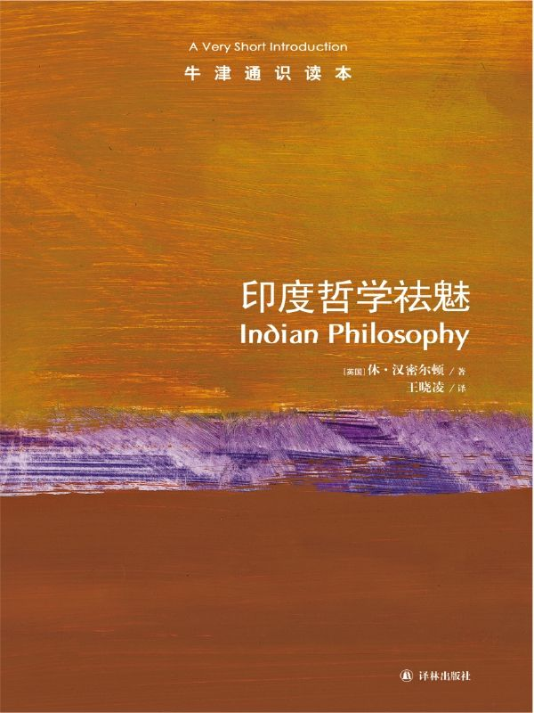

任氏有无轩主人评分：{{stars(page.route)}}

### 摘录

>p13：本书谈到了印度传统中使用的梵语和巴利语两种语言。

知识点。

>p17：无论对以上内容作何种理解，正因为存在着宗教信仰和修行与个人命运——尤其是死后的命运之间的关系，宗教才被归为耶稣救世学，或是“系统的灵魂救赎”。

宗教的显性归类。

>p19：哲学家对这种不可验证性是不接受的，并且认为这种有关实相本质的信息是无效的。

也就是说实相不可验证。

>p32：samskrt（梵文）这个词有一个表声音的词根“kr”，它与karma（业）一词同根。前缀“sams”使这个词语带有“形式良好”或“结构良好”的含义。这暗示了梵文词语的正确发音与其所指称的宇宙之意之间的相互关联。

知识点。

>p46：根据经文（见上面方框内容），在解释第三条觉悟之前，佛陀用一个四重表述来概括他的所见：（1）人的生存具有某种内在的本质特征；（2）特定的因滋生转世轮回；（3）停止转世轮回是可能的；（4）存有终止轮回的途径。

需要进一步理解。

>p55：面对着迅速散播的与真理相反的言论，婆罗门教派如果想维持他们所掌握的主导地位，就必须对一些既能证明他们习俗的正当性又能确认他们的权威性的问题进行阐述。

宗教如是，统治如是。

>p61：因此，《吠陀经》中以定义形式出现的戒律就意味着必定有一些促成它们存在的必要因素：每一种情况下，至少都要包括施动者及其产物。这就意味着《吠陀经》经文既确定了它们所提到的宇宙的真实性，又证实了为维持那个宇宙的连续性就必须执行具有合法性的戒律，这两点都令人信服。

这有点自证的味道。

>p71：把非存在作为一个单独的范畴，这对于纯现实主义的哲学流派来说可能会令人感到惊讶。把它补入原有的六个范畴，其目的是为了在一个系统内把非存在或不存在的迹象作为实在而又“真实”的事物状态包含进来，而在此系统内，存在被认为是所研究物体的固有本性——实相。

这确实有点奇怪。

>p74：这就使得我们考虑到方法本身，此方法是作为一个具有五个阶段或“分支”的观点提出的，它也从探究中得出特定的结论。这五个阶段是：第一，对有待证实之论点的陈述；第二，论点理由的陈述；第三，列举一个能够用来支撑论点并作为“准则”的事例；第四，将论点与“准则”相联系；第五，对依此被证明的论点的重述。

这个论证过程有点像三段论，但不够简洁。书中有一个例子。这里不摘录。

>p76：所列举的事例或准则即，意识的多元性以及那些特定的属性暗示了非物质的、永恒的自我，这种自我既与精神分离又与肉体分离：换句话来说，这些正是此类自我的特征。

最终都回到自我了吗？

>p80：唯一一支从早期存留至今的佛教派别是小乘佛教。其他早期的佛教派别包括说出世部派、正量部派、经量部派和萨婆多部派。

进一步阅读：大乘佛教从何而来？书中没有说明。

>p81：在婆罗门思想中，法既意味着宇宙秩序又意味着个人责任，正如本书表框所示。在佛教中，法（dharma，巴利语拼作dhamma）还有两大重要含义。首先，它指代佛的教义。……其次，对于我们来说更为重要的是，“佛法”这一术语通常泛指“万事万物”，并未表明其具体所指。

这是self-reference吗？

>p82：“万物皆存在”（`sarva-asti`）

哈哈。这个和斯穆里安证明的万物不存在正好相反。

>p87：龙树所表述的思想我们可以从四个层次来更好地加以理解：（1）“自我存在”从不产生于事物本身。（2）“自我存在”也不是产生于事物本身之外的其他事物。（3）当然，更不可能同时产生于二者。这些方面包含着的一个潜在观点是，通过原因或条件而产生包含“自我存在”的任何事物的想法都是不符合逻辑的，因为任何受到因果关系和条件限制的实体都是偶然发生的：“偶发的自我存在”是荒谬的，根本没有独自存在并具有因果关系的“他物”。（这在《中论》15，1——3中被反复提及。）（4）第四个方面即具有“自我存在”的事物不可能无因产生，因为如果这种情况存在的话，这个世界将会混乱无序，而实际上世界并非如此。龙树的评论者进一步解释说，如果事物可以产生出自我，同一事物就将连续不断、牢不可破的链式复制；某个带有独特“自我存在”的事物要想产生出一种具有完全不同的“自我存在”的事物是不可能的——因果关联会存在于何处呢？而且这两种产生模式的混合体也会受到这两类问题的同时困扰。

龙树是个猛人。需要进一步研究。

>p91：但是与正理派的逻辑方法论不一样的是，龙树使用逻辑推理的目的是为了削弱现存的其他所有知识方法依据的基本前提：经验世界永恒的现实。龙树是否仅仅试图以这种方式把所有其他人的观点降到荒谬性的程度，还是他也用这种逻辑推理的方法来建立自己有关空性理论的主张，这在以后成为使其信徒产生分化的一个问题。

知识点。

>p99：意识活动（citta-vrtti）有许多不同种类，大致可分为正知、谬误、分别知、睡眠和记忆五大类。

知识点。

### 评论

这本书基本没有看懂——甚至比[《犹太人与犹太教》](../犹太人与犹太教)更没看懂。显然，我的学术体系因为比较偏西方，所以对另外一个体系的哲学（宗教）体系感到很陌生。

