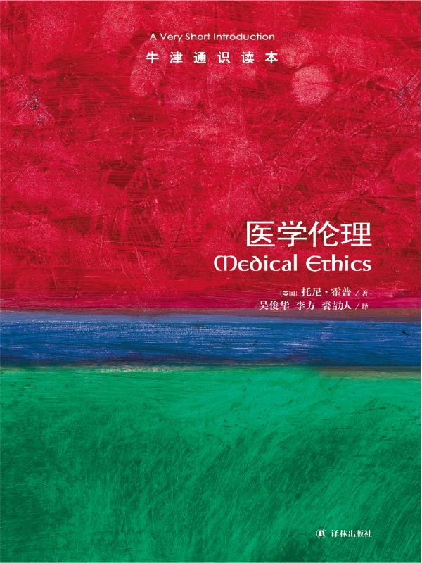

任氏有无轩主人评分：{{stars(page.route)}}

### 摘录

>p13：哲学家与文化历史学家以赛亚·柏林对托尔斯泰的一篇评论开头如下：希腊诗人阿基洛科斯的诗段中有一句诗写道：“狐狸知道许多事情，而刺猬知道一件大事。”

这是两种不同的人啊。

>p17：重要的是赞成或反对该观点的理由，而不是谁持有该观点。

对事不对人呗。

>p23：我们很少能对结果完全肯定。如果这种不确定成为一条不去行动的理由，那么我们将根本无法在生活中做决定。

风险管理就是处理这个的。

>p29：以别人的痛苦为代价去追求一种道德清白感，这是有悖常理的。

引以为戒！

>p46：比较存在（无论以何种状态）与非存在有意义吗？有人说过这样的比较就像拿任意一个数用零去除那样没意义，乍看起来这种说法好像有道理，但其实没有意义。

这段很值得深思。

>p56：概念分析主要有四种形式：提供一个定义，阐明一个概念，区分（分开）和鉴别两个不同概念间的相似性（整体化）。

这个是方法论。

>p56：一致性的根本原则是，假如你推断你在两种相似的情形下必须做出不同的决定或者做不同的事情，那么你必须能够指出导致了不同决定的这两种情形道义上的相关差异，否则你将是前后矛盾的。

精辟！

>p58：在我看来，关于道德的推理包含了我们对特定环境或案例的道德反应和我们的道德理论之间连续的动态变化。罗尔斯称此过程为反思平衡。

知识点。

>p58：1.尊重患者的自主权；2.有利：促进对患者最有利的方面；3.不伤害：避免伤害；4.公正。这个原则有四个要素：分配公正、尊重法律、权利和惩罚性公正。

十分重要。

>p61：自然论证归结为这样的声明：这不是自然的，因此这在道义上是错误的。……扮演上帝的论证也能被概括为：因为这是在扮演上帝，所以这个行为在道德上是错误的。

引以为戒。

### 评论

这本书很有深度——虽然篇幅很短。书中提到的实例或者思想实验都非常有深度，值得每个人去思考。同时，这也是对个人思想体系的锤炼。一些我们认为已经想清楚的东西，我们自以为已经形成了的体系，真的完备而一致吗？

