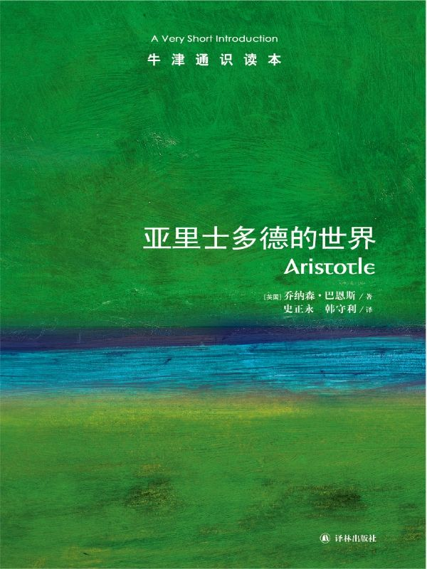

任氏有无轩主人评分：{{stars(page.route)}} 

### 摘录

>p10：亚里士多德哲学思想的一个显著特点是中庸之道，这不仅是他所信奉的伦理原则之核心，也是他思想方法的一大特色。

Interesting to know!

>p13：在他后期的著作《尼各马可伦理学》中，亚里士多德论述道：**“幸福”——人们认识自己且感觉最旺盛活跃的一种思想状态——存在于一种充满智力活动的生命中。**这种生命是不是过于神圣、人类无法企及？不是的，因为“我们不能听命于那些因为我们是人而督促我们思考人类思想，因为我们是凡人而督促我们思考凡人思想的人。相反，我们应尽可能地使自己不朽，尽可能地按我们身上最精细的元素生活——虽然这类元素在体积上很小，但在能量和价值上却比其他任何元素都更伟大”。

这才是幸福的**真正**的定义。

>p37：首先，柏拉图对各学科的统一性进行过思考。他把人类知识看做一个潜在统一的系统：在他看来，科学不是论据的胡乱堆砌，而是将论据组织起来形成对世界的连贯描述。亚里士多德也是一个系统的思想家，他完全同意柏拉图关于科学的统一理论；即便他在如何取得统一以及如何展示统一的方法上与柏拉图意见不同。第二，柏拉图是个辩证学家。亚里士多德声称自己是逻辑学的先驱；无可争议的是，亚里士多德把逻辑变成了一门科学并创立了形式逻辑这一分支学科——亚里士多德，而非柏拉图，是第一个逻辑学家。……其三，柏拉图关注本体论的许多问题。（“本体论”是对形而上学的一部分的不实称谓：本体论者试图确定什么样的事物真正存在，构成世界的基本实体是什么。）亚里士多德没有接受这个理论（一些人认为他没有理解这个理论），却在他的整个哲学生涯中一直受着该理论困扰，并多次（经常是令人丧气地）努力，以建立另外一种本体论学说。……第四，柏拉图认为科学知识就是探询事物的因或解释。亚里士多德延续了这一努力。他也把知识与解释联系起来。他的科学努力不仅指向观察和记录，而且最主要地指向如何进行解释。……最后一点，知识概念本身也提出了某些哲学问题：认识事物意味着什么？我们如何获得知识，或者说通过何种渠道我们逐渐认识世界？为何实际上我们假定能认识所有事物？解决这些问题的哲学通常被称为认识论（epistêmê是希腊单词，意思是“知识”）。

这应该是柏拉图和亚里士多德之间的重要区别。

如本文结尾处所述，人们认为亚里士多德所创立的两门学科中其中一门就是逻辑学（另一门生物学当然在现在看来已经过时，但排名在逻辑学之前）。

>p49：《前分析篇》中的逻辑理论被称为“亚里士多德的三段论法”。

这个是“三段论”的出处。

>p53：从词素学上理解，亚里士多德对“知识”的定义是错误的；但若理解为对科学研究之性质的评论，该定义则表达了一个重要的真理。

For information.

>p77：亚里士多德所区分的第一种因——“构成某物的成分”，通常被他称为“作为物质的因”，被他的评论者称为“质料因”。……亚里士多德所说的第二种因——“形式和模式”，通常被称做“形式因”。……现代读者最乐于把因果概念与一物对另一物的作用联系起来——比如与推和拉联系起来；他们也许觉得最熟悉的就是亚里士多德的第三类因，通常被称为“作用力”或“动力因”。……亚里士多德把他的第四类因看做“为了什么的原因”和“目标”。这常常被称为“目的因”（finis是表示“目的”或“目标”的拉丁语单词）。

我在这里列出这么多东西，当然不是认为这四个原因有多么的正确——而且实际上基本是错误的——而是因为它们展示了亚里士多德的思想有多么深刻而系统。

>p82：在亚里士多德看来，知识的最终来源是感知。

For information.

>p87：亚里士多德以地球为中心的天文学观点，即天体都位于一系列的同心圆上，不是他自己的创造。他不是专业的天文学家，但可依靠同时代天文学家欧多克斯和卡利普斯的著作获得观点。专著《论天》主要关注的是抽象天文学。亚里士多德的主要论点是，物理世界在空间上是有限的，而在时间上则是无限的：宇宙是一个巨大但有边界的球形体，无始无终地存在着。

这样的见解同样深刻。

>p103：亚里士多德的目的论有时可用一句口号来概括：“大自然不会徒劳地做任何事情”；他本人也常常用格言来表述这个意思。

我也觉得如此啊。但是他的目的论很朴素；另外，我们也要注意，这有时会转变成“设计论”——因为只有设计才会有目的。

>p109：光有智力活动还是不够的。人类不是一个个孤立的个体，人类的优点不能由遁世者来践行。

所以，不能避世。

>p112：他非常自信地赋予国家一种非常积极的功能，设想国家的目标是促进良善生活。如果是这样，不难想象的是，渴望改善人类生存条件的国家也许就会在人类生活的各个方面进行适度的干预，也许就会迫使国民做任何会使他们幸福的事情。那些把国家看做善的促进者的人最后倒成了压制政策的提倡者。自由的热爱者更倾向于给国家赋予一种消极功能，把国家看做一种防御手段，保护国民不受恶之侵害。

在这点上，我同意作者，反对亚里士多德。当然，亚里士多德有这样的想法不足为奇。我们如今也有不少人和亚里士多德想法是一样的。

>p115：学习不仅对哲学家来说是最快乐的事，而且对其他人来说也是如此，即使他们只是短暂地享受这种快乐。

学习不仅对哲学家来说是最快乐的事，而且对其他人来说也是如此，即使他们只是短暂地享受这种快乐。

### 评论

亚里士多德在西方的地位是无与伦比的。通过这本小书，可以对他的思想体系有更深入的理解。亚里士多德作为一个自然科学家，其成就在今日看来已经十分原始，但他设立的逻辑学以及他在哲学上的思考一直影响着一代又一代的思考者。

我曾经想在中国历史上找出一位可以与他比肩、哪怕是与他接近的人物，但可惜没有。

