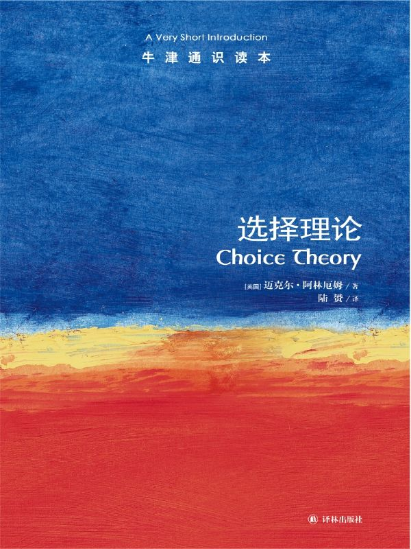

任氏有无轩主人评分：{{stars(page.route)}} 

### 摘要

>p6：合理性是选择模式而不是单个选择本身的属性。……因此，要探究理性究竟意味着什么，我们必须关注选择模式。

也就是说，我们经常要求某人做出一个合理的选择，但是一个选择本身没有合理性——它的出现本身就证明它是合理的。我们选择A而不选择B的过程才能衍生出合理性。

>p11：你无意间作出非理性决定的事实并不意味着如果有人指出这种不理智，你仍将继续如此。

对啊。

>p13：为了避免类似问题，我们可以规定，如果你从完整菜单中选择了某个选项，在菜单范围缩小后，如果该选项还列在其中，你必须要选择该选项。这一要求称为**缩约条件**，又被称为“森的首要属性”，得名于诺贝尔经济学奖得主、哲学家阿马蒂亚·森（生于1933年）。

这个条件符合日常经验。这也是众多属性中的第一个。

>p14：为了避免类似汤的例子中遇到的问题，我们要求如果在所有包含某个选项的成对选择中，你都选择了该选项，那么你从完整的菜单中也应该选择这个选项（尽管不一定是唯一的）。这一要求被称为**扩展条件**，又被称为“孔多塞条件”，得名于法国数学家、启蒙运动的重要人物马里耶·让·安托万·尼古拉斯·卡利塔特·德·孔多塞侯爵（1743——1794）。

这是第二个。

>p17：当且仅当选择可以由偏好关系来解释时，它是合理的。

“合理性”

>p19：由于显性条件至少排除了我前面所提到的那些影响合理决定的问题，我要说，理性选择的过程就是能满足显性条件的过程。……情况就是如此：当且仅当选择可以由偏好序列来解释时，它是理性的。

“理性”

>p25：缩约条件要求：如果你从候选菜单中选择了某个选项，并且在范围缩小后的菜单内依然含有该选项，那么你应该从小范围菜单中选择该选项。扩展条件要求：如果你在某个选项与候选菜单的任何一个其他选项之间进行成对选择时都选了该选项，那么你应该从完整菜单中选择该选项，尽管不一定是唯一的。如果存在某种“至少一样好”关系，使得你所选的选项恰好就是那些至少和菜单上剩余的任何选项一样好的选项，那么你的选择可以由偏好关系来解释。当且仅当选择可以由偏好关系解释时，该选择是合理的，即它同时满足缩约条件和扩展条件。显性条件要求：如果你在存在第二个选项的情况下选择第一个选项，那么任何时候你选择第二个选项，如果第一个选项也存在，你应该同时选择该选项。……如果选择可以由具备传递性的偏好关系解释，那么该选择可以由偏好序列解释。 当且仅当选择可以由偏好序列解释时，该选择是理性的，即满足显性条件。 用效用来表示一个“至少一样好”序列，就是为每个选项指派一个数字，使得当且仅当第一个选项比第二个更好时，它具有更高效用。如果存在某种效用指派方式，使得你所选择的选项恰好就是那些至少和其他选项具有一样高效用的选项，那么你的选择是效用最大化的。 当且仅当选择是效用最大化时，该选择是理性的。

这个算是小结，也是符合常识的。

>p50：在不利条款下进行赌博或保险都没有任何不合理之处。但是，显而易见，如果你是风险厌恶的，那么你不会在不利条款下赌博，尽管你可能会保险。同样，如果你是风险喜好的，那么你不会在不利条件下保险，尽管你可能会赌博。

这里的理论和我刚翻译完的《对冲》（暂定名）是可以对照起来看的。

>p68：从这个结果中得出一般推论，我们可以说，虽然在有限重复的场景中，个人的理性行为不一定是集体理性的，但在无限重复的场景中，这种情况可能（尽管并非必要）成立。因此，无限重复可能将竞争转化为合作。这一结果是民俗的重要部分，因此它被称为“民间定理”。

这个定理很重要。它在一定程度上解决了人类社会总体走向理性的趋势。

>p76：当且仅当一个规章采用多数法则时，它满足中性条件、响应条件和匿名条件。

这里不再对三个条件进行展开。可以继续再看。

>p79：它被称为不可能定理，因为它可以被解释为规章不可能同时具备四个属性：理性、独立性、一致性和非独裁性。这是选择理论最为根本但也最让人烦恼的结果之一。它暗示，所有关于“国家利益”的言论都是空谈（除非众人一致同意，但这种情况不太可能发生。）

这个定理是我学习本书最大的收获。太深刻了。

### 评论

这本书我只能打出一个低分：实在是太不明觉厉了。

感觉有几点：首先，它的理论肯定是正确的。其次，由于是电子书版本，一些图的显示不是很好，一定程度上影响了我的阅读。第三，在讲述效用的时候，感觉有点太快，没有完全讲透，导致后续关联章节有点乱。

