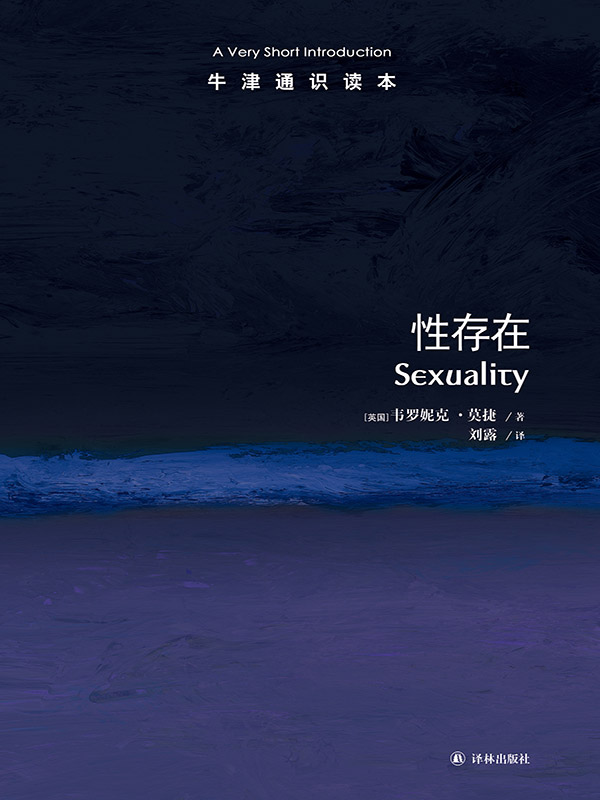

任氏有无轩主人评分：{{stars(page.route)}}

### 摘要

>p8：古代并不是性自由主义的时代。当时的性道德处于道义与法律规范的严格约束之下。但是，对于道德的注重仅限于性行为，而非性欲的对象。古代人并不以生理上的性身份来理解他们自己，但维护社会性别身份对他们来说却至关重要，这一点我们后面将会讨论到。这就与现代社会的人理解性别的方式有着很大的区别，现代人理解和判定自己性别的中心依据是诸如异性恋和同性恋这样的概念。正是基于这一区别，米歇尔·福柯、保罗·贝内、戴维·哈波林或约翰·温克勒等历史学家都将古代世界定位为“性存在之前的世界”。这一时期，性的概念以及它所蕴含的文化意义都与今天的有着本质的不同。

这是一个很重要的定义和界限。问题在于：性行为本身也应该有对象啊！

>p12：当时，社会地位就是根据这样的主动/被动角色来确定的，而不是异性恋/同性恋这样的分类，后一范畴到很久以后才出现。

这个趋势也延续到现代。所谓长者对幼者的爱。

>p13：一些人认为爱慕男性比爱慕女性更为高尚，因为去爱一个和自己平等的生物，比去爱一个低等生物要好。

这个观点在[《凯恩斯传：一个利他主义者的七面人生](https://rsywx.net/books/01855.html)中也有体现。

>p18：不过，我们还需谨记的一点是，古罗马和古希腊文化并不是同质单一的。虽然古罗马和古希腊的性伦理道德十分相似，它们之间却也有一个显著的不同，即在古罗马文化中，鸡奸问题显得较为严重，而且希腊式恋爱关系（以及其所谓的教育上的好处）在古罗马也不被看好。

参见上文标注。这也是一个很重要的区别。

>p18：古希腊时代，女性的名字在她的一生之中都不得在公共场合被提起；相比之下，古罗马帝国女性的公民地位则要高一些。古罗马女性（至少是有产阶级的女性）体现出了比古希腊女性更多的独立性。

最近在看《企鹅欧洲史》第二卷[《罗马帝国的遗产》](https://rsywx.net/books/01946.html)，其中的一些段落可以为该段描述做注。

>p21：基督教对于性的敌意，反映了当时一项更为普遍的宗教任务，即将人们从世俗的束缚和欲望中解放出来。独身和贞洁被视为行为规范，而性和欲望则要受到监管。

这个是自然的。必须要更尽忠于上帝，要将自己的爱与热情投身给上帝，而不是枕边人，更不能沉溺于肉体之欢愉。

>p22：但是，教会的神父们认识到，大部分的信徒们不太可能接受基督教的独身生活理念。因此，以使徒保罗为代表的神学家将婚姻看作与物质世界之间的一种合理妥协，并称赞婚姻为社会的基石。

但到最后，人性还是大过天。

>p23：基于对婚姻中性行为繁衍功能的强调，以及对其他出于肉欲的性行为的反对，女性之间的同性性行为尽管很少受到法律制裁，却不断遭到教会当局的谴责与压迫。教会对于男性之间的同性性行为所持的态度却似乎更加矛盾。

矛盾性的出现应该和之前提到的罗马、希腊文化有关。

>p30：性存在这一新概念，将性严格限定在自然和生物范畴，认为它既是一个科学研究领域，也是一种主观经验。性学将性纳入身体和精神疾病与退化的医学分类范畴，取代了以往宗教不加区分地将性归入罪恶的做法。在这一过程中，性的社会意义大为改变。

这点很烦。因果关系还没有完全清楚。

>p38：后来同性恋维权团体和持不同意见的精神病专家均提出，真正的问题并不在于同性恋本身，而是在于对同性恋的仇视，英国、俄罗斯和中华医学会精神医学分会由此分别于1994年、1999年和2001年类似地废止了将同性恋者视为精神疾病患者。

但同性恋也是由病理根源的，如果能确立这个病理根源，那么对其的仇视等也应该烟消云散了。

>p43：性学史上一个重要的悖论由此产生，即性存在的生物模型用自然本能、正常和反常性现象、生物性的性别差异等概念来描述性现象，但同样的研究也使其所依赖的上述分类成为了问题。

互为因果。也是我上面批注时提到的。

>p45：正如我们所看到的，西方对性的文化理解是由三种模型决定的：道德/宗教模型、生物模型和社会模型。虽然这三种模型在历史上出现的时间有先后之分，但我们仍然要强调的重要一点是，这三种模型仍然在当今的社会中并存。对性的道德、生物学和社会学的理解，在社会、政治和我们的日常生活对于性意义的阐释中，仍然有着举足轻重的影响。

For info.

>p50：20世纪六七十年代的妇女运动，一般被称作“第二次女权主义浪潮”。

For info.

>p53：一些著作，如1990年出版的希拉·杰弗里斯的《反高潮：女权主义的性革命观》中便提出：回顾这场性革命，与其说它给女性带来了更多的性自由，倒不如说是满足了男性对于女性身体开放性的幻想。这些著作的作者认为，性革命的话语方式让男性对女性性存在的控制合法化了，并且让女性无法对男性的性进犯“说不”。

哈哈哈。所以说，女性的解放仍然是以男性为主导！

>p54：新的女性运动便采纳了“个人的即是政治的”这一口号，意在表达的观点是，女性的相当一部分“个人”生活，实际上都植根于女性作为一个整体在两性权力关系中所处的从属地位。

个人的即是政治的。似乎有点夸大。

>p60：里奇曾于1980年撰文《强制的异性恋关系与女同性恋的存在》，宣扬“女同性恋统一体”的概念。

For info.

>p67：女权主义者呼吁在强奸、性骚扰、色情出版物等领域进行立法，将这些问题从私生活的领域推入到公共领域，但她们同时又反对国家干预堕胎等行为，认为女性对此拥有“私人”决定权。

我还是这个观点：既然是私人的，那就不该是社会的，更不该是政治的。

>p80：在优生学的语境下，医学诊断和道德观念之间的界限至少是模糊不清的，而“道德水平低下”这样的概念则将两者完全混为一谈。

优生学是一门被污名化了的学科。纳粹对此负有不可推卸的责任。

### 摘要

这本小书很有意思。和所有VSI的书籍一样，属于提纲挈领的文章。书中的一些论述，我有不同的想法，甚至没有完全理清，甚至无法写出我想写出的地方。

中国历来对性讳莫如深。这是一本值得推荐的小书。