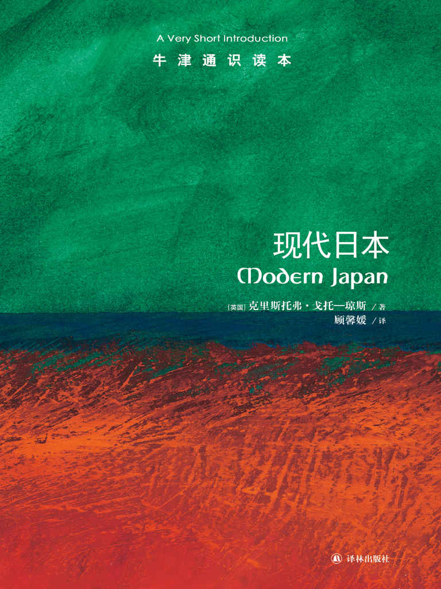

任氏有无轩主人评分：{{stars(page.route)}}

### 摘要

>p12：因此，现代社会的关键课题之一就是学习在看到现代时如何进行辨识，即便它看起来不符合我们的经验。否则我们就是在冒险将所有文化差异都视为现代性发展受阻的证据。

我们的经验也是我们的文化的一部分，或者说就是由文化塑造的，所以它对我们在看新的东西的时候产生影响也是很正常的。所以，这就可能引发思维定式。

>p20：日本的军事领导人与皇室之间存在权力对抗权威的关系，且已持续多个世纪。

这点和众多书籍可以参照，包括我翻译的那本。

>p21：然而，侵略带来了灾难性的结果，不仅未能支撑秀吉的地位，战争的失败还耗空了秀吉家族的金库，并销蚀了秀吉常胜将军的名号，为德川家康最终崛起创造了机会。尽管如此，秀吉未能得逞的侵略还是预示了新兴国家将国内的不满情绪导向海外征服的趋势。

最后一句是金句。

>p28：德川对佛教的支持也许在无意间成了一种手段，冲击了天皇在神道教中的神圣地位。

这一点可以参考中国唐朝时对佛道两家的态度的不断转变。

>p29：这一时期，一些早期现代日本最著名的艺术形式已经生根发芽，尤其是浮世绘（`ukiyoe`）和歌舞伎（`kabuki`）剧场，而后者还兼容纳那些身为高级妓女的女演员。

For information.

>p39：一方面是现代日本同自身历史和传统的不稳定关系，另一方面是它同现代性和西方的不稳定关系，这两方面是这段时期的关键特征。

这也构成了日本的思想体系的根本性质。

>p53：另一方面，我们可能会看到一种更接近沙文主义的反应。这类观点认为，核心困境并非如何在现代化带来的急剧变化中保存“日本人”的元素，而是如何对抗现代化进程本身。这一立场将日本的传统（且不论是否由生造而来）极端化，并断言这些传统较西方国家的传统优越，据此认为在“进步”这一错误伪装下，西方国家传统将有可能污染并削弱日本。随着日本自信心与力量的增长，上述沙文主义便有陷入侵略性使命感的可能，即认为日本在道义上有义务重申它自己真正的认同，而这一义务意味着，帮助其他亚洲国家超克现代性及西化的隐性感染，是所谓日本在道义上的“使命”。简而言之，上述立场提供了条件，令一种自相矛盾的、反帝国主义的帝国主义有可能在亚洲出现；日本的任务是将亚洲从西方帝国主义的掌控中解放出来。

同上注。

>p76：然而，这些审判中最突出的问题恐怕是麦克阿瑟将天皇列在受审范围之外。在战后许多日本知识分子——例如政治理论家丸山真男——看来，对于麦克阿瑟的第二大雄心即日本的民主化而言，未令天皇直面责任是有害的，因为这开了危险的先例，破坏了政治主体的观念，而这一观念正是民主意识的根本。

关于这点，恐怕历史已经无法再给我们任何答案了。所有的叙述只能来自两方：麦克阿瑟将军以及天皇的翻译。

>p101：日本欲在国际上成为“正常国家”——自1990年代早期起，这一问题已经遍布政治、社会和文化领域，并且至今未获解决。在一些评论人士看来，可以就“日本的双生缺欠”来有效地表述这一难题：首先，日本缺乏“正常”的能力（指一支强有力的军队，配以使用军队的法律机制和社会意愿）；其次，日本在国际体系中缺乏“正常”的合法性（指在“学会面对过去”和向邻国道歉这两方面，日本显然不合格）。

双生缺欠是第一次看到。但说到的这两个亏欠确实是日本的现状。

=== 评论 ===

这本书可以作为若干书的补充和参考，如[《菊与刀》](https://rsywx.net/books/01845.html)、[《国家的启蒙》](https://rsywx.net/books/01935.html)、以及由我翻译即将出版的《日本权力之谜》。

书中的许多结论符合常识，并有着深刻的剖析。是一笔不可多得的当代日本的参考书。唯一遗憾的是，还不够新。