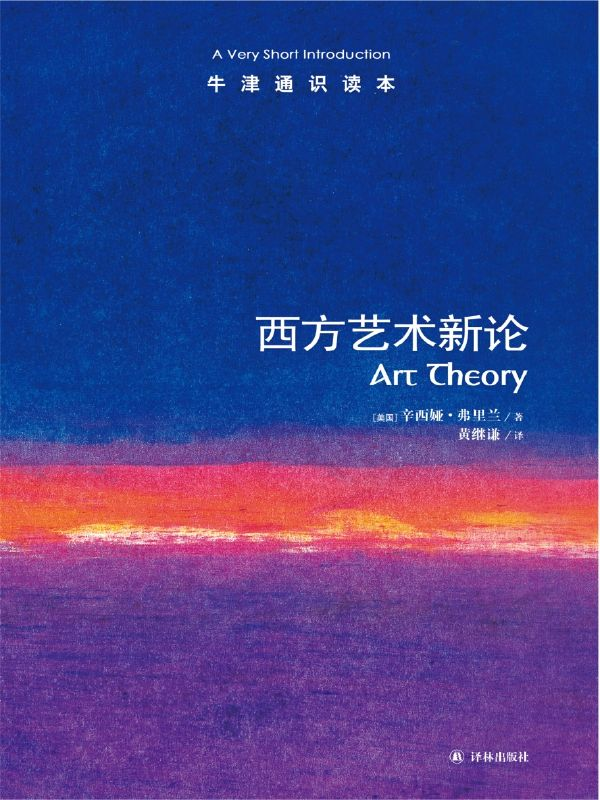

任氏有无轩主人评分：{{stars(page.route)}}

### 摘要

>p10: 艺术即仪式的理论看起来似乎合乎情理，因为艺术会涉及由某些目的所形成的多种因素的综合，通过典礼、姿势、人工制品的运用而产生象征性价值。……但是当一位行为艺术家在使用鲜血的时候，仪式理论并不能解释那些现代艺术家有时采取的怪异、激烈的行为。

同意作者的第一个观点，“看起来似乎合乎情理”。但不同意后面的观点。他们采取怪异、激烈的行为恰恰是为了完成仪式。仪式成为艺术的一部分了。

>p17: 许多思想家坚持认为艺术应当激起一种特殊的和非功利性的距离感和中立性的反应。

我基本赞同这点。

>p29: 亚里士多德认为，悲剧应该展示一位好心的英雄仅仅因为犯了一个错误（并非人类品德上的弱点）就导致了灾难性的结果。

亚里士多德给出了悲剧的一个很好的定义。

>p42: 丹托辩解道，在每一个时代和背景中，艺术家依靠一种观众能理解和接受的艺术理论创造了一些被称作艺术的东西并赋予这些作品历史和艺术惯例的背景。

“观众能理解和接受”是关键。

>p55: 如果21世纪的“原始”艺术家应该脱离历史潮流而去为其他人珍惜某种神秘的过去，这是个沉重的负担。

这是一个重要的问题。如果艺术家不能展示现在，就只能遁入过去。

>p56: 独裁者和其他政治势力常常压制艺术，因为艺术会提供批判性的抵抗观点并通过唤起文化的根源建立一种新的国家身份。

这点我很同意。参见[《天鹅绒监狱》](https://rsywx.net/books/01862.html)

>p58: 杜威认为我们必须进入相关社群的精神层面才能了解某种艺术的语言。丹托辩解说：不管特定文化将什么东西从理论上概括为艺术，艺术家能使什么成为艺术取决于一个特定时代和文化中可能存在的艺术目的的背景。丹托设想所有文化中都有一个类似艺术世界的东西，人们还在其中对艺术进行了实际的“理论概括”，在这一点上他也许运用了过于现代的西方“艺术”概念。

见上一个评论。

>p59: 由于艺术是态度和见解的一种深刻表达，与另外一种文化中的艺术进行交流能帮助人们理解另一种文化。但是我们通过所谓的直接体验，无法理解艺术和文化本身。

同意。但还有疑问。我感觉我看艺术品，都是通过所谓的直接体验。我写书评的时候，也是基于我的直接体验。

>p59: 在某种文化或在这种文化的艺术中可能不只有“一种”观点。尽管艺术可以表达某种文化的价值观，但不存在完全同质的文化或没有被世界其他文化所影响的文化。

I really, really doubt so. For western art, maybe yes. 

>p60: 来自其他地域和时代的艺术形式并不总是符合我们的当代艺术标准，这种标准是针对在画廊中展出的和表达个人意图或“天才”的作品而设定的。

哈哈，所以商业因素永远要被考虑在内。

>p76: 只因为生命常常是被阻碍、被干扰、懒散或者负累沉重的，就使得人们接受了在正常的生活过程和创造、享受艺术作品之间存在内在对抗的看法。

所以，我们欣赏艺术，只是为了逃避或者猎奇吗？

>p82: 天才属于那些能运用他们的媒介让所有观看者做出敬畏和崇拜反应的创造者。

然。

>p83: 女性主义对于经典主要有两种类型的批判。游击队女孩在她们的修订版艺术史中选择的方式可以被称为“增加女性并搅局”的方式。这些女性主义者的目标是在伟大和重要的艺术经典中加入更多的女性。……第二种选择方式是对经典的概念进行更彻底的重新审视（或者叫“打倒等级制度”），女性主义者追问经典是怎样建构起来的，是何时、为何目的而建立的。

这里对“女性主义”的注解很有意思。

>p95: 尽管没有一种阐释是绝对“正确”的，但是一些艺术阐释看起来比其他的更加合理。

感觉是废话。

>p97: 表现论认为艺术能传达一些感觉和情感领域里的东西。

当然啊！不然呢？

>p109: 艺术家将它们传递给观众，反过来他们必须能对艺术作品做出阐释。……“阐释”就是给一件艺术作品的意义提供一种合理的解释。我不相信能对艺术作品做出这种认知贡献的只有一种真正的解释。只不过有些阐释比其他阐释更有效罢了。最高级的阐释是理由充分的、细节丰富的、似乎可信的。它们反映了背景知识和理性辩论的共同标准。

艺术家是否应该对作品做出阐释？如果不应该，谁应该？

### 评论

这本书让我对艺术——确切地说是艺术的表现——有了进一步的理解。由于它主要是说西方艺术，所以对一些区域的“艺术”出现的种种诡异和不寻常之处没有进行阐述，我并不感到诧异。
