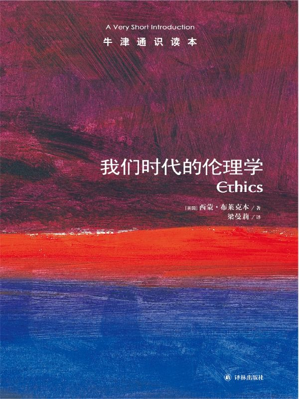

任氏有无轩主人评分：{{stars(page.route)}} 5

### 摘要

>p5：实现幸福生活的另一种途径是首先思考应当避免什么，而在这一方面，人们是很容易达成以下共识的……或者说，“地狱总比天堂更容易描绘”。

最后一句话很令人深思。我们害怕地狱，所以很认真地描述它，唯恐漏过任何一个细节。

>p13：威胁伦理学的七大因素

分别是：上帝之死、相对主义、利己主义、进化理论、决定论与无用论、非理性指令、错觉。都值得再看一遍。

>p19：这里的关键问题是，上帝或诸神不应被视为享有绝对权威。我们必须认为，他们在允许我们的某些行为和禁止我们其他行为方面作出了正确的选择。他们像我们一样必须知道什么是虔敬的，什么是正义的。不是因为他们无穷的威力，不是因为造物主的身份，不是因为严酷的惩罚，也不是因为回报我们的厚礼，《圣经》才规定众神这么做。这样做不会使他们成为善的。再者，仅仅由于他们的威力而服从他们的戒律将是奴性的表现和自私的行动。

这点**实在实在**是太重要了。

>p20：有神论思想看起来比无神论思想更糟糕，因为有神论思想似乎扭曲了人们对行为准则的认识。如道德哲学家伊曼努尔·康德（1724——1804）所述，它使我们仅仅由于惧怕惩罚或出于其他动机而遵循道德律行事，我们却真切希望人们出于敬虔道德律而行事。

这点要和上面一点对照起来研究。有神论认为有神，而神=绝对权威。

>p24：因此，我们面临两种不同的选择：我们要实现跨文化需求，“以某种方式处理丧事”；同时，我们又必须遵照当地的风俗，“这是我们的一贯做法”。以上就是相对主义的本质。

我觉得这没什么问题。但如果继续引申，就很危险。

>p33：人们热衷于贬斥财富和社会地位仅次于自己的那些人的品位，远甚于贬斥那些与自己差距巨大的人群。……我们需要大声宣扬自己有别于比我们社会地位略低的人，因为我们有可能被误认为与他们相似。相反，我们却不那么强调自己不同于地位更低的人，因为我们不会被误认为与他们同属一级。

太高的人批评不起，太低的人批评没好处、不值得。

>p36：第一个混乱思想是，解释我们是如何成为我们自己的，这是一回事；声称我们并非自己想象的那样，这又是另一回事。……然而，当推理出利他主义并不真正存在，或我们不会真正坦荡无私地相互关心——我们只希望最大限度地扩大机会，从助人的行为投资中获得回报时，第二种混乱思想就产生了。我们犯了同样的错误——由于其所作的官能性解释，我们推断出心里的真正动机并非就是其表现出来的那样——但是这个推论比关于母爱的推论更容易形成，因为我们担心前者的推论往往是正确的。……第一种混乱思想是：仅仅从进化论的解释就得出结论，认为我们表面上关心的事情并非我们真正关心的。……第二种混乱思想的结论是：不可能有真正让人在意的事，因为从进化论上找不到证据。……我们可能有的第三种混乱思想是用心理学理论解释自然现象，尤其是解释人类基因，再回过头来解释有这种基因的人。

啊哦。这段需要认真读读。理解第一、第二个混乱思想。而第三种混乱思想，让我感觉是针对任何心理学去说的。

>p44：伦理道德的基本原则必须是那些我们可以合理地彼此要求的内容。

己所不欲，勿施于人。古往今来，莫不如此。

>p45：我们知道自己应该洁身自好，无论别人把他们的手搞得多么脏。无论这个借口多么冠冕堂皇，一个严格自律、正直的人自不会加以利用。在许多情况下，保持自己的双手干净是可以做到的，并不属于超义务。

你可以听从命令开枪，但你可以打不中。

>p47：即使是一条公正的道德律也可能对不同的人造成不公平的后果，因此就不奇怪人们为何不迷信那些由自身并不践行的人提出来的道德了。

比如近期的垃圾分类。

>p48：通过作出承诺，我们彼此之间对对方的下一步行为有了预期，共同的事业由此得以发展。这一点值得我们引以为豪；不满足这一点，就无法实现着眼于统一行动的弹性计划。

这也是契约社会的基础。

>p54：很早以前，古希腊历史学家修昔底德（前455——前400）就已注意到通过对用词的选择来预设道德结论的做法。

慎之慎之！

>p58：死亡不是一种生活方式，不是静谧、长眠、和解、满足、阴冷、孤独、黑暗或者其他什么。

那它又是什么？

>p64：如果抛开问题本身，说一些抽象而空洞的大话，那么悲叹人生的虚空本性以及欲望的无常就再简单不过了。

魏晋风度大抵如是。

>p67：`summum bonum`（至善）

FYI

>p73：即使天塌下来，也要实现正义（`Fiat justitia et ruant coeli`）。

FYI

>p73：法律的正当性在于它维护了人们的安全。但是，这不是说法律或规则本身必须具有前瞻性，必须从属于在具体情形下需要获取的利益。体系是人创设的，它具有功利方面的正当性，但规则的具体运用却不具有这样的正当性。

参见之前的一些摘录。

>p76：赋予人们幸福不是道德哲学的责任，更不是宪法或政府的责任，它们仅仅是个平台，在此之上，人们可能找到快乐。美国的独立宣言提出“生存、自由和追求幸福”的权利，却没有如何实现幸福的论述。

目标，而不是方法。

>p79：不仅大一统悲观主义，任何对人类生活或人类社会的理性思考，都表明我们是优柔寡断的动物。我们不断受外界思想的摆布，不能正确认识自我，很难摆脱不现实的幻想和野心。我们只有短暂的自制力，即使在为自己能够审慎、独立、自由、理性地作出决定而沾沾自喜时，我们仍被不为人知的流行观念以及各种社会和文化力量左右。倘若那些更具有洞察力的人能把我们从极度愚蠢中拯救出来，那往往于我们有益，而并非对我们的不敬。

蓝瘦香菇

>p92：普遍性测验听起来好像是黄金法则的一个版本：“推己及人”——基督教有时宣称它为其教义之一，几乎任何一种伦理传统中都能看到它的影子，包括在孔子（前551——前479）创立的儒家思想里。

己所不欲，勿施于人。

>p93：善良意愿是有良好动机的行为，是基于法律或责任感的行为。“责任是出于对法律的尊重而采取的必要行动。”我们本身能够代表行动规则，善良意愿是与这一代表关系相一致的行为。因此，道德的核心不在于我们所做的事，而在于我们行为的动机：“当道德价值产生分歧时，重要的不是我们所看见的外在行为，而是我们看不见的内在行为准则。”

参见《[凯恩斯传：一个利他主义者的七面人生](https://rsywx.net/books/01855.html)》中对利他的定义。

>p94：那是什么样的法则？它的代表必须决定意愿，为了这种意愿成为所谓的至善和无限，它甚至不考虑我们从中所期待的效果。因为在遵从法则中，我抛弃了所有冲动的意愿，只剩下行动对普遍法则的服从，这种服从单独构成意愿的原则，也就是说，我只能以以下方式行动，即我在行动的同时可以期待自己所信奉的准则成为普遍法则。

法则、元规则。没有元规则的人，不要和我对话！

>p94：后来康德以其他形式对其加以表述：一是“在行动中假设你的行为准则能经由你的意志成为普遍的自然律（自然律公式）。”另一句可能算最有影响力的名言是：“按人性原则行动，永远不要把你自己和其他任何人仅仅当做手段，而要同时当做目的”（人性公式）。

谨记谨记。

>p99：最具代表性的观点体现在约翰·罗尔斯所著的《正义论》中。

日后看书可参考。

>p103：看到他人遭受痛苦却无能为力的善人会感到极其不安。在这种情况下，让我们采取行动的是同情心或仁慈心，而不是任何语言程序规则。

同理心啊。

>p105：如果我们谨慎、成熟、想象力丰富、行事公正、作风正派，并且受幸运之神眷顾，我们大概不会从道德之镜中看到自己成为圣人，但也不会看到自己成为妖魔。

吾愿如此。

### 评论

本书有诸多观点与我有着共鸣。我想，对我触动最深的，应该是这一段：

>我们知道自己应该洁身自好，无论别人把他们的手搞得多么脏。无论这个借口多么冠冕堂皇，一个严格自律、正直的人自不会加以利用。在许多情况下，保持自己的双手干净是可以做到的，并不属于超义务。

我想，我的人生观应该就是如此了。

能从这样一本小书中，找到我人生观的完整描述，幸何如哉！