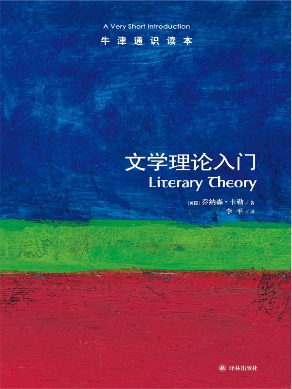

任氏有无轩主人评分：{{stars(page.route)}}

### 摘要
>p5: 他并非真正拒绝对这一问题做出解答，他所拒绝的只是对这一问题做出“逻各斯”式的解答，认为“什么是文学”的本质主义追问应该让位于“是什么让我们（或者其他社会）把一些东西界定为文学的”。

很多时候，我们在下定义的时候就是如此做的——甚至会反过来，通过定义“它”不是什么来定义“它”。

>p9: 理论这个词在这里是什么意思?首先，理论表示“思考、猜测”。

不能同意。太轻率地使用了理论这个词。

>p14: 思考发展成理论的一个特点就是它提供非同寻常的、可供人们在思考其他问题时使用的“思路”。

适用性？普适性？可重复性？

>p32: 文学是一种把语言本身置于“突出地位”的语言。……1.文学是语言的“突出”；2.文学是语言的综合。文学是把文本中各种要素和成分都组合在一种错综复杂的关系中的语言。3.文学是虚构。……读者对文学的关注各有不同，其原因之一就是文学的言辞表述与世界有一种特殊的关系，我们称这种关系为“虚构”。4.文学是审美对象。……对于康德和其他一些理论家来说，审美对象具有“无目的的合目的性”。它们的建构具有一种目的性：它们之所以这样建构是为了使它们的各个部分都协调一致去实现某个目的，但这个目的就是艺术作品本身，是蕴含在作品当中的愉悦，或者是由作品引起的愉悦，而不是外在的目的。……5.文学是互文性的或者自反性的建构。

基本同意。

>p38: 一部作品通过与其他作品之间的关系而存在于其他作品之中。

所以，没有独立的作品。

>p43: 如果那些故事把女人要想幸福就必须在婚姻中寻找说成是理所当然的，如果它们认为阶级区别是自然的，并且去描述一个情操高尚的女佣如何可能嫁给一位老爷，它们就是在使偶然的历史安排合法化。

联想现在的“霸道总裁爱上我”这样的文字吧。

>p43: 文学是意识形态的手段，同时文学又是使其崩溃的工具。

这句话的大意是，文字/文学具有极强的杀伤力，也是不能、不应该被操控的。

>p44: 任何看似合乎情理的东西，文学都可以使其变得荒谬不堪，都可以超越它，都可以用一种向其合理性和充分性提出质疑的方式改变它。

见上注。

>p45: 文学是一种为揭露和批评自己的局限性而存在的艺术机制。它不断地试验如果用不同的方式写作会发生什么。

比如卡尔维诺的不断探索。

>p55: 美国人传统上就是逃离文化的人。当文化研究把文学作为上层精华诋毁时，很难把它与资产阶级平庸主义长期的民族传统区别开来。在美国，回避高雅文化而研究通俗文化算不上政治的激进，也算不上反抗的姿态，它倒更能称得上是一门大众文化学科。

高级黑。

>p56: 文学既包含语言的各种特点，又包含对语言的一种特殊的关注。

这里开始体现文学的意义。

>p57: 意义至少有三个不同的范畴，或者叫层面，即词的意义、一段言语的意义和一个文本的意义。……我们有各种不同的意义，但有一点可以说是具有普遍意义的，那就是意义的基础是区别。

这三层含义并不完整，但已经足够。我们看文字时，很多时候连这三层意义都没有去掌握。

>p59: 索绪尔强调，一种语言不是为存在于语言之外的范畴提供名称的“系统命名法”。这对现代理论是至关重要的一点。

这里的关键是“范畴”。

>p62: 在文学研究中也有一个经常被忽视的基本区别，就是两个课题之间的区别：一个根据语言学的模式，认为意义就是需要解释的东西，并且努力证明为什么意义会成为可能。另一个与其相反，它从形式开始，力图解读这些形式，从而告诉我们这些形式究竟意味着什么。在文学研究中，这是诗学和解释学的对比。

这是两个重要的方向。

>p63: 意义是需要探讨的。这当然也是为什么现代文学研究一直更倾向于解释学而不是诗学（还有一个原因是，一般说来人们研究文学作品并不是因为他们对文学的功能感兴趣，而是因为他们认为这些作品要告诉他们有意义的东西，而他们想知道那些东西是什么）。

我个人也比较倾向于这个。

>p68: 意义由语境限定，但语境没有限定。

大赞！所以，我们永远都“意犹未尽”。

>p68: 对于解释学的阐述常把恢复解释学和怀疑解释学区别开来。前者力图重新建构产生作品的原始语境（作者的处境和意图，及文本对它最初的读者可能具有的意义），而后者则力图揭示文本可能会依赖的、尚未经过验证的假设（政治的、性的、哲学的、语言学的假设）。

这也是两个重要的方向。

>p72: 这四种主要转义手法——隐喻、转喻、提喻和反讽——被史学家海顿·怀特用来分析历史解释，或者用他的话叫作“情节化”。

For info.

>p77: 叙事诗重述一个事件，而抒情诗则是努力要成为一个事件，我们可以这样说。

For info.

>p84: 我一直在讨论的三个层次——事件、情节（或者叫故事）和话语——是作为两种对立起作用的：一是事件和情节之间的对立，二是故事和话语之间的对立。

这段暂时没有看懂。有待深入思考。

>p84: 事件是通过谁的看法聚焦并得以表述的?聚焦人可以是，也可以不是叙述者。

理解。

>p90: 首先，故事给人们带来快乐和满足——亚里士多德告诉我们，快乐和满足是通过模仿真实生活和它本身的韵律而产生的。叙述的特有形式在讲述骗人者反而受骗了，或者局面发生了相反的变化时，就制造了曲折变化，给人以快乐和满足，而且许多叙述都具备这个基本的功能：通过使大家熟悉的局面发生转变而给人以快乐和满足。

故事的本质就是如此了。

>p91: 我们只能在两者之间徘徊：一是把叙述看作是一种修辞结构，这种结构产生睿智的幻觉；一是把叙述作为一种主要的、可以由我们支配的制造感觉的手段去研究。

叙事手法。

>p93: 述行和述愿的区别抓住了不同类型言语之间的重要区别，并且改变我们的认识，使我们看到语言在多大程度上可以完成行为，而不仅仅是报道那些行为。但随着进一步的深入研究，奥斯汀在论述述行语时遇到了一些困难。……述愿语是声明如实再现事物的语言，是命名已经存在事物的语言；述行语是修辞的过程，是语言的行为，它运用语言学的范畴，创造事物，组织世界，而不仅仅是重复再现世界，从而削弱了述愿语的声明。

作者这里的“述行”和“述愿”的叙述是值得再看一次的。

>p104: 我就是的这个“我”是什么——人、行动者或参与者、自我，是什么使它成为这样?关于这个题目的现代思考有两个基本问题：首先，这个自我是先天给定，还是后天所造？第二，应该从个人的，还是社会的角度去理解自我?这两组对立的观点又引出了现代思想的四条分支。

四种不同的现代思想。很深刻。

>p108: 文学的价值一直与它给予读者的经验相联系，它使读者知道在特定的情况下会有什么感受，由此得到了以特定方式行动并感受的性格。

妙啊！

>p111: 对历史上边缘化的群体的研究有两个过程：一方面，严谨的调查研究表明，把某些特征，如性取向、性别，或者明显的形态特征作为界定一个群体身份的根本特点是不合理的，这些研究驳斥了把以性别、阶级、种族、性行为，或者国籍为特征的一个群体的本质身份强加给该群体中的每一个成员的做法。另一方面，群体也可以把强加给他们的身份变为自己的力量。

这里作者转向边缘群体。特别注意“这些研究驳斥了把以性别、阶级、种族、性行为，或者国籍为特征的一个群体的本质身份强加给该群体中的每一个成员的做法”这一段。

### 评论

文学是日常生活中的重要成分。本书对文学进行了深入的剖析，是不可多得的一本文学理论入门书籍。