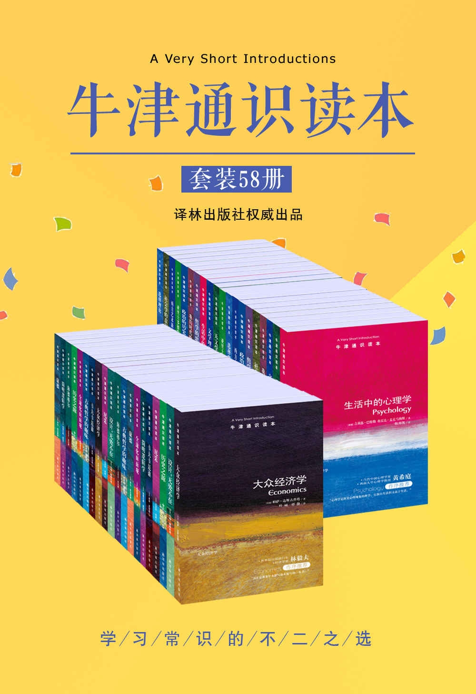

## 牛津通识读本

[《牛津通识读本》](https://global.oup.com/academic/content/series/v/very-short-introductions-vsi/?cc=us&lang=en&)（Very Short Introductions，简称VSI）好像是一套永远出不完的书，我现在找到的这个版本有58册，完全是文字版电子书，实在难得。

我准备一本一本地读，写一些心得汇总在这里。

### 目录 01-10
  - [001 - 资本主义（【英】詹姆斯·富尔彻）](./资本主义)
  - [002 - 中国文学（【美】桑禀华）](./中国文学)
  - [003 - 政治哲学与幸福根基（【英】戴维·米勒）](./政治哲学与幸福根基)
  - [004 - 政治的历史与边界（【英】肯尼思·米诺格）](./政治的历史与边界) 
  - [005 - 哲学的思与惑（【英】爱德华·克雷格）](./哲学的思与惑)
  - [006 - 犹太人与犹太教（【英】诺曼·所罗门）](./犹太人与犹太教)
  - [007 - 印度哲学祛魅（【英】休·汉密尔顿）](./印度哲学祛魅)
  - [008 - 医学伦理（【英】托尼·霍普）](./医学伦理)
  - [009 - 亚里士多德的世界（【英】乔纳森·巴恩斯）](./亚里士多德的世界)
  - [010 - 选择理论（【英】迈克尔·阿林厄姆）](./选择理论)

### 目录 11-20
  - [011 - 性存在（【英】韦罗妮克·莫捷）](./性存在)
  - [012 - 现代日本（【英】克里斯托弗·戈托——琼斯）](./现代日本)
  - [013 - 西方艺术新论（【美】弗里兰）](./西方艺术新论)
  - [014 - 我们时代的伦理学（【英】布莱克本）](./我们时代的伦理学)
  - [015 - 文学理论入门（【美】卡勒）](./文学理论入门)
  - [016 - 维特根斯坦与哲学（【英】格雷林）](./维特根斯坦与哲学)
  - [017 - 天文学简史（【英】霍斯金）](./天文学简史)
  - [[vsi:018.数学|018 - 数学（【英】高尔斯）]]
  - [[vsi:019.叔本华|019 - 叔本华（【英】贾纳韦）]]
  - [[vsi:020.社会学的意识|020 - 社会学的意识（【英】布鲁斯）]]

==== 目录 21-30 ====

==== 目录 31-40 ====

==== 目录 41-50 ====

==== 目录 51-58 ====