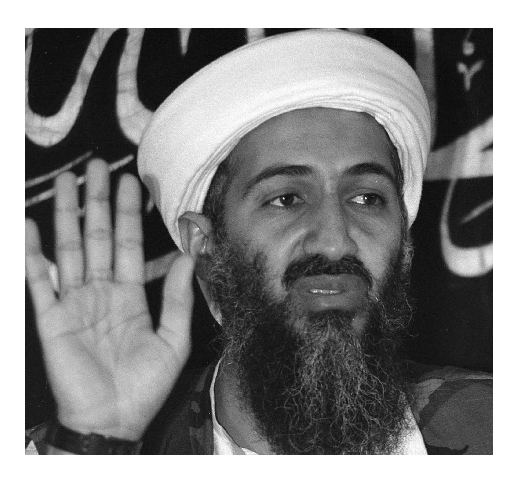

---
title: 本拉登在伊斯兰世界的呼吁
----

## 本拉登在伊斯兰世界的呼吁

这是一个在充满政治动乱、社会动乱的土地上，怪异、暴力的思想如何萌芽的故事。这是一个组织镇定自若掌握历史时刻的故事。本拉登号召无差别屠杀美国人，他怎么能获得数以千计的跟随者？又怎么能获得数百万人某种程度上的肯定？ 本拉登形成并散布其消息的信仰的历史、文化、本体对于很多美国人而言是很陌生的。通过把握那些过往的伊斯兰伟绩，他承诺恢复认为自己是那众多外国君主的受害者的尊严。他利用古兰经和它的一些解释制造文化和宗教假象。他接近那些由于现代化和全球化带来的巨大变化而无所适从的人。他的言辞来自精挑细选的多个来源：伊斯兰教，历史，特定地区政治和经济上的弊病。他同时强调在穆斯林世界普遍传播的对美国的不满。他强烈抗议美国驻军沙特阿拉伯这一伊斯兰教最神圣的处所。他谈及海湾战争后实施的制裁给伊拉克人民带去的痛苦，他也反对美国支持以色列。

### 伊斯兰教

伊斯兰（Islam这个单词的本意是“屈从于神的意志”）教兴起于阿拉伯，基于穆斯林坚信的一系列来自唯一的神，也是亚伯拉罕和耶稣的神对先知穆罕默德的启示。这些启示经由天使加百列转述，并记录在古兰经（Qur'an）中。穆斯林坚信，这些启示，交给了自亚伯拉罕直到耶稣这一最伟大且最终的先知链，完成了上帝的对人类的谕旨。言行录（The Hadith）则叙述了穆罕默德同代人记录的他的言行，它是另一个基本来源。第三个关键要素是教法（Sharia)，也即从古兰经和言行录中派生出来的法律条文。

伊斯兰教有两大主要派别：逊尼派（Sunni）和什叶派（Shia）。先知去世后不久，为穆斯林社会，又称乌玛（Ummah）选择一个新的领导，一位哈里发（caliph）的问题出现了。开始，他的继任者可以从他同时代人中选出，但是随着时间推移，这也变得不可能了。那些认为任何乌玛的领袖必须是先知的直系后代的人，形成了什叶派；而逊尼派则认为，嫡出并不是必须的，只要候选人满足其它信仰和知识方面的要求。血腥的战争后，逊尼派成为（也还是）多数派（什叶派在伊朗占优势）。从而，伊斯兰帝国——领导乌玛的实体——是一个逊尼派组织。它一直延续到1924年，最初由阿拉伯控制，其后由奥斯曼·土耳其控制。

很多穆斯林回顾历史时，都将先知穆罕默德获得启示后的那个世纪称为黄金时代。在阿拉伯人中这一记忆最为强烈。那时，在不到一个世纪内，伊斯兰教从阿拉伯半岛迅速扩展到中东，北非甚至欧洲。看起来这简直就是奇迹。对伊斯兰教过往辉煌的思念一直是一股强大的力量。

伊斯兰教既是宗教信仰，也是生活中方方面面行为的准则。很多穆斯林认为，一个好的政府就是一个由他们信仰中的那些道德教义指导的政府。当然，我们不能想当然的认为这意味着废除世俗政府，而取而代之以教会的法则。它只是意味着，有些穆斯林对宗教和政体间的分割感到不快，尽管历史上穆斯林领袖很欣然的将两者分离了。

然后，对于极端分子而言，这样的分离，以及议会、法律部门的存在只能证明这些领导人是伪穆斯林，他们在生活的各个方面篡夺着上帝的权威。时不时的，伊斯兰世界会出现标榜为“正统派运动”的爆发（叫这个名字只是为了好听而已）。一些教士指责信徒们的不坚定，同时呼吁回归对古兰经和言行录文字教义的遵守。Ibn Taimiyyah是为14世纪的学者，本拉登很喜欢引用他的说法。他诅咒那些腐败的领袖，也同时诅咒那些未能批判他们的神职人员。他迫切要求穆斯林们自我阅读古兰经和言行录，不要只是依赖如他那样的学者的解读，要互相为他人是否遵守教义而负责任。 伊斯兰极端分子的历史版本中，将伊斯兰黄金时代的衰落归咎于那些偏离了宗教所指引的真正道路的领袖和人民。伊斯兰变得脆弱，而觊觎已久的外国侵略者们长驱直入，偷走了他们渴望已久的土地、财富甚至灵魂。

### 本拉登的世界观

尽管本·拉登宣称他是全球的领袖，他提出了一种伊斯兰历史的极端看法，并以之主要向阿拉伯人和逊尼派进行呼吁。他基于基要主义者的观点，认为哈里发最终的陨落是由于领导人废弃了对宗教的投入这一纯粹的道路。他一再呼吁其跟随者进行殉教，因为“压迫和屈辱之墙只能用枪林弹雨来摧毁”。对那些怀念古老而平静的世界秩序，而慨叹不再的人，他说他的“哈里发”是当今不稳定的一个想象中的替代。对于另外的人，他提供的是过分简单化的阴谋论来解释他们的世界。

本拉登同时也十分依赖埃及作家Sayyid Qutb。Sayyid Qutb是穆斯林兄弟组织成员，1966年被政府处死，罪名是试图颠覆政府。Qutb将其伊斯兰修养和他非常肤浅西方历史和思想进行了混合。上世纪40年代，他由埃及政府派往美国进行学习，回国时充满了对西方社会和历史的憎恨。他无视西方的成就，认为他们全部都只是物质上的，并认为西方社会“没有任何可以安抚自己的良心和证明自身的存在”的东西。

Qutb的文字衍生了三个主题。首先，他认为这个世界已经被野蛮、放荡以及无信仰所包围。Qutb将无信仰状态称为jahiliyya，这是一个宗教用语，特指先知穆罕默德得到启示之前的无知时代。Qutb认为人只能在伊斯兰和jahiliyya之间进行选择。第二，他警告说，越来越多的人（包括穆斯林）为jahiliyya以及它的物质享受吸引，而偏离了伊斯兰世界观；jahiliyya可能会战胜伊斯兰。第三，在Qutb认为的上帝与撒旦的战争中，没有中间立场。他所定义的所有的穆斯林因而必须在战斗中拿起武器。如果哪个穆斯林拒绝这样做，那他不过是又一个背道者，需要被消灭。

本拉登颇为赞同Qutb的极端观点。他和他的追随者找到了一种许可，为其毫无正当理由的大规模谋杀找到理由：信仰受到挑战，需要正义的卫护。很多美国人带着困惑问道：“‘他们’为什么恨我们？”有些人问道：“我们应该怎么做才能停止这些攻击？”

本拉登和基地对这两个问题都给出了答案。对于第一个问题，他们说美国攻击了伊斯兰；美国对所有牵涉到穆斯林的冲突负有责任。因此，以色列与巴勒斯坦人开战，美国要被指责；俄罗斯和车臣开战，美国要被指责；印度和克什米尔穆斯林开战，美国要被指责；菲律宾政府和它南方岛屿的穆斯林种族开战，美国也要被指责。美国还要对穆斯林国家的政府负责，后者被基地组织讥称为“你们的代理”。本拉登如此断然的说：“我们和这些政府的斗争，与我们和你们的斗争不可分割。”这些指责在成百万阿拉伯和穆斯林中找到了现成的听众。他们对美国十分恼怒，因为美国在自伊拉克到巴勒斯坦的诸事务中支持了他们各自国家的统治者。

本拉登对美国的不满开始可能是针对某些特定的美国政策的反应，但是很快就变本加厉。对第二个问题，美国人应该怎么做（才能停止这些攻击），基地的回答是，美国应该放弃中东，皈依伊斯兰教，并终止其社会及文化的不道德和无神论。“很难过的告诉你们，你们是人类历史见证过的最坏的文明。”如果美国不这么做，它将与伊斯兰国家对敌，它将是一个基地领导人所谓的“不配去生，更配去死”的国家。

### 历史和政治背景

伊斯兰世界中的基要主义运动很少能长久获得政治权力。19和20世纪，基要主义参与了反殖民的斗争，但是在一次大战之后占据主要地位的争取独立的“世俗”斗争中没有扮演什么角色。受过西方教育的律师、战士和官员们领导了大多数的独立运动，而宗教影响力以及传统文化被视为国家进步的障碍。

阿拉伯中东在二战后从西方政权手里获得了独立，其后它们从最早拥有骄傲和乐观的一端发展到了今日冷漠、犬儒、绝望等情绪混合的另一端。在若干个国家，已经存在了一个王朝统治，或者由最高部落家族很快建立了一个。诸如沙特阿拉伯、摩洛哥和约旦等国的君主统治至今仍在。而在埃及、利比亚、伊拉克和也门等国的君主统治最终被世俗的民族主义革命推翻。

这些世俗的统治都承诺一个光明的未来，并通常和推行建立一个单一的阿拉伯世俗政权的空想捆绑在一起，如埃及总统Gamal Abdel Nasser的阿拉伯社会主义，又如叙利亚和伊拉克的Ba'ath政党。然而，继之而来的几乎不变的是那些通常不愿容忍任何反对的独裁政体——即使是在如埃及那样有着国会传统的国家。随着时间的推移，他们的政策被依附权力的欲望定型，成为压制、赏赐、逐出和转移公众愤怒到替罪羊（通常是外国）的政策。

到了20世纪70年代末期，整个穆斯林世界内，世俗、独裁的民族主义的破产已经显而易见。与此同时，这些政体堵塞了几乎所有的和平反抗的途径，迫使他们的批评者选择沉默、被流放或者暴力反抗。1979年伊朗的革命将什叶派神权推向统治地位。这一成功激励着其它地方的逊尼派基要主义者。

20世纪80年代，石油给沙特带来了暴富，为了和什叶派的伊朗进行竞争，沙特开始推行其对伊斯兰教义的逊尼派解读，即瓦哈比主义（Wahhabism）。沙特政府总是意识到他们承担着保卫伊斯兰圣地的责任，于是它联合了王国内和其它波斯湾沿岸国家的富有阿拉伯人，捐献金钱，建立清真寺和宗教学校，可以宣扬并传授其对伊斯兰学说的解释。

在这一正统性的竞争中，世俗政权根本无法给出别的选择。相反，很多情形下，其统治者接受了当地的伊斯兰运动，让出了许多社会、教育方面事务的控制。伊斯兰教徒们得陇望蜀，继续要求权力。在埃及这一趋势特别明显。经历了1981年激进伊斯兰分子刺杀安瓦尔·萨达特总统的事件后，埃及政府对伊斯兰好战分子进行了粗暴的镇压，而对其它温和的伊斯兰学者和作家进行了骚扰，放逐了很多人。在巴基斯坦，军事政权为了证明其获取统治是正当的，采取了虔诚的公众姿态，同时在教育和社会方面引入前所未有的伊斯兰的影响。

到了20世纪90年代，这些伊斯兰政体的实验开始举步维艰：伊朗的革命失去的动力，威望和公众支持，巴基斯坦的统治者发现大部分国民对基要主义伊斯兰兴趣寥寥。伊斯兰复兴运动在穆斯林世界获得了追随者，但是没能掌控政治权力（除了在伊朗和苏丹）。1991年在阿尔及利亚，伊斯兰教徒几乎确定可以通过选举而获得政权时，军方先手抢夺了胜利果实，从而引发了直到今日还在进行着的血腥的内战。

当今统治者的反对者们要想参与到现有的政体中，方法不多——如果还能说有什么方法的话。因此，他们就成了现成的听众，响应着对穆斯林的召唤，净化他们的社会，反抗不受欢迎的现代化，严格遵循教法。

### 社会和经济病症

20世纪70年代和80年代早期，前所未有的巨大财富洪流引导着当时在很大程度上还是非现代化的石油国家试图采取一些“近道”，赶上几十年的发展。他们投资巨型基础设施项目，迅速扩充教育，创建了补助金形势的社会保障体系。这些体系形成了一种广泛的“理所应当”的感觉，而没有与之对应的社会责任感。20世纪80年代后期，石油收入缩减，众多亏本开发项目带来的经济衰退，人口的增长，使得这些“津贴”项目无法维系。作为结果，这些项目都被削减。那些已经将政府的慷慨视作自身权利的人们对此愤愤不平。而当他们得知有多少石油收入直接进入了统治者、他们的朋友和帮手的口袋后，更是为这些愤恨火上浇了油。

和产油国家不同（也和阿富汗不同，它的经济发展勉强刚刚起步），其它阿拉伯国家和巴基斯坦一度看起来正走向比较均衡的现代化。这些国家所建立的商业、金融、工业领域，由企业家精神和对自由企业广泛理解所支撑，进展的不错。但是亏损的重工业、国有寡头和不透明的行政体系渐渐扼杀了其发展。更重要的是，这些国家中心的政权最首要的重点放在了保护其精英对国家财富的掌握上。他们不愿培养动态的经济，创造对那些受教育的年轻人有吸引力的工作，这些国家的经济停滞不前，而依赖于外派劳工到阿拉伯产油国家或者西方的这一保险手段。更过分的是，很多穆斯林国家队妇女的压制和隔离不仅严重限制了个人的机遇，也削弱了整体经济的生产力。

到了20世纪90年代，高出生率和低婴儿死亡率在整个穆斯林国家产生了一个共同的问题：一个巨大而稳定增长的年轻人群，却没有任何合适或稳定的、合理的就业期望。这是社会动荡的明确前兆。这些年轻人中的很多人，例如那些只在宗教学校受教的大量年轻人，缺少他们的社会所需要的技能。更多的人获得了有价值的技能，但是生活在无法创建令人满意的工作的停滞的经济体中。

他们的教育系统通常很少——如果还能说有的话——关注世界其他部分的思想、历史和文化。这个系统的产物就是成百万同时进行世俗和宗教学习的人。世俗教育反映出对技术领域，而不是人性和社会科学的强烈文化偏好。这些年轻人中的很多人，即使能到国外学习，也缺乏理解不同文化的洞察力和能力。

对得体生活追求的失败，无法从教育中获益——而这样的教育通常是靠着家庭巨大的牺牲才得到的，成立自己的家庭也阻碍重重，一些年轻人很容易就成为了激进化的目标。