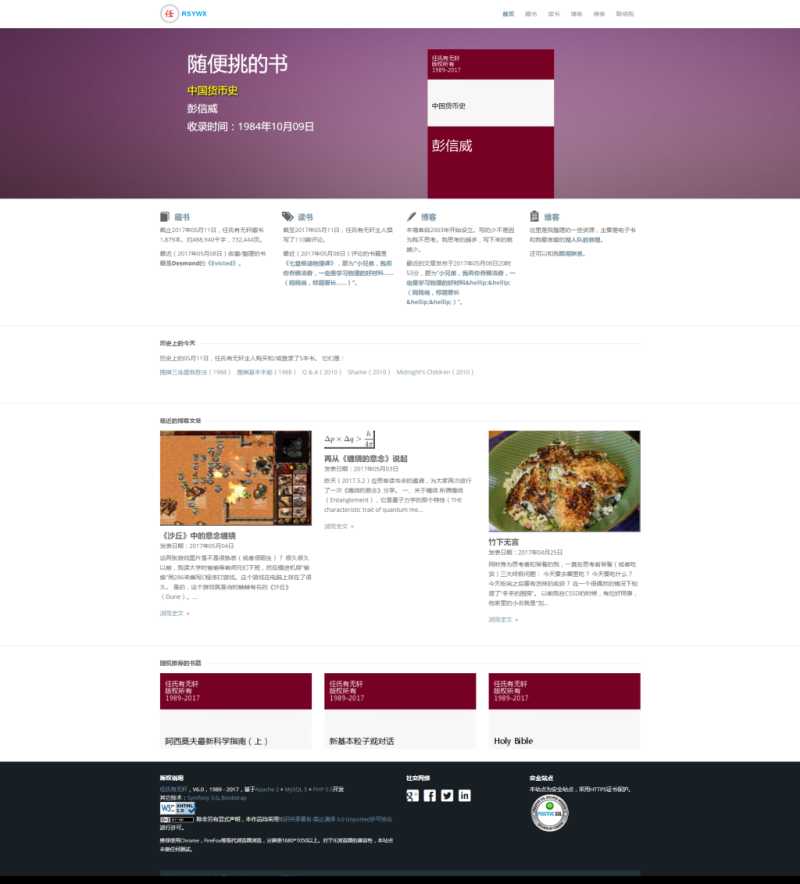
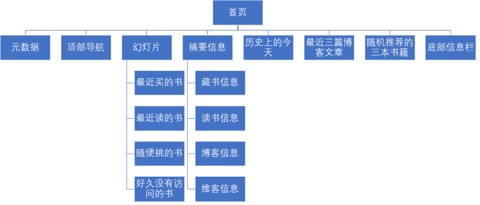
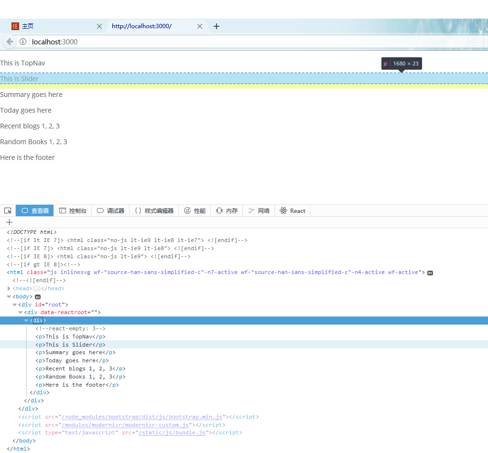

## 主页

我们现在的主页（`Home.js`）还十分简陋，只有一个“Hello world!”字样。这只是用来表明我们在前一篇“[路由](../router)”中所定义的路由（到页面）的解析已经完成。

我们在这一章和后续几章将详细分析：

  * 如何设计一个界面并将其分割为合理的“组件；
  * 如何设计各个组件的实现；
  * 如何进行异步远程API的调用；
  * 如何对状态进行设置和读取；
  * 如何基于状态的变化对页面进行渲染。

本章以及后续的几章是最为重要的内容。

### 界面设计和分割

我们先来看看完成的首页应该是个什么样子。如下的屏幕截图来自目前处于发布状态的“任氏有无轩”首页：



这是一个典型的由上到下的页面布局。几乎内容都是动态的，来自页面本身的变量或者远程的API返回内容。我们可以直观地将其分为如下几个部分：

  * 顶部导航栏
  * 站点Logo部分。静态。
  * 导航部分。根据当前所在页面，高亮显示目前所在位置。[^1]
  * 幻灯片。这里会展示四个不同的内容（截图中没有显示）：
      * 最近买的书；
      * 最近读的书；
      * 随便挑的书；
      * 好久没有访问的书；
  * 任氏有无轩的摘要信息：
      * 藏书信息；
      * 读书信息；
      * 博客信息；
      * 维客信息（静态）；
  * 历史上的今天
  * 最近的三篇博客文章
  * 随机推荐的三本书籍
  * 底部信息栏（版权、社交信息、安全声明）
  * （不可见）的页面元信息（`MetaData`）

简单地算算，我们会有十几个组件。为了兼顾视觉结构和功能结构，我们会这样来设计我们的结构层次：



作为一个简单的映射，我们可以简单地认为：这里的每个框都对应着一个组件，由一个React类去实现。

### 由顶向下的设计

在React应用设计过程中，我推荐使用由顶向下的设计过程。我们总是从最顶层的、可能包含更多子组件的组件开始，规划层级关系，设定布局要素。

我们修改`/src/Home.js`文件如下：

```javascript
import React, { Component } from 'react';

import TopNav from './layout/TopNav';
import Slider from './layout/Slider';
import MetaData from './MetaData';
import Summary from './layout/Summary';
import Today from './widget/Today';
import RecentBlogs from './widget/RecentBlogs';
import RandomBooks from './widget/RandomBooks.js';
import Footer from './layout/Footer.js';

class Home extends Component {
  render() {
    return (
      <div>
        <MetaData description='主页' />
        <TopNav active="0"/>
        <Slider />
        <Summary />
        <Today />
        <RecentBlogs />
        <RandomBooks />
        <Footer />
      </div>
    );
  }
}

export default Home;
```

这个文件还无法通过编译，因为有很多“子组件”缺失。我们可以仿照之前的方式，生成这些文件（并放置在对应的目录中）。而这些子组件目前只返回一个简单的`<p>...</p>`段落，用于提供这些组件会在哪里显示的视觉反馈而已。比如这个`/layout/Slider.js`文件：

```javascript
import React, {Component} from 'react';

class TopNav extends Component{
  render() {
    return (
        <p>This is Slider</p>
    );
  }
}

export default TopNav;
```

注意：我们用到了`MetaData`这个React部件，用来操作页面的元信息，因此我们需要用`npm install react-document-meta`来安装这个依赖关系。

如果一切都如我们所愿，在完成上述目录和文件的创建后，我们就可以用npm start命令来看看效果：


我们看到，所有页面的部分都已经成功地展示了——虽然没有任何样式的修饰。这是很了不起的第一步。我们完成了一个页面的分割和组合。

### React的DOM渲染

在进入更深层次的编程之前，我们来看看这个页面到底是什么东西。

在FireFox中按下`Ctrl-Shift-I`，可以调出FX内置的调试器。这是一个非常强大的HTML、JS调试器，如果你还从没有使用它或者不熟悉它，建议花一些时间去熟悉一下这个工具。



从图片中我们可以清楚地看到：

  * 我们在`/public/index.html`中创建的那个`<div id="root">`被原封不动地转到了最终页面中。
  * React在该root节点下，生成了若干DOM节点并形成了一棵新的树。
  * 我们在各个组件中提供的内容作为该树的子节点，依次显示在树中。

注意：不要用浏览器的“查看页面源代码”的方式来查看React页面。所有的“内容”都是React对DOM动态操作而生成的，所以“查看页面源代吗”根本看不到这些动态生成的节点。

注意：FX内置的调试器已经足够强大，并能给出很多关于DOM节点的信息。

接下来我们会依次实现这些组件。

[^1]: 因为导航栏显示的部分链接会引向外部站点，所以，这个高亮其实只对部分页面有用。
