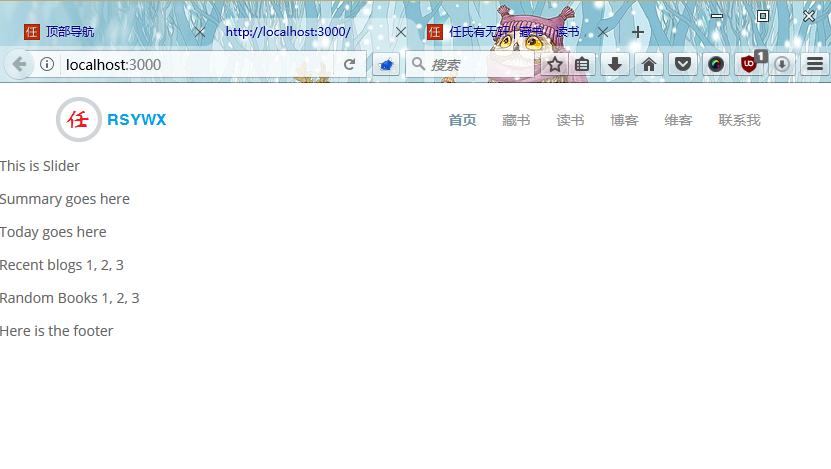

## 顶部导航

在本章中我们将实现顶部导航栏。最终效果如下图：


这个组件相对简单。一部分是纯静态的Logo，一部分是顶部导航栏，根据我们当前所在的页面确定要高亮哪个部分。比如，上图因为是展示首页，所以“首页”部分得到加粗显示。

该组件的实现是在`/layout/TopNav.js`中，我们修改该组件的`render`函数：

```javascript
  render() {
    let active=this.props.active;
    return (
        <header>
        <nav className="navbar navbar-default grove-navbar" role="navigation">
            <div className="container">
                <div className="navbar-header">
                    <a href="#" className="grove-toggle" data-toggle="collapse" data-target=".grove-nav">   <i className="glyphicons show_lines"></i>  </a>
                    <a href="/" className="navbar-brand"></a>
                </div>

                <div className="collapse navbar-collapse grove-nav">
                    <ul className="nav navbar-nav">
                        <li className={active==="0"?"active":""}>
                            <a href="/">首页</a>
                        </li>
                        <li className={active==="1"?"active":""}>
                            <a href="/books/list">藏书</a>
                        </li>
                        <li className={active==="2"?"active":""}>
                            <a href="/books/readings">读书</a>
                        </li>
                        <li>
                            <a href="https://rsywx.net/wordpress">博客</a>
                        </li>
                        <li>
                            <a href="http://www.rsywx.com">维客</a>
                        </li>
                        <li className={active==="99"?"active":""}>
                            <a href="/contact">联系我</a>
                        </li>
                    </ul>
                </div>
                {/*<!-- /.navbar-collapse -->*/}
            </div>
        </nav>
    </header>
    );
  }
```

任何一个组件，如果需要在最终的HTML DOM中渲染一些东西，就必须实现`render`函数，而且返回一些DOM的节点。而这正是我们再这个函数中所做的。

这个`render`函数的函数体中，大部分代码是标准的HTML5代码，用来返回相应的HTML DOM节点。

需要单独列出讨论的地方只有一点。

读者如果细心的话，会注意到我们在前一篇“主页”的代码中有这么一行：

>`<TopNav active="0"/>`

我们已经知道，组件是一个类，所以理论上有“构造函数”，而“构造函数”也有其参数。

在React中，我们可以向组件传递“构造参数”，这些“构造参数”以命名参数的方式出现在该组件的`props`属性中，因此在`render`函数中可以通过这样的方式来访问：

>`let active=this.props.active;`

然后在JSX中（也就是返回的HTML DOM节点中）用JSX语法来进行相应的判断：

```javascript
<li className={active==="0"?"active":""}>
   <a href="/">首页</a>
</li>
```

如果`active`这个变量为0，那么我们为这个列表项的CSS样式加上`active`（渲染效果就是加粗显示），否则就什么样式也不加。

经过这段操作后，我们的页面会更新成如下的样子：



很好！我们成功地完成了第一个组件的编写！我们的页面开始看起来有点样子了！

### 再说说`render`函数

可以这么说，组件的`render`函数是其核心。它通过结合JSX语法和JS语法提供了丰富的控制结构，达到最终需要的渲染效果。

  * 在该函数体中，可以使用所有常规的JS语法。
  * 在该函数的`return`块中，可以使用所有标准的HTML语法，也可以使用所有JSX语法——此时，JSX部分应该用`{...}`包含起来。
  * `render`函数在该组件的状态[^1]更新后被自动调用（除非有别的条件控制而不进行更新）。''render''函数非常聪明，它会分析整个DOM树，合并刷新请求，而且只更新那些需要更新的节点。

DOM操作是个非常耗时的操作，有了这样的智能合并和智能刷新计算，我们在浏览该页面时才不会觉得很“顿滞”，为用户带来良好的浏览体验。

在下一章，我们将学习建立幻灯片组件。

[^1]: 关于状态，我们会在后续章节进行更详细的讲解。