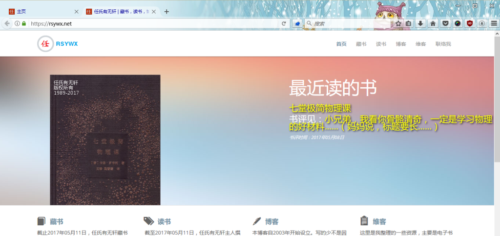

## 幻灯片组件

接下来我们要实现“幻灯片组件”。这个组件又由四个独立组件完成，分别显示：最近购买的书籍、最近评论的书籍、随机选择的书籍和好久没有访问的书籍。

### 幻灯片的responsive显示

由于幻灯片是一个“桌面”专属的属性，我们需要对这段内容进行处理，在“桌面”和“手机”配置下，分别显示不同的内容。

在“桌面”配置下，该段内容是四个幻灯片循环显示：



如果进入“手机”配置（屏幕宽度不那么大），该段内容将是简单的一个欢迎标语：


参照我使用的模板的写法，我将这两个不同的内容再分解为两个不同的组件：

```javascript
// /src/layout/Slider.js

import React, {Component} from 'react';
import SpecialTitle from '../widget/SpecialTitle';
import NormalTitle from '../widget/NormalTitle';

class Slider extends Component {
  render() {
    return (
      <div>
        <NormalTitle />
        <SpecialTitle />
      </div>
    );
  }
}

export default Slider;
```

`SpecialTitle`用于“手机”设备下的显示，代码非常简单：

```javascript
import React, {Component} from 'react';

class SpecialTitle extends Component {
  render() {
    return (
  <div className="widewrapper pagetitle visible-xs">
    <div className="container">
      <h1>欢迎来到任氏有无轩！</h1>
    </div>
  </div>
  )}
}

export default SpecialTitle;
```

`NormalTitle`用于“桌面”设备下的显示，我们再将它分为四个小组件：

```javascript
import React, {Component} from 'react';
import LatestBookSlide from './LatestBookSlide';
import LatestReadingSlide from './LatestReadingSlide';
import RandomBookSlide from './RandomBookSlide';
import ForgottenBookSlide from './ForgottenBookSlide';

class NormalTitle extends Component {
  render (){
    return (
      <div className="hidden-xs">
        <div
          id="layerslider"
          style="..."
          <LatestBookSlide />
          <LatestReadingSlide />
          <RandomBookSlide />
          <ForgottenBookSlide />
        </div>
      </div>
    );
  }
}

export default NormalTitle;
```

其中，`LatestBookSlide`, `LatestReadingSlide`, `RandomBookSlide`和`ForgottenBookSlide`分别显示幻灯片组件中的一幅幻灯片，对应我们想要显示的四个内容。

### 实现`LatestBookSlide`

我们挑选一个组件来详细讲解如何实现。我们会看到如何调用远程API来获得数据，并操作状态（state）来触发页面的刷新。

React的组件有自己的生命周期，详细的介绍可以参见官方文档。

大部分情况下，我们用到的是组件的`componentDidMount`这一生命周期相关事件。此时，该组件所有的DOM节点已经被置入整个HTML文档的DOM树中，但是相应的动态内容可能还没有被获取。这是一个恰当的时机来获取远程API的数据。

#### 获取远程API数据

React和JS支持原生的异步远程API调用[^1]。ES6开始支持`await`关键字，但是为了保持与浏览器的兼容性，我们采用比较保守的`then`方式：

```javascript
componentDidMount() {
    fetch('http://api.rsywx.com/book/latestBook')
      .then(response => {
        return response.json();
      })
      .then(json => {
        let book=json.out[0];
        this.setState({
          title: book.title,
          author: book.author,
          publisher: book.p_name,
          purchdate: book.purchdate,
          id: book.bookid,
          cover: "http://api.rsywx.com/book/cover/"+book.bookid+"/"+book.title+"/"+book.author+"/300"
        });
      })
  }
```

`fetch`函数返回一个promise，这是一个异步对象。然后我们对返回的内容进行解析。这个解析一般分为两步。

第一步是获得JSON方式表示的返回内容（`return response.json()`）。

第二步是对该JSON字符串进行解析，并设置该组件的状态（`this.setState()`）。

值得注意的是，我们在这段代码中，直接在组件状态中创建了若干状态变量（如`title`, `author`等）。这些变量稍后会在`render`函数中被使用。

#### 编写`render`函数

我们已经说过，`render`将返回一系列HTML5的节点。我们是按照模板在进行操作，所以其中的大部分内容都可以直接从模板中拷贝过来。

在需要显示动态内容的时候，我们可以这样做：

```html
<div><p className="s18">{this.state.author}</p></div>
<div><p className="s18">{this.state.publisher}</p></div>
<div><p className="small"><em>收录时间：{this.state.purchdate}</em></p></div>
```

### 值得注意的地方

首先，对状态变量（`this.state`）的操作。React规定，对状态（以及状态变量）的读操作使用`this.state.变量名`的方式，对状态的写操作必须使用`this.setState`的方式，而不能用`this.state.变量名=一个值`的方式。

在JSX中引用变量，要将变量用`{...}`括起来。

就是这样，我们很快地完成了幻灯片组件中的一个子组件的开发。其它三个子组件的开发方式与此类似。不在赘述。请读者自行完成。

注意：本应用使用到的API接口在`http://api.rsywx.com`中可以找到文档说明。调用方式为：`http://api.rsywx.com/module/method`，将`module`和`method`替换为对应的模块名（大小写不敏感）和方法名（大小写敏感）即可。

[^1]: 此时需要注意，远程API要支持JS的跨域调用。实现JS跨域调用有很多方式。在本实例中，由于提供API服务的服务器也在作者控制之下，所以采用的是比较简单的在API头中加入CORS的方式。