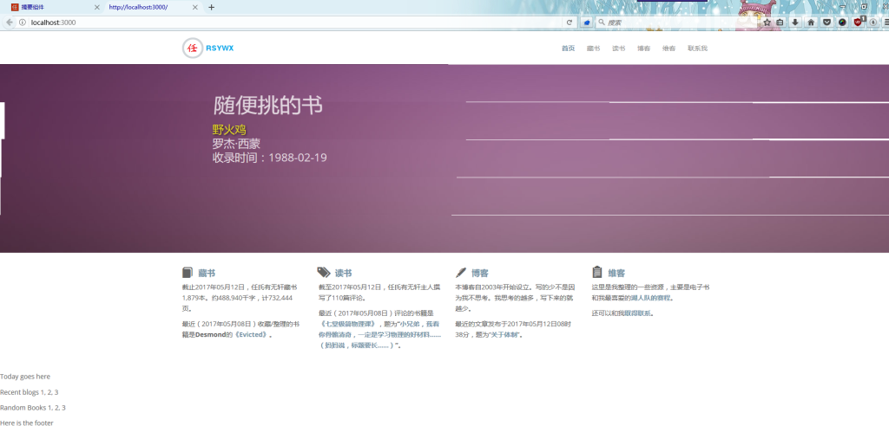

## 摘要组件

这一章中我们要实现“摘要组件”，分别给出藏书、读书、博客、维客的摘要信息。前三个牵涉到动态内容，最后一个只有静态内容。

与[前一章](../slide)中的做法类似，我们也进一步将该组件分解为四个小组件：

  * `BookSummary`：显示藏书的摘要信息。
  * `ReadingSummary`：显示读书的摘要信息。
  * `BlogSummary`：显示博客的摘要信息。
  * 直接用`<div>`显示维客信息和其他杂项信息。

于是`/layout/Summary.js`会被改写为：

```javascript
class Summary extends Component {
  render() {
    return (
      <div className="widewrapper">
        <div className="container">
            <div className="row features">
                <BookSummary />
                <ReadingSummary />
                <BlogSummary />
                <div className="col-md-3 feature">
                    <h3><a href="http://www.rsywx.com"><i className="glyphicons notes_2"></i>维客</a></h3>
                    <p>这里是我整理的一些资源，主要是电子书和我最喜爱的<strong><a href="/misc/lakers/2016">湖人队的赛程</a></strong>。</p>
                    <p>还可以和我<strong><a href="/contact">取得联系</a></strong>。</p>
                </div>
            </div>
        </div>
    </div>
    );
  }
}
```

下面我们以`BookSummary`为例，简要说明一下编程要点。其`componentDidMount`函数如下：

```javascript
  componentDidMount() {
    fetch('http://api.rsywx.com/book/summary')
      .then(response => {
        return response.json();
      })
      .then(json => {
        let summary=json.out.summary[0];
        let last=json.out.last[0];
        let formatter=new Intl.NumberFormat('en-US', {
          minimumFractionDigits: 0,
        });

        let pcd=new Date(last.purchdate);
        let y=pcd.getFullYear();
        let m=String(pcd.getMonth()+1).padStart(2,'0');
        let d=String(pcd.getDate()).padStart(2, '0');

        this.setState({
          bc: formatter.format(summary.bc),
          wc: formatter.format(summary.wc),
          pc: formatter.format(summary.pc),
          purchdate: y+"年"+m+"月"+d+"日",
          id: last.bookid,
          title: last.title,
          author: last.author,

        });
      });

  }
```

基本上，这都是获取数据、格式数据然后设置状态的过程。

在`render`函数中，我们主要也就是将模板的内容复制过来，对需要动态内容的地方进行JSX替换即可：

```html
最近（{this.state.purchdate}）收藏/整理的书籍是<strong>{this.state.author}</strong>的<strong><a href={"/books/"+this.state.id+".html"}>《{this.state.title}》</a></strong>。
```

其他几个子组件的编写与此类似，不再赘述。

现在我们的主页面会是这样的：



在下一章，我们讨论“历史上的今天”这个组件的编写。