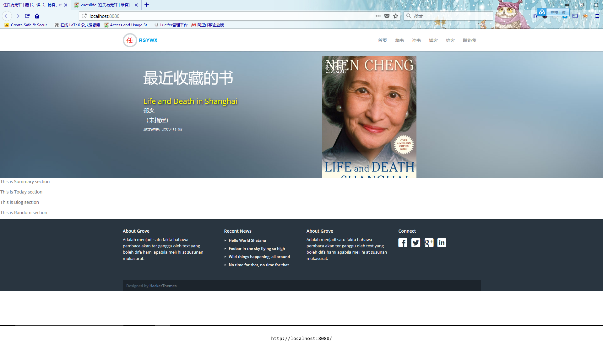
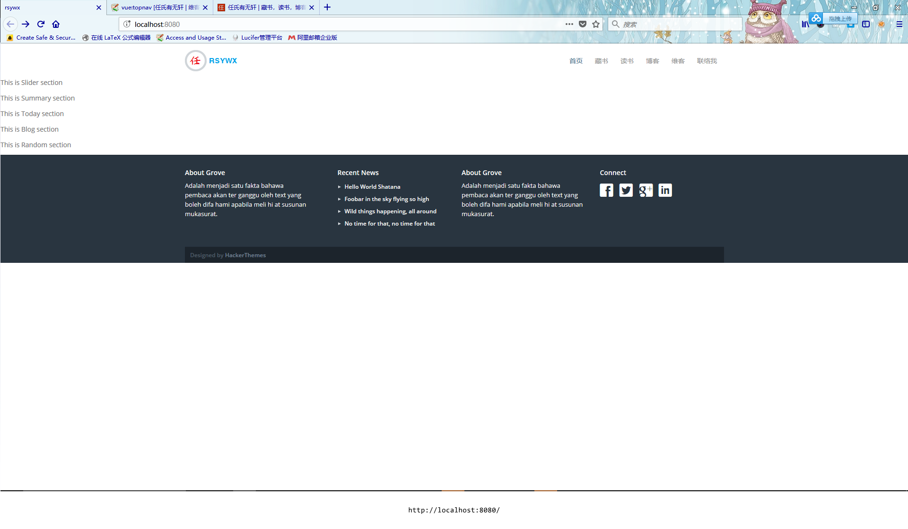

## 顶部导航

在本章中我们将实现顶部导航栏。最终效果如下图：



这个组件相对简单。一部分是纯静态的Logo，一部分是顶部导航栏，根据我们当前所在的页面确定要高亮哪个部分。比如，上图因为是展示首页，所以“首页”部分得到加粗显示。

该组件的实现是在`/src/components/TopNav.vue`中，我们先修改该组件的`<template>...</template>`部分：

```html
<header>
...
</header>
```

Vue与React不同，它任何一个组件都封装了至少两个部分：一个是模板部分（也就是常规MVC架构中的V部分），一个是控制这个模板如何显示的控制器部分（MVC中的C）。

需要单独列出讨论的地方有两点。

### 链接

第一个是顶部导航的链接，它们将链接到各个（我们即将创建的）页面。以“藏书”链接为例，它将根据一些筛选条件，如：搜索类型（缺省为所有书籍）、关键字（缺省为所有）以及页面（缺省为第1页）等链接到藏书列表的页面并显示符合条件的书籍。

我们首先创建一个`src/screens/BookList.vue`文件，用来显示我们的书籍。和之前做法一样，我们也只放入最基本的代码：

```javascript
<template>
  <p>This is BookList page</p>
</template>

<script>
export default {
  name: "BookList",
};
</script>
```

我们将一个一个完整的页面放置到`src/screens`目录下进行统一管理，而`src/components`中只放置那些构成一个页面的组件。所以我们要将原来放在`src/components`下的`Home.vue`移动到`src/screens`之下，并对引用到该文件的文件做相应的修改。

接着我们在`src/router/index.js`中加入一个路由声明：

```javascript
routes: [
    ...
    {
      path:'/books/list/:type/:key/:page',
      name: 'BookList',
      component: BookList
    }
  ],
```

详细的路由声明语法可以参见[官方文档](https://router.vuejs.org/zh-cn/)，这里不再重复。

读者应该还记得，我们在创建应用时选择了`vue-router`的支持，所以任何外链都可以这样来做：

```html5
<li>
    <router-link :to="{name: 'BookList', params: {type: 'title', 'key':'all', 'page': 1}}">藏书</router-link>
</li>   
```

我们这里使用了`vue-router`提供的`router-link`标签，采用的是命名路由的方式（因为我个人觉得这样简单，而且和我以前玩Symfony时的路由体验接近），并传递了众多参数。[^1]

[^1]: 为了简单起见，我们没有采用缺省路由参数的方式。

这样产生的链接形如：`http://localhost:8080/books/list/title/all/1`。

**12.02注：**还是改到hard code这个链接以及“读书”链接。因为后期编程发现，在书籍列表页转换了分页后，点击顶部这个链接只会引起浏览器地址变化却不能激发数据的重新获取。所以，为了简单起见，我还是直接将这个地址用`<a href=...>`的方式写进去。

我们点击这个链接，就可以访问书籍列表页面。

### 链接高亮

我们需要完成的另一个视觉改进是根据当前页面来高亮导航栏中的对应项目。

`TopNav`只是一个组件，它需要“别人”来告诉它当前高亮的是哪个项目，而能告诉它的这个“别人”只能是调用该组件的所谓“父组件”（在本页面中就是`Home.vue`页面）：

```javascript
<template>
  <div>
    <TopNav :active='1'/>
    <Slider/>
    <Intro/>
    <Today/>
    <Blog/>
    <Random/>
  </div>
</template>
```

我们向`TopNav`传递一个参数，表明我们现在的活动页面是1（对应于首页）。

然后我们需要在`TopNav`中完成这个参数的获取并进行处理。

此时我们需要用到Vue中的`v-bind:class`来处理：

```html5
<li v-bind:class="{ active: active==1 }"> 
    <a href="/">首页</a>
</li>                          
```

这段代码的作用是，如果`active`为1（也就是要高亮“首页”），那么就为这个菜单项加上一个`active`的CSS样式类。在这点上，Vue做的比较简洁，不需要植入`if`判断。

我们还要在组件中声明一下，让组件能处理来自父组件的属性。[^2]

[^2]: 作为一种约定，我们将来自父组件的设定称为属性，而由本组件自行维护的设定称为状态。

```javascript
<script>
export default {
  name: "TopNav",
  props: [
      'active',
  ]
};
</script>
```

在Vue中，我们只要在组件中加入一个`props`属性，并在其中声明我们要从父组件中接受的参数（属性）即可。

经过这一系列操作后，我们的页面会更新成如下的样子：



很好！我们成功地完成了第一个组件的编写！我们的页面开始看起来有点样子了！

### 再说说组件

Vue中的组件由两部分组成：一部分是模板，用来显示页面（组件）的内容；一部分是脚本，用来控制页面呈现，并提供相应的数据。

有关Vue的模板语法，请参见官方文档：[模板语法](https://cn.vuejs.org/v2/guide/syntax.html)。

有关脚本中组件的声明和语法，也请参见官方文档：[Vue实例](https://cn.vuejs.org/v2/guide/instance.html)。

本教程不是官方文档的说明，而是基于本应用的开发过程进行相关说明。

我的编程风格是，在满足条件的情况下，用尽可能少、尽可能平实的语法。

在下一章，我们将学习建立幻灯片组件。