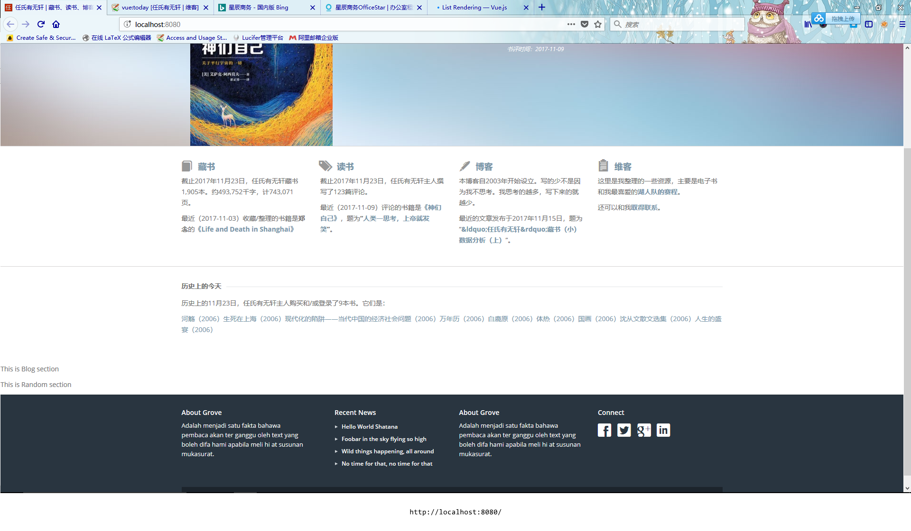

## 今日藏书组件

这一章中我们要实现“今日藏书组件”，列出在历史上的今天我们收藏了哪些书。由于历史上的今天收藏的书可能有好几本，所以在本章中我们要学到如何对返回的记录集进行遍历。

获取数据的方式很常规，我们在`created`方法中进行远程API的访问：

```javascript
methods: {
    getToday() {
      var uri="http://api.rsywx.com/book/ofDay";
      fetch(uri)
        .then(res => {
          return res.json();
        })
        .then(json => {
          this.books=json.out;
        });

    },
  },
  created: function() {
    this.getToday();
  }
```

### `<template>`中的循环

首先列出完整代码。

```html
<div class="widewrapper">
    <div class="container content">
      <div class="row">
        <div class="col-sm-12">
          <div class="showroom-controls">
            <div class="links">历史上的今天</div>
          </div>
          <div class="row cropping">
            <div class="showroom-item blog-item col-sm-12">
              <p>历史上的{{String(today.getMonth()+1).padStart(2,'0')}}月{{String(today.getDate()).padStart(2,'0')}}日，任氏有无轩主人购买和/或登录了{{books.length}}本书。它们是：</p>
              <p>
                <router-link v-for="book in books" :to="{name: 'BookDetail', params: {id: book.bookid} }" :key="book.bookid">{{book.title}}（{{new Date(book.purchdate).getFullYear()}}）</router-link>&nbsp;&nbsp;
              </p>
              
            </div>
          </div>
          <div class="clearfix"></div>
        </div>
      </div>
    </div>
  </div>
```

这里的关键是`v-for`的绑定。它将遍历返回的书籍，并对每本书的实例生成一个链接。另外，出于Vue的要求，类似循环必须制定一个`key`值——我们在这里简单地用`book.bookid`即可。

对比[[react:today|React中同一页面]]的编程，Vue要简单很多。

完成这一步后，我们的应用首页是这样的：

