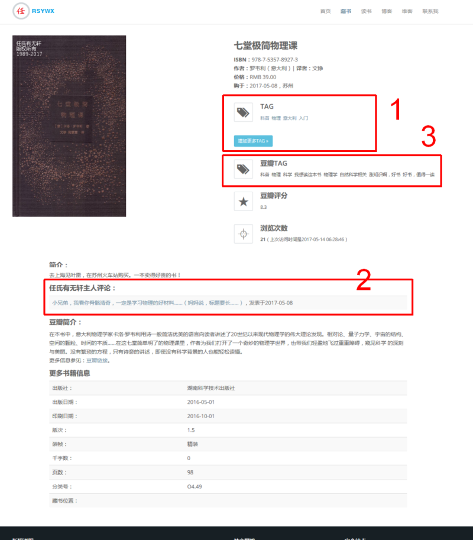
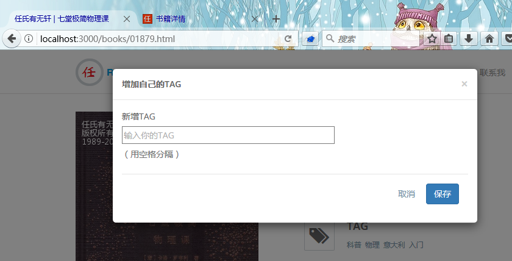

## 书籍详情

我们先来看完成效果：



### 增加路由

Vuet是一个单文件入口应用，没有实际物理位置上的一个一个文件供我们调用访问，一切都是通过路由调度来实现的。

首先，我们修改`/src/router/index.js`，增加一个引用和路由分配：

```javascript
{
  path: '/books/:id',
  name: 'BookDetail',
  component: BookDetail,
  props: true,
}
```

请注意，我们在声明这个“书籍详情”的路由时，我们增加了一个参数：`id`。有关路由配置的详细说明可以参见[官方文档](https://router.vuejs.org/)。

我们这个路由因为是要显示某一本书的详细信息，所以我们用一本书的`id`（实际是`bookid`字段）作为这本书的标识。比如：`http://.../books/01879`就是显示`bookid`为01879的这本书的详细信息（如上图所示）。

**特别注意：**在我目前Symfony的实现以及React的实现中，我都是用`/books/01879.html`的URI形式，但是在Vue下多了这个`.html`后会有一些问题，所以就改用这个比较简单的方式。[^1]

[^1]: 讨论见：https://stackoverflow.com/questions/47481723/change-uri-directly-for-a-vue-app-and-caused-error

**12.02更新**：经过在Vue论坛的，[^2]Vue还是可以用这种URI方式的，方法是修改''/build/webpack.dev.conf.js''（对于开发模式来说），加入这么一段：

[^2]: [提问和解答](https://forum.vuejs.org/t/topic/22287/11)

```javascript
  devServer: {
    ...
    historyApiFallback: {
      disableDotRule: true,
    }
  },
```

另外需要注意的是，这个路由的声明中我加入了一个`props: true`。它的作用是将路由的参数（`id`）作为一个“属性”传递给匹配该路由的组件并成为这个组件的属性。我们马上会看到这个属性是如何被用来获取书籍信息的。

### 编写BookDetail

写好路由配置后，我们来编写“书籍详情”页面。

#### 获取URI中的参数

首先，我们要获得URI中的这个参数（`id`），才能进行后续的工作。

```javascript
<script>
import TopNav from '@/components/TopNav';

export default {
  name: "BookDetail",
  components: {
    TopNav,
  },
  data: function() {
    return {
      book: [],
      isbn: '',
    }
  },
  methods: {
    getBookDetail(id) {
      var uri='http://api.rsywx.com/book/bookByBookId/'+id;
      fetch(uri)
        .then(res => {
          return res.json();
        })
        .then(json => {
          var book=json.out[0];
          book.cover="http://api.rsywx.com/book/cover/"+book.bookid+"/"+book.title+"/"+book.author+"/300";
          this.isbn=json.out[0].isbn;
          this.book=book;
        });
    }
  },
  created: function() {
    this.book=this.getBookDetail(this.id);
  },
  props: [
    'id',
  ]
};
```

除了常规的说明外，我们用`props: ['id']`直接获取了路径中的书籍ID。有了这个参数，我们就可以完成所有的内容获取了。

#### 利用Tags组件获取本书的tag

图片中红框标出的第一部分是“任氏有无轩”主人（也就是我）给这本书加的tag。这一段的代码如下：

```javascript
getTags(id) {
    var uri='http://api.rsywx.com/book/tagsByBookId/'+id;
    fetch(uri)
        .then(res => {
            return res.json();
        })
        .then(json => {
            this.tags=json.out;
        }); 
},
```

这段的实现非常简单。其对应的模板写法更为直接了当，用一个`v-for`循环就搞定了：

```html

<h3>TAG</h3>
<small><router-link :to="{name: 'BookList', params: {type: 'tag', key: tag.tag, page:'1'} }" v-for="tag in tags" :key="tag">{{tag.tag}}&nbsp;</router-link>
</small>
<a class="btn btn-info btn-sm" data-toggle="modal" href="#addtag" >增加更多TAG »</a><br/>

```

有兴趣的读者可以对照[React中对应的写法](../../react/detail)，相对来说Vue的实现更简单。

#### 增加自己的tag并跳转

在显示书籍tag的时候，我们提供了一个功能让访问者可以为这本书增加自己的tag。点击“增加更多TAG”的按钮后，会弹出如下的一个对话框：



用户可以输入由空格分割的一些tag，应用会增加那些原本还没有的tag。然后跳转回这本书的详情页面，并显示新的tag列表。

目前，我们没有针对这一跳转部分加以特别处理。

#### 根据一本书籍的tag选择具有该tag的书籍

这实际上是一个搜索加书籍列表的处理。在我们的程序中，这一功能在“书籍列表”中完成。

#### 获取读书评论

这一部分其实相对简单。我们只要简单地调用一个API并对返回的JSON数据集进行相应处理即可。

#### 获取豆瓣评论（以及其他豆瓣的书籍信息）

豆瓣开放了它的API供我们调用，其搜索关键字是一本书的ISBN号。我们对不是我们开发的API没有控制，所以可能出现CORS的错误。

解决方法是：在后台API用PHP等脚本语言封装豆瓣的API，然后该后台API提供CORS支持，便于我们的JS调用。

需要注意的是，这个豆瓣API的调用需要获得书籍的`ISBN`号码，而当前书籍的ISBN号需要在我们的异步API完成后才能正确获得，换句话说，如果我们将“根据ISBN获取豆瓣信息”的调用和我们之前看到的所以和显示tag的组件类似，我们在`BookDetail`这个组件的`componentDidUpdate`中进行豆瓣API的操作，我们无法保证我们能获得ISBN。解决方法和我之前在React中的处理类似，就是用到组件的某个更新状态下的事件。而要充分使用这个事件，我们需要进行如下准备工作。

第一，在组件的`data`中声明一个变量`isbn`:

```javascript
data: function() {
    return {
      book: [],
      isbn: '',
    ...
    }
  },
```

第二步，声明一个“监视”（watch）触发：

```javascript
  watch:{
      isbn: function(newV, oldV) {
          if(newV!=oldV) {
              this.getDouban(this.isbn);
          }
      }
  },
```

当且仅当`isbn`原来的值和新的值（应该就是通过API获得了书籍详情后得到更新的ISBN号）不同时，我们进行豆瓣书籍信息的拉取。

### 详情页面的其他部分

其他部分的实现相对简单，不再赘述。

读者应该注意到，我们使用了之前编好的组件（如`TopNav`）。这就有点模板组合的味道了。

我们已经完成了“书籍详情”的编写。我们的站点也渐渐丰富了起来。

下一章我们来讨论“书籍列表”页面的编写。