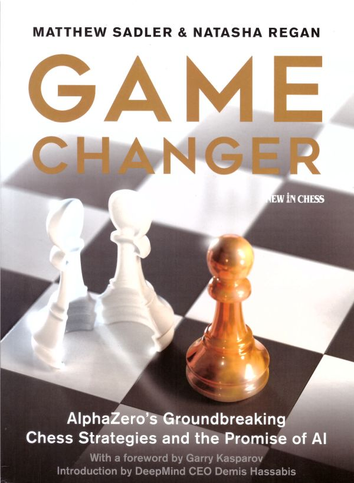

[《Game Changer》](https://rsywx.net/books/01936.html)是一本讲述[AlphaZero](https://en.wikipedia.org/wiki/AlphaZero)这一目前为止史上最强**国际象棋引擎**的书。

我托Vera帮我买了这本书，然后她不但托人买，还学习了猪手而代为买单。非常感谢！

本来我一直提不起兴趣为这本书编写一个Wiki目录，因为一直没有找到很好的方式来呈现国际象棋的棋盘，后来找到了一个[Grav](https://getgrav.org/)的插件[Chessboard](https://github.com/exoticorn/grav-plugin-chessboard)，所以决定一试。

我不是国际象棋高手，但很喜欢国际象棋，也喜欢看似简单的规则下隐藏着的深刻内涵。

TR@SOE

2020年5月1日

##目录

  * [01. 计算机国际象棋竞赛之快速引介](./quick_tour)
  * [02. 零零零](./zero_zero_zero)
  * [03. Demis Hassabis、深思（DeepMind）以及AI](./demis_hassabis)
  * [04. AlphaZero是如何思考的](./how_alphazero_thinks)
  * [05. AlphaZero的风格](./alphazero_style)
  * [06. 本书所选的AlphaZero行棋主题引介](./introduction_themes)
  * [07. 棋子的调动：前哨](./outposts)
  * [08. 棋子的调动：机动性](./activity)
  * [09. 攻王：边兵的挺进](./march_rook_pawn)
  * [10. 攻王：弱格](./color_complexes)
  * [11. 攻王：弃子换取时间、空间和伤害](./scrifice_for_time_space_damage)
  * [12. 攻王：异侧易位](./opposite_side_castling)
  * [13. 攻王：防守](./defence)
  * [14. AlphaZero的开局库](./opening_repertoire)
  * [15. 王翼印度防御之萨米奇变体](./king_indian_samisch)
  * [16. 卡尔斯巴德兵型](./carlsbad)
  * [17. 后记](./epilogue)
  * [18. 术语](./technical_note)

