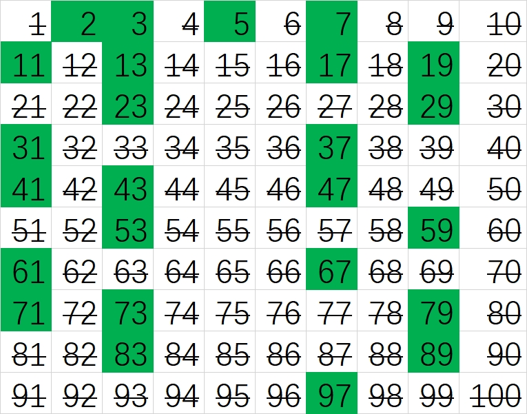

这一章我们要讲述将自然数“分成”各个部分。

`1`是所有自然数的基本组成元素。所有自然数都不过是若干个`1`加起来得到的结果。这个性质是归纳过程的核心。

但是通过“加法”得到数字比较慢，有没有比较快的方法？我们马上会想到乘法，但马上有一个问题自然而然地出现：**有没有什么自然数无法通过两个较小的数相乘而得到呢？**这类数就是所谓的素数（或者叫质数，prime numbers）。[^1]

数论中的一个主要核心就是对素数的研究。我们将证明，任何大于1的自然数要么是素数，要么可以表示为素数的乘积（BTW，这样的数被称为合数）。素数是所有自然数的构建基石。

我们还将证明，素数有无穷多个，但它们在自然数中的分布如何？比一个自然数$n$小的素数有几个？如何找到它们？又如何使用它们？……从古到今，这些问题驱动了数论的发展并将我们引向众多美妙的数学发现。

**定义**：自然数$p\gt 1$为素数，当且仅当$p$不是小于$p$的自然数的乘积。

**定义**：自然数$n$为合数，当且仅当$n$是小于$n$的自然数的乘积。

**定理2.1**：$\forall n \in N, n>1, \exists p, s.t\: p|n$。[^2]

**练习**：试着写下小于100的所有素数。不要用计算器或其他的帮助。

**定理2.3**：自然数$n$为素数，iff对于所有的素数$p\lt \sqrt n$，$p\nmid n$[^3]

**练习**：用上面的定理证明101是个素数。

寻找下一个素数永远是一个正在进行的任务，因为素数在通讯加密方面具有不可替代性。目前数学家找到的最大素数是$2^{77,232,917}-1$，一个23,249,425位数，同时也是一个梅森素数。[^4]

数学家有很多先进的方式来找素数，不过现在我们要看一种古老的方式，它可以追溯到[埃拉托色尼](https://en.wikipedia.org/wiki/Eratosthenes)（公元前三世纪的希腊天文学家、数学家和地理学家）发明的筛法（Sieve of Eratosthenes）。

筛法的过程非常直观简单，简述如下（假定我们要求100以内的素数）：

1. 在一张纸上写下1-100这100个数字。把它们写成一个10*10的矩阵可能好一些。
2. 把`2`圈出来，这是第一个素数。
3. 将所有`2`的倍数划掉。
4. 把`3`圈出来，这是下一个没被划掉的数字，也是下一个素数。
5. 将所有`3`的倍数划掉。
6. 圈出那个没被划掉的最小的数（下一个素数），并把它的倍数划掉。重复这个过程。

大家可以想一想，为什么经过这些步骤后，可以得到小于100的所有素数列表呢？

我自己做了一个这样的练习，截图如下（我用Excel做的，绿色是圈出来的、“留下来”的素数，其他的是合数）：

**练习**：对于自然数$n$，定义$\pi (n)$为小于等于$n$的素数的数量。

1. 做出$n=1, 2,..., 100$时$\pi (n)$的图像。
2. 做出一个有关$\pi (n) \sim n$之间关系的猜想。特别地，$\frac{\pi (n)}{n}$是一个递增函数还是递减函数？会不会存在一个极限呢？

高斯提出，$\pi (n) \sim \frac{n}{ln(n)}$，然后进一步精细地定义为$\pi (n) \sim Li(n)$，也就是$\lim_{n->\infty}\frac{\pi (n)}{Li(n)}=1$，而其中$Li(n)=\int_2^n\frac{dx}{ln(x)}$。（参见[《上帝创造整数：高斯》](../../gcti/gauss)）

## 算术基本定理

在数学领域中，数学家很少给一个定理加上“基本”找个前缀，因为这样的定理太少。我们一生之中可能也只会碰到其中的一两个，比如：[代数基本定理（Fundamental Theorem of Algebra）](https://en.wikipedia.org/wiki/Fundamental_theorem_of_algebra)，[微积分基本定理（Fundamental Theorem of Calculus）](https://en.wikipedia.org/wiki/Fundamental_theorem_of_calculus)等。

我们很有幸地马上开始接触一个基本定理：**[算术基本定理（Fundamental Theorem of Arithmetic）](https://en.wikipedia.org/wiki/Fundamental_theorem_of_arithmetic)**。

这个定理分两部分，一部分证明存在性，一部分证明唯一性。

**定理2.7（算术基本定理之存在性部分）**：所有大于1的自然数要么是一个素数，要么可以表示为素数的有限乘积。也就是说，对于大于1的自然数，存在各异的素数$p_1, p_2, ..., p_m$和一系列自然数$r_1, r_2, ..., r_m$，s.t$n=p_1^{r_1}p_2^{r_2}...p_m^{r_m}$。

*证明*：（略）。提示：可以用数学归纳法。

**引理2.8（欧几里得引理，用于证明唯一性）**：令$p, q_1, q_2, ..., q_n$为素数，而$k$为一个自然数，s.t $pk=\prod_{i=1}^n q_i$，那么$p=q_i$对于某个$i$成立。

*证明*：（略）。

**定理2.9（算术基本定理之唯一性部分）**：令$n$为自然数，令$\{p_1, p_2, ..., p_m\}$以及$\{q_1, q_2, ..., q_m\}$是素数的集合，且$p_i\ne p_j, q_i\ne q_j (i\ne j)$。令$\{r_1, r_2, ..., r_m\}$以及$\{t_1, t_2, ..., t_m\}$是自然数的集合，s.t $n=\prod_{i=1}^{m}p_i^{r_i}=\prod_{j=1}^{s}q_j^{t_i}$。那么，$m=s,\:\{p_1, p_2, ..., p_m\}=\{q_1, q_2, ..., q_s\}$。也就是说，素数集合相等，但顺序不一定相同，也就是$p_i$不一定等于$q_i$。但如果$p_i=q_j$，那么$r_i=t_j$。换句话说，如果我们将一个自然数表述为一系列各异的素数的乘积，那么表达方式是一致的，而只有素数出现的次序会不同。

*证明*：假定$n=p_1p_2...p_k=q_1q_2...q_l$。我们这里不写出指数项是因为我们将列出所有的（包括重复的）素数因子，比如对于$2^2$我们写成$2*2$。这两个素数集合的乘积是相同的，根据引理2.8，我们可以得到：任意一个乘积中的因子可以整除另一个乘积，也就是$\forall p_i\mid q_1q_2...q_l, 1\le i \le k$。根据欧几里得引理，$\exists p_i=q_j, 1\le j\le l$。在$p$和$q$的乘积中约去这个公因子并重复这个过程。

如果$k\ne l$，那么我们要么得到$p_{i_1}p_{i_2}...p_{i_r}=1\:(k\gt l)$，要么得到$q_{j_1}q_{j_2}...q_{j_s}=1\:(k\lt l)$。但是由于所有的$p, q$都是一个素数，素数最小就是2，所以其乘积不可能等于1。因此$k=l$。这两种乘积表达式具有相同数量（但不一定各异）的素数因子，而我们的消去过程消去的都是相等的质因子。因此这两种表达是相同的，只是质因子顺序有可能不同。QED。

结合定理2.8和2.9，我们得到完整的**算术基本定理**：

>所有大于1的自然数要么是素数，要么可以表述为有限素数的乘积且这样的表述是唯一的而只有因子排列顺序的差异。

考虑一下我们对素数的定义中，刻意排除了`1`。如果`1`被认定为一个素数，算术基本原理还能成立吗？

**练习2.10**：将$n=12!$表示为一系列素数的乘积。

**练习2.11**：对于$25!$，确定它在末位有几个0？

*解*：素数相乘中，只有$2*5=10$能在乘积的末位加上1个0。对于$25!$，将其进行因子分解后，可以看到具有$5$这个因子的只有$5, 10, 15, 20, 25$这五个数，一共提供了6个5，具有$2$因子的数量肯定比6多，所以，$25!$的末位有6个0。

从**算术基本定理**，我们可以定义，如果$p_i$得到排序，s.t $p_1\lt p_2 \lt...\lt p_m$，那么我们说$p_1^{r_1}p_2^{r_2}...p_m^{r_m}$是自然数$n$的唯一素数分解式。

## 算术基本定理的应用

**定理2.12**：令$a, b$是大于1的自然数，而且$a, b$可以分别用唯一素数分解式表达为：$p_1^{r_1}p_2^{r_2}...p_m^{r_m}$和$q_1^{t_1}q_2^{t_2}...q_m^{t_m}$。那么$a\mid b\:\:iff \forall i\le m, \exists j\le s, s.t\:\:p_i=q_j, r_i\le t_j$。

*证明*：

（充分性）假定$a\mid b$，那么$b=ak$。根据算术基本定理，等式两边的素数分解式是一致的。因此，对于$i\in [1, m]$，$a$中出现的$p_i^{r_i}$和$k$中出现的$p_i^{u_i}$要与$b$中的某个$q_j^{t_j}$对应。因此一定存在$q_j=p_i$，而且$r_i+u_i=t_j$，也就是$r_i\le t_j$。

（必要性）假定对于所有的$i\le m$，存在$j\le s, s.t\:\:p_i=q_j, r_i\le t_j$，那么对于$b$中的每个素数因子项，可以将其改写成$p^r*q^t$。其中的$p^r$与$a$的分解式一一对应，所有的$q^t$项相乘会得到一个数（$\ge 1$），这个数就是$k$。所以$b=ak \implies a\mid b$。

**定理2.13**：令$a, b$为自然数，且$a^2\mid b^2$，那么$a\mid b$。

*证明*：

根据算术基本定理，$a, b$有各自的唯一分解式：

$a=\prod_{i=1}^{m}p_i^{q_i}, b=\prod_{j=1}^{n}r_j^{s_j}$

因此$a^2=\prod_{i=1}^{m}p_i^{2q_i}, b^2=\prod_{j=1}^{n}r_j^{2s_j}$。根据定理2.12，我们知道，因为$a^2\mid b^2$，所以$2r_i\le 2s_j \implies r_i\le s_j$。再根据定理2.12，得到$a\mid b$。QED。

素数唯一分解式可以帮助我们去找两个自然数的最大公约数和最小公倍数。例如：

**练习2.14**：找到$(3^{14}*7^{22}*11^5*17^3, 5^2*11^4*13^8*17)$。

*解*：观察这两个数的素数唯一分解式，可以看到其中唯一相同的部分是$11^4$和$17$。所以这两个数的GCD就是$11^4*17$。

**练习2.15**：找到上面这两个数的lcm。

*解*：我们知道，$lcm(a, b)=\frac{ab}{gcd(a,b)}$。

所以上面两数的$lcm=\frac{(3^{14}*7^{22}*11^5*17^3)*(5^2*11^4*13^8*17)}{11^4*17}=3^{14}5^27^{22}11^513^817^3$。

**定理2.18**：若$a_1, a_2, ..., a_{n+1}$是小于等于$2n$的数，那么在这些数中一定存在一对数字，比如说$a_i, a_j\:(i\ne j)$，使得$a_i\mid a_j$。

*证明*：每个$a_i$都可以写成$a_i=2^{\alpha_i}*\beta_i$，其中$\alpha_i$为0或自然数，而$\beta_i$是一个奇数。$\beta_i$有$n+1$个，但取值范围只有$n$个，也就是$1, 3, 5, ..., 2n-1$。根据鸽笼原理，对某个$i, j$而言，一定存在$\beta_i=\beta_j$。对应的，$\frac{a_i}{a_j}=2^{\alpha_i-\alpha_j}$，可以合理假定$\alpha_i\ge \alpha_j$（如果不是，则交换$i, j$），由此$a_j\mid a_i$。QED。

**定理2.19**：不存在任何自然数$m, n$，s.t $7m^2=n^2$。

*证明*：

对于任何自然数$m, n$而言，它们的分解式是唯一的。特别地，我们关注它们分解式中7的指数，令其为$p, q$。那么在$m^2, n^2$中，7的指数就是$2p, 2q$。注意，等式两边7的指数的奇偶性肯定不会一样：必然一个是偶数一个是奇数。所以等式不能成立。QED。

也许有人会说，这个证明太麻烦。我知道$\sqrt 7$是个无理数，所以$\sqrt 7m \ne n$。所以证毕。但是，**基于我们现在的知识**，我们还没法证明$\sqrt 7$是无理数——因为我们还没有给出有理数、无理数的定义！同学，你超前了！

**定理2.20**：不存在任何自然数$m, n$，s.t $24m^3=n^3$。

*证明*：（略）。提示：用两边3的指数项来得出矛盾。

用分解式的唯一性可以来证明一些牵涉到有理性/无理性的有趣问题。

**定义**：有理数（`rational number`）是这样的数字，它可以表示为$\frac{a}{b}$，其中$a, b$为整数且$b\ne 0$。

**定义**：不是有理数的数字就是无理数（`irrational number`）。

**练习2.21**：证明$\sqrt 7$是无理数。

**练习2.22**：证明$\sqrt{12}$是无理数。

**练习2.23**：证明$7^{\frac{1}{3}}$是无理数。

有了算术基本定理，我们可以回头来证明[第一章](../divide)中的一些定理。

**定理2.25**（定理1.42）：令$a, b, n$为整数，如果$a\mid n, b\mid n, (a,b)=1$，则$ab\mid n$。

*证明*：

在第一章中我们没有用算术基本定理来证明。现在我们用算术基本定理来证明。

首先排除一些特殊情况。

1. 如果$a=0$或者$b=0$，所以$ab=0$，0可以整除任何不为0的整数，而$a\mid n$以及$b\mid n$已经表明$n$不能为0，所以$ab=0\mid n$。
2. 如果$a=1, b\ge 1$，那么$b\mid n \implies ab\mid n$。
3. 如果$b=1, a\ge 1$，那么$a\mid n \implies ab\mid n$。

所以我们考虑一般情况，也就是$a\ge 2, b\ge 2$。

首先，由于$a\mid n, b\mid n$，所以$a, b$的分解式中的每一项都在$n$中出现，并且$n$中对应素数因子的指数不会小于$a, b$中对应的素数因子的指数。

但由于$(a, b)=1$，因此$a, b$没有相同的素数因子，也就是说不存在一个素数$p, s.t. p\mid a, p\mid b$。$ab$的分解式就是$a, b$分解式的乘积。所以$ab$中的每个素数因子也都出现在$n$中，且$n$中对应的素数因子的指数不会小于$ab$中对应的素数因子的指数。因此$ab\mid n$。QED。

**定理2.26**：令$p$为一个素数而$a$为一个整数，那么$p\nmid a\:\: iff\: (a,p)=1$。

[^1]: 在我的这些笔记中，会混合使用“素数”、“质数”，以后不再说明。

[^2]: `s.t`是`such that`的缩写，可以翻译为“使得”。其他数学符号（$\forall, \exists$）的说明在此不赘述。

[^3]: `iff`是`if and only if`的缩写，也就是“当且仅当”。

[^4]: 梅森素数（Mersenne prime）是形如$2^n-1$这样的素数。见[维基词条](https://en.wikipedia.org/wiki/Mersenne_prime)。
