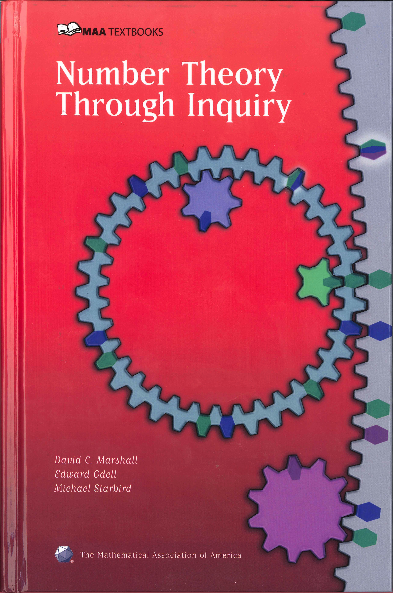

一本我不知道能不能有毅力看完的书。先看了再说！

TR@SOE

2020年7月25日

## 目录

* [01.分而治之](./divide)
* [02.素数时间](./prime)
* [03.模的世界](./modulo)
* [04.费马小定理和欧拉定理](./fermat)
* [05.公钥加密](./public)
* [06.多项式同模与本征根](./polynomial)
* [07.黄金定理](./golden)
* [08.毕氏三元数、平方和以及费马大定理](./pythagorean)
* [09.接近无理数的有理数及佩尔方程](./rationals)
* [10.找寻素数](./search)
* [附录A.数学归纳法：多米诺效应](./mathematical)
  